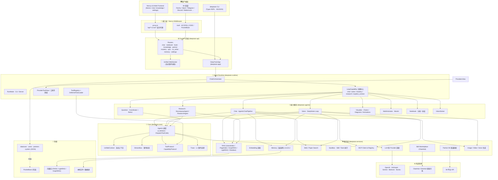
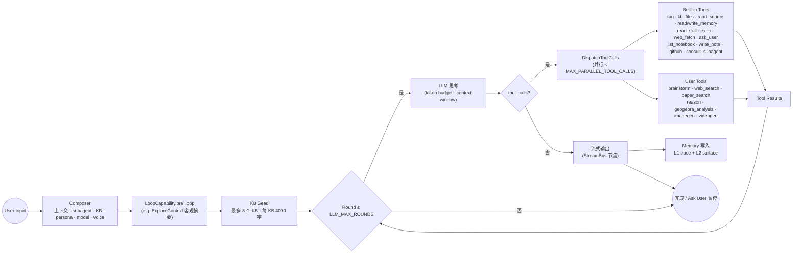
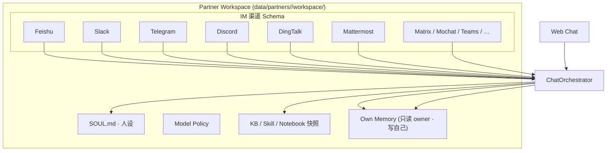
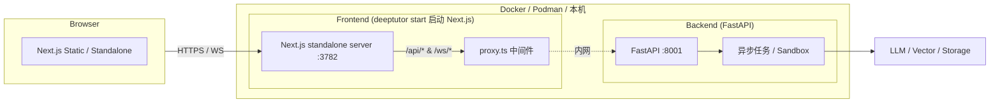
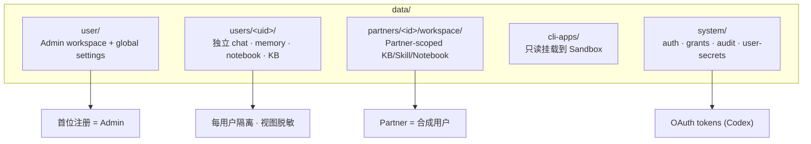
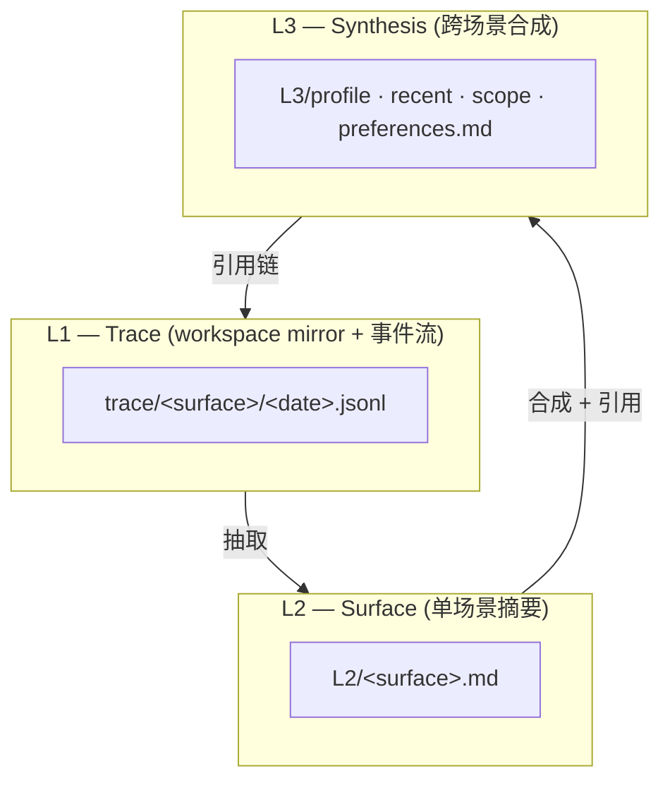

# DeepTutor 系统架构图

> **DeepTutor** 是一个面向终身学习的"代理原生"（agent-native）个性化辅导工作台。它把 Chat / Quiz / Research / Visualize / Solve / Mastery Path 等多种学习模式统一在一个 Agent Loop 之上，并把知识库、笔记、记忆、Skill、Partner 等可复用的学习上下文在同一运行时中串起来。

---

## 1. 总体架构（System Architecture）

下图展示了 DeepTutor 从前端到后端、从运行时到外部 LLM / RAG / IM 渠道的整体分层。

---

## 2. Agent Loop 架构（Chat Agent Loop）

DeepTutor 的所有能力（Chat / Solve / Mastery / Research / Visualize）共享同一个 Agent Loop。

---

## 3. Partner 架构

"Partner = 一个有个性和手机号 的 Chat"。它把已配置 SOUL · 模型 · 渠道 · 工具的聊天实例挂载到 IM 平台。

---

## 4. 运行时部署架构

> 仅需对外暴露 `3782` 端口；`8001` 仅在直接调试 API 时可选暴露。

---

## 5. 多用户 / 数据布局

---

## 6. 记忆三层 (Memory Layers)

每条 L3 主张都能追溯到 L1 的原始事件；Memory 浏览器提供 **Memory Graph** 视图。

---

## 7. 关键架构特点总结

| 特性 | 体现 |
| --- | --- |
| **One Runtime for Every Mode** | Chat / Solve / Quiz / Research / Visualize / Mastery 都跑在同一个 Agent Loop |
| **Loop Capability 扩展** | 通过 `LoopCapability` 协议无侵入地加入新能力（默认不抑制 chat 工具面） |
| **Provider Flexibility** | 25+ 个 LLM / TTS / STT / Image / Video Provider 适配 |
| **Multi-Engine RAG** | LlamaIndex / PageIndex / GraphRAG / LightRAG / Obsidian 都能挂入 |
| **Memory Auditable** | 三层文件 + Memory Graph，记忆可读、可审、可改 |
| **Subagent & Partner** | 既有 Claude Code / Codex 等外部代理，也在内部跑 Partner Bot |
| **Multi-User Ready** | 单实例通过 auth + grants 即可支持多用户隔离 |
