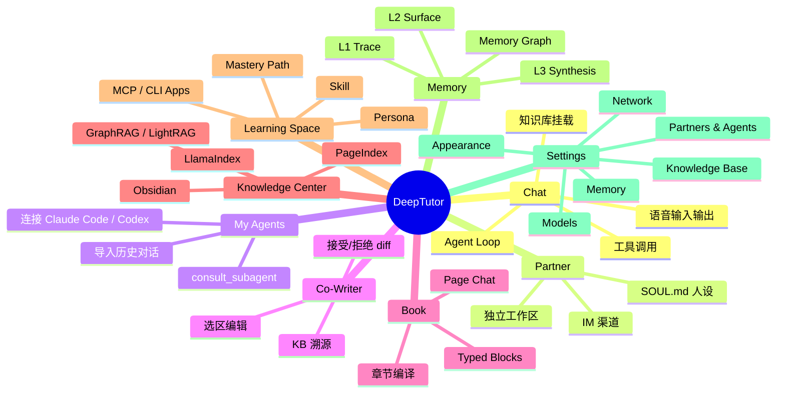
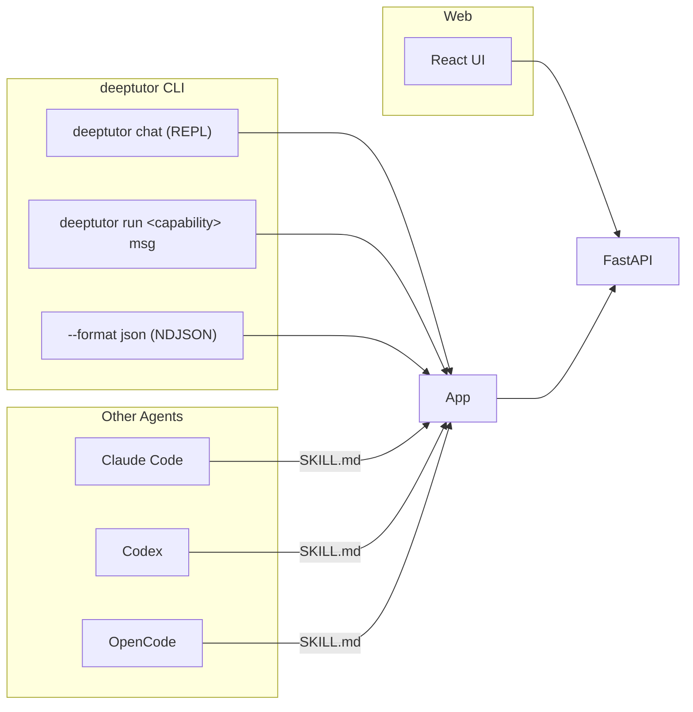

# DeepTutor 功能介绍

> DeepTutor 是一个面向终身学习的"Agent 原生"工作台。它把 Chat / Quiz / Research / Visualize / Solve / Mastery Path 等多种学习模式统一在同一个 Agent Loop 之上，并把知识库、笔记、记忆、Skill、Partner 等可复用的学习上下文串起来。下面按照"主工作面 → 深度能力 → 个性化层 → 运维层"四大维度介绍。

---

## 1. 九大主工作面

---

## 2. 九大主工作面详解

### 2.1 💬 Chat — Agent Loop
- **单线程多能力**：聊天、调用工具、挂知识库、读附件、生成图片、调用子代理、写笔记，全程在同一上下文。
- **多轮工具循环**：模型思考 → 调用工具 → 观察 → 循环 → 无工具输出。
- **可挂工具（用户开关）**：`brainstorm` · `web_search` · `paper_search` · `reason` · `geogebra_analysis` · `imagegen` · `videogen`。
- **上下文工具（按 turn 挂载）**：`rag` · `kb_files` · `read_source` · `read/write_memory` · `read_skill` · `load_tools` · `exec` · `web_fetch` · `ask_user` · `list_notebook` · `write_note` · `github` · `consult_subagent`。
- **上下文分类**：
  - **Sticky Session Context**：subagent / KB / persona / model / voice（持久化）。
  - **One-time References**：文件 / 聊天历史 / 书籍 / 笔记本 / 题目库 / Agent 导入（一次性）。
- **入口能力**：Quiz、Research、Visualize、Solve、Mastery Path。

### 2.2 🤝 Partner — 持久化 IM 伙伴
- **"一个有个性和手机号的 Chat"**：
  - 有自己的 `SOUL.md` 人设 / 模型策略 / 工具白名单 / 知识库 / 记忆 / 渠道。
- **多渠道**：Feishu / Slack / Telegram / Discord / DingTalk / QQ/NapCat / WeCom / WhatsApp / Zulip / Mattermost / Matrix / Mochat / Microsoft Teams。
- **独立工作区**：`data/partners/<id>/workspace/`，完全复用 Chat 的 RAG / Skill / Notebook / Memory 工具。
- **记忆策略**：读 owner 记忆，但只写自己的。
- **可作为 subagent**：在普通 Chat 中 `@partner` 即可邀请。

### 2.3 🧑‍🚀 My Agents — 接入 / 导入其他 Agent
- **连接活体 Agent**：Claude Code / Codex / Gemini / Kimi / opencode / MiMo Code CLI，或自己的 Partner。
- **通过 `consult_subagent` 工具调用**，输出流到 Activity 面板。
- **导入历史对话**：把 Claude Code / Codex 历史会话作为"第三方转录"导入，可检索、可恢复。

### 2.4 ✍️ Co-Writer — 选区级 Markdown 写作
- **Split-view** Markdown 工作区，支持 KaTeX / Mermaid / diagram fence 实时预览。
- **选区编辑**：选中一段 → 让 Agent 改写 / 扩展 / 缩写 → 接受/拒绝 diff → 落地。
- **KB 溯源**：编辑过程可基于 KB 或网络证据；保留工具调用轨迹。
- **保存到 Notebook**：成熟草稿沉淀为可复用上下文。

### 2.5 📖 Book — 动态电子书
- **从 KB / 笔记 / 题目库 / 聊天历史生成源代码**。
- **章节 Outline 先评再生成**，避免一刀切。
- **Typed Blocks**：
  - text · callout · quiz · flash card · timeline · code · figure
  - interactive HTML · animation · concept graph · deep dive · user note
- **Page Chat**：每页独立的对话。
- **维护命令**：`deeptutor book health` · `deeptutor book refresh-fingerprints`。

### 2.6 📚 Knowledge Center — 多引擎 RAG
| 引擎 | 特点 |
| --- | --- |
| **LlamaIndex** | 默认 · 向量 + BM25 混合 · 本地优先 |
| **PageIndex** | 推理式检索 · 页面级引用 |
| **GraphRAG** | 知识图谱检索 |
| **LightRAG** | 轻量图谱 RAG |
| **LightRAG Server** | 外部 HTTP 接入 |
| **Tencent IMA** | 腾讯 IMA 库接入 |
| **Linked Obsidian** | 双向同步 Obsidian Vault |

- **Document Parsing**：Text-only / MinerU / Docling / markitdown / PyMuPDF4LLM。
- **版本化索引**：`version-N` 目录持久化，失败不会损坏旧索引。
- **错误粒度删除**：即使 KB 处于 error 状态也能删除单个失败文档。
- **CLI 镜像**：`deeptutor kb list|info|create|add|search|set-default|delete`。

### 2.7 🌐 Learning Space — 个性化上下文库
- **Conversations & Materials**：聊天历史 / 笔记本 / 题目库（题目含你的答案 + 参考答案 + 解释）。
- **Personalization**：
  - Mastery Path（学习路径）
  - Persona（peer / research-assistant / teacher 等行为预设）
  - Skill（`SKILL.md` playbook）
  - MCP Services（一键安装托管 MCP Server + 自定义 URL 远程 MCP）
  - CLI Apps（[CLI-Anything](https://github.com/HKUDS/CLI-Anything) 命令行工具，每条独立 usage doc 懒加载）
- **EduHub 导入**：从社区市场一键下载 Skill（带安全门）。

### 2.8 🧠 Memory — 可审计的三层记忆
| 层 | 内容 | 形态 |
| --- | --- | --- |
| **L1 Trace** | 工作区镜像 + 仅追加事件流 | `trace/<surface>/<date>.jsonl` |
| **L2 Surface** | 单场景摘要 | `L2/<surface>.md` |
| **L3 Synthesis** | 跨场景合成 | `L3/profile|recent|scope|preferences.md` |

- **Memory Graph**：中心 L3 → 中环 L2 → 外环 L1，每条 L3 主张都能追溯到证据。
- **Track Surfaces**：`chat · notebook · quiz · kb · book · partner · cowriter`。
- **审计预算**：Settings → Memory 调整 Update / Audit / Dedup 预算。

### 2.9 ⚙️ Settings — 单一控制面
- **状态条**：Backend / LLM / Embedding / Search 实时状态。
- **Appearance**：主题 / UI 语言 / 代码块样式（Default / Cream / Dark / Glass）。
- **Network**：API base / 端口 / CORS。
- **Models**：LLM / Embedding / Search / TTS / STT / Image / Video 各独立配置。
- **Knowledge Base**：Document Parsing 引擎。
- **Chat**：工具开关 / 各项能力参数 / 附件上限。
- **Partners & Agents**：可在 Chat 中调用的子代理。
- **Memory**：Consolidator 预算。
- **Draft & Apply 流程**：先试用再提交。

---

## 3. 深度能力

### 3.1 🔍 Deep Research — 带引用的研究报告
- 题目分解 → 多源检索 → 综合 → 引用脚注 → 输出报告。
- 支持 `--config mode=report` · `depth=standard` 等参数。

### 3.2 🧮 Deep Solve — 推理式求解
- 在 Chat Agent Loop 上挂的能力（含让模型逐步推理）。
- 工具包括 `reason` · `geogebra_analysis` · `paper_search`。
- 工作笔记由 `note_solver` 私有工具保存。

### 3.3 ❓ Deep Question — 题目生成与判题
- 多题源 ReAct 协同生成（基于输入材料）。
- 题目可保存到题目库（含用户答案 + 参考答案 + 解释）。
- 题目可作为 Mastery Path 节点。

### 3.4 📊 Visualize — 图表 / 图表 / 动画
- 图表 / 流程图 / Mermaid / 3D 几何 / 动画。

### 3.5 🎬 Math Animator — Manim 动画
- 把推理过程自动写到 Manim DSL → 渲染短视频。
- 需要 `[math-animator]` extra（LaTeX / ffmpeg / 系统库）。

### 3.6 🧱 Mastery Path — 学习路径
- 一条路径上挂多个 Mastery 节点（每节点是一组题目）。
- 每类型节点有"掌握门槛"（必须达到分数才能进入下一关）。
- 错题 / 答题轨迹自动落到 L1，贡献 L2 surface、L3 profile。

### 3.7 🧠 Vision Solver — 视觉题求解
- 截图 / 拍照 → 提取 OCR → 解析几何 / 图表 → 推理求解。

---

## 4. CLI 特色（Agent-Native Interface）

- **REPL**：`deeptutor chat`，相同的能力 / 工具 / KB 任选。
- **单 turn**：`deeptutor run <capability> <msg>`，便于脚本化。
- **NDJSON**：`--format json` 输出事件流，每个事件带 `session_id`；可被 jq / pip / 串行调用。
- **会话可串联**：用 `session_id` 把多个 run 钩到同一 Memory。
- **`SKILL.md` 自描述**：约 150 行的握手文档，给外部 Agent 一键上手。

---

## 5. 关键命令清单（节选）

| 命令 | 用途 |
| --- | --- |
| `deeptutor init` | 创建 / 更新 `data/user/settings` |
| `deeptutor start [--home PATH] [--dev]` | 启动后端 + 前端 |
| `deeptutor serve [--port PORT]` | 只启动 FastAPI |
| `deeptutor run <capability> <msg>` | 单 turn 调能力 |
| `deeptutor chat` | 交互式 REPL |
| `deeptutor partner list/create/start/stop` | 管理 IM Partner |
| `deeptutor kb list/info/create/add/search/set-default/delete` | LlamaIndex KB 管理 |
| `deeptutor skill search/install/list/remove/login/logout/publish/update` | Skill 市场 |
| `deeptutor memory show/clear` | 检视 / 清理 L1/L2/L3 |
| `deeptutor session list/show/open/rename/delete` | 会话管理 |
| `deeptutor notebook list/create/show/add-md/replace-md/remove-record` | 笔记本 |
| `deeptutor book list/health/refresh-fingerprints` | Book 维护 |
| `deeptutor plugin list/info` | 列出注册工具 / 能力 |
| `deeptutor config show` | 配置总览 |
| `deeptutor provider login <provider>` | OAuth 登录 |

---

## 6. 典型使用场景

| 场景 | 关键能力 |
| --- | --- |
| **沉浸式题目精解** | Chat + Solve + RAG + Notebook |
| **多文档综合调研** | Chat + Research + KB + Co-Writer |
| **从教材生成可练课程** | Book + KB + Quiz |
| **题海 → 掌握路径** | Mastery Path + Question + Memory |
| **AI 教师驻群** | Partner + IM + Persona |
| **外包代码 / 推理** | My Agents (Claude Code / Codex) |
| **个人记忆沉淀** | Memory L1→L2→L3 |

---

## 7. 多用户与部署

- **单用户默认**（无 auth）。
- **多用户可选**：开启 `auth.json` → 第一位注册者 = Admin → `/admin/users` 分配 grants（模型 / KB / Skill / 工具 / 沙盒）。
- **凭证隔离**：OAuth token 写到 `data/system/user-secrets/<owner>/private/`，沙盒路径读不到。
- **部署通道**：
  - `pip install deeptutor`（PyPI）
  - 源码 / Docker（GHCR）/ Podman / Compose（多 profile，含 OAuth 端口管理）
  - 仅需对外暴露 `3782` 端口；`8001` 可选。

---

## 8. 生态

- **EduHub / ClawHub**：社区 Skill 市场，`deeptutor skill install` 一键安装 + 安全门。
- **CLI-Anything**：101 套现成 CLI 工具作为 Chat 工具调用。
- **HKUDS / 清华 THU-MAIC** 学术背景 — 论文已上 arXiv。

---

## 9. 价值观

- **One runtime for every mode**：切换目标，不切换引擎。
- **Connected learning context**：同一上下文跨流程。
- **Inspectable memory**：用户可读、可改、可审计。
- **Extensible by default**：工具 / Skill / MCP / CLI / Partner 各是独立扩展点。
