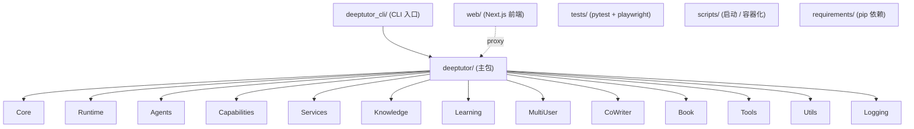
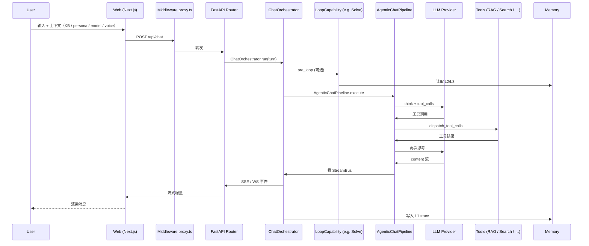
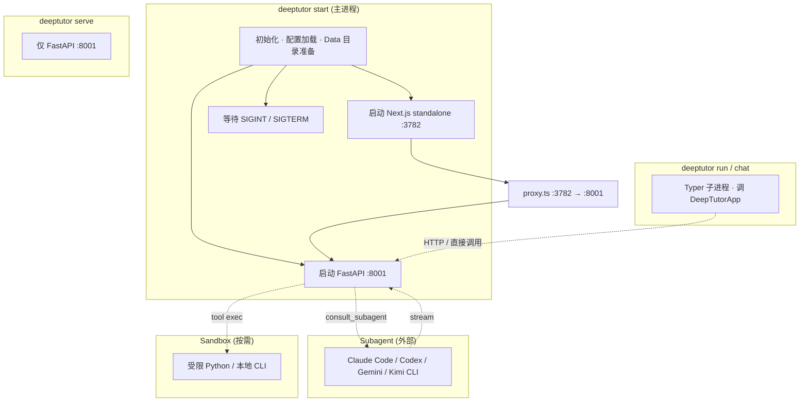

# DeepTutor 模块图

> 本文档从代码视角梳理 DeepTutor 各模块的职责与依赖关系。所有路径相对仓库根 `DeepTutor/`。

---

## 1. 包结构总览



---

## 2. deeptutor/ 核心模块

```mermaid
flowchart LR
  subgraph app["app · 启动入口"]
    A1["DeepTutorApp"]
  end

  subgraph api["api · FastAPI 装配"]
    A2["main / run_server"]
    A3["routers (chat, notebook, book, knowledge, partner, …)"]
  end

  subgraph core["core · 协议与基础"]
    C1["context · UnifiedContext"]
    C2["stream_bus · StreamBus"]
    C3["stream · 流式封装"]
    C4["tool_protocol · ToolLookup"]
    C5["capability_protocol · LoopCapability"]
    C6["agentic · LLMClient / DispatchToolCalls"]
    C7["trace · Trace / CallId"]
    C8["i18n · 国际化"]
    C9["errors"]
  end

  subgraph runtime["runtime · 运行时调度"]
    R1["mode · RunMode (CLI / Server)"]
    R2["orchestrator · ChatOrchestrator"]
    R3["request_contracts"]
    R4["registry · ToolRegistry / DeferredToolLoader"]
    R5["providers · 工具作用域 / view"]
    R6["bootstrap / home / launcher"]
  end

  subgraph capabilities["capabilities · 能力扩展"]
    Cp1["registry · LoopCapability 注册"]
    Cp2["solve · DeepSolveCapability"]
    Cp3["mastery · MasteryPathCapability"]
    Cp4["research · DeepResearchCapability"]
    Cp5["explore_context · 客观摘要"]
    Cp6["subagent · 代理查询"]
    Cp7["obsidian"]
  end

  subgraph agents["agents · 业务能力"]
    Ag1["base_agent · BaseAgent"]
    Ag2["chat · AgenticChatPipeline / AgentLoop / SessionManager"]
    Ag3["research · Decompose / Research / Synthesize"]
    Ag4["question · Coordinator + ReAct agents"]
    Ag5["notebook · Analysis / Summarize"]
    Ag6["math_animator · Manim"]
    Ag7["visualize · Chart / Diagram / Animation"]
    Ag8["vision_solver"]
    Ag9["_shared · tool_composition / capability_result"]
  end

  subgraph learning["learning · 学习路径"]
    L1["mastery · 路径 / 评分 / 调度"]
    L2["policy · 学习策略"]
    L3["models · 数据模型"]
  end

  subgraph knowledge["knowledge · 知识库"]
    K1["manager · KBManager"]
    K2["initializer · 初始化 / 重建"]
    K3["add_documents · 文档入库"]
    K4["manifest · KB 元数据 / 种子摘要"]
    K5["naming · 知识库命名规范"]
    K6["progress_tracker · 进度追踪"]
    K7["kb_types"]
  end

  subgraph book["book · 动态电子书"]
    B1["BookEngine · 章节编译"]
    B2["Block 类型 (quiz / timeline / animation / interactive)"]
    B3["健康检查 / 指纹刷新"]
  end

  subgraph cowriter["co_writer · 选区编辑"]
    W1["选区编辑 Agent + 工具"]
    W2["草稿存储 / 接受-拒绝 diff"]
  end

  subgraph services["services · 适配层"]
    S1["llm · 多 Provider 客户端"]
    S2["embedding · 嵌入模型"]
    S3["rag · 多引擎 RAG"]
    S4["search · web / paper"]
    S5["mcp · MCP 注册 / 客户端"]
    S6["memory · L1/L2/L3"]
    S7["partner · IM 渠道 + 业务"]
    S8["skill · ClawHub / EduHub"]
    S9["sandbox · 代码执行"]
    S10["generation_http · Image / Video / Voice"]
    S11["cli_apps · CLI-Anything 套件"]
    S12["subagent · 子代理调用"]
    S13["config · 配置 / 设置"]
    S14["session · 会话持久化"]
    S15["storage · 文件存储"]
    S16["auth / pocketbase_client"]
    S17["notebook / parsing / setup / cron / model_selection"]
  end

  subgraph tools["tools · 内置工具集"]
    T1["builtin · 工具注册"]
    T2["toolkit · 工具包聚合"]
  end

  subgraph utils["utils · 通用"]
    U1["通用工具 / 路径 / IO"]
  end

  subgraph events["events · 事件总线"]
    E1["事件发布 / 订阅"]
  end

  app --> api
  app --> runtime
  api --> runtime
  runtime --> core
  capabilities --> core
  agents --> core
  agents --> capabilities
  services --> core
  runtime --> services
  runtime --> agents
  knowledge --> services
  book --> services
  cowriter --> services
  learning --> runtime
  multi_user["multi_user · 多用户"] --> services
  events --> runtime
  tools --> services
  utils --> services
  utils --> runtime
  logging --> api
```



---

## 3. 关键模块详解

### 3.1 `core/agentic` — Agent 调用与工具调度
- 提供 `LLMClient`（多 Provider 抽象）、`DispatchToolCalls`（并行工具分发）、`UsageTracker`（token 预算）。
- `MAX_PARALLEL_TOOL_CALLS` 控制同轮内最大并发工具调用数。
- 决定是否走 **native tool calling**（`can_use_native_tool_calling`）。

### 3.2 `core/tool_protocol` & `capability_protocol`
- **`ToolProtocol`**：所有工具的实现契约（`name`、`description`、`params_schema`、`invoke`）。
- **`LoopCapability`**：Agent Loop 上"槽位式"扩展点；可以挂自己的 `owned_tools`，亦可定义 `pre_loop` 钩子。
- 这一对协议决定了"Chat 工具面"如何在不同能力下被复用 / 扩展。

### 3.3 `agents/chat/agentic_pipeline.AgenticChatPipeline`
- 主体 Agent Loop：构建 prompt → 调用 LLM → 派发工具 → 观察 → 循环直到无工具调用。
- 内置 KB Seed（最多 3 个 KB × 每 KB 4000 字），ContextBudget 控制 prompt + 工具结果大小。
- 同一管线承载 Chat 与 Solve（DeepSolve 是它的 Capability 形式）。

### 3.4 `agents/_shared/tool_composition`
- 提供 `compose_enabled_tools` / `default_optional_tools` / `user_has_memory` / `user_has_notebooks`。
- 决定一次对话中哪些工具被挂上 — user 显式开关、上下文（如是否开启 KB）以及 Capability 共同作用。

### 3.5 `runtime/orchestrator.ChatOrchestrator`
- 把每个 turn 请求（来自 Web / CLI / IM）拆成 `UnifiedContext`，调用 Capability 链 → 主 Chat Pipeline → 把产物推送到 `StreamBus`。
- 提供 stream 写入动作、断点续传（下游可订阅 `part` 事件）。

### 3.6 `services/llm`
- 抽象 `LLMClient` + `ClientFactory` 让 25+ Provider 平滑切换。
- `context_window.resolve_effective_context_window`：根据模型 + 账户配置计算真实可用窗口。
- `reasoning_params` · `thinking` 控制：管理 thinking/CoT 行为 & 缓存。

### 3.7 `services/rag`
- 工厂模式 `factory.py`：根据 KB 绑定返回不同 engine。
- `pipelines/`：包括 LlamaIndex 索引、PageIndex 服务、GraphRAG / LightRAG / Obsidian 适配。
- `kb_paths.py` + `index_versioning.py` 控制版本化目录。

### 3.8 `services/memory`
- 三层 Memory 写入器与读取器。
- `consolidator` 调度 Update / Audit / Dedup 任务（按 Settings→Memory 调整预算）。
- `MemoryGraph` 提供可视化引用链。

### 3.9 `services/partner`
- Channel schema 描述一种 IM 平台如何接入；Partner = `data/partners/<id>/workspace/` 子工作区。
- 写 Partner = 写一个 schema + 适配钩子，其他业务逻辑（模型 / 工具 / Memory）从 Chat 复用。

### 3.10 `services/skill`
- `skill login/install/list/remove/publish` 市场集成；`security gate` 校验来源。
- `SKILL.md` 是给 Agent 看的操作说明。

### 3.11 `knowledge/*`
- `manager` 提供顶层 API：list / create / add / search / delete。
- `initializer` 负责新建 KB 时按 `kb_types` + 引擎创建目录、版本号、manifest。
- `add_documents` 调用 `services/parsing` 解析 → 调引擎 ingest → 触发 `progress_tracker`。

### 3.12 `learning/`
- `mastery` · `policy` · `scheduler` · `grading` 共同支撑 Mastery Path：
  - `policy` 决定 "这道题应该多刷几次"；
  - `grading` 把答题结果转成 L1 事件；
  - `scheduler` 决定下一次出现顺序；
  - `models` 持久化 level/score/mastery 状态。

### 3.13 `book/` · `co_writer/`
- **Book**：把 KB / 笔记 / 聊天历史编译成"动态电子书"，每一章由 typed block 组成（text / quiz / flash / timeline / code / animation / interactive / concept graph / deep dive / user note）。
- **Co-Writer**：选区编辑 Agent + 接受/拒绝 diff；用户可对所选文字执行 rewrite / expand / shorten，并基于 Knowledge Base 溯源。

### 3.14 `services/cli_apps` · `services/subagent`
- **CLI Apps**：来自 [CLI-Anything](https://github.com/HKUDS/CLI-Anything) 目录的命令行工具，作为 Chat 可调用工具挂载。
- **Subagents**：Claude Code / Codex / Gemini / Kimi / opencode / MiMo Code 等本地 CLI 由 `consult_subagent` 工具调用，输出流到 Activity 面板。

### 3.15 `multi_user/`
- 隔离 workspaces、grants、审计、用户级凭证。
- Per-user 数据落在 `data/users/<uid>/`；Admin 通过 grants 分配模型 / KB / Skill / 工具。

### 3.16 `web/`（Next.js 前端）
- `app/`（App Router）— 各页面（home / classroom / knowledge / memory / settings / co_writer / book / partner / learning / admin …）。
- `components/` — UI 组件（chat panel / activity / session tree / agent chips / canvas / whiteboard / quiz cards …）。
- `context/` — React Context（session / settings / i18n）。
- `hooks/` — 复用 hooks。
- `lib/` — 客户端 SDK / API 客户端 / SSE / 工具函数。
- `proxy.ts` — 把 `/api/*` 与 `/ws/*` 反向到 FastAPI（容器内直连）。

---

## 4. 数据流（一次典型 Chat Turn）



---

## 5. 进程结构



---

## 6. 文件持久化布局

```
data/
├── user/                    # Admin workspace + global settings
│   ├── settings/*.json
│   └── (global resources)
├── users/<uid>/             # Per-user scope
│   ├── chat/<session_id>/
│   ├── notebooks/
│   ├── knowledge/<kb_name>/
│   ├── memory/L1|L2|L3/
│   └── tools + sessions
├── partners/<id>/workspace/ # Partner (synthetic-user) scope
├── cli-apps/                # Installed CLI apps (read-only mount into sandbox)
└── system/                  # auth · grants · audit · user-secrets/<owner>
```
