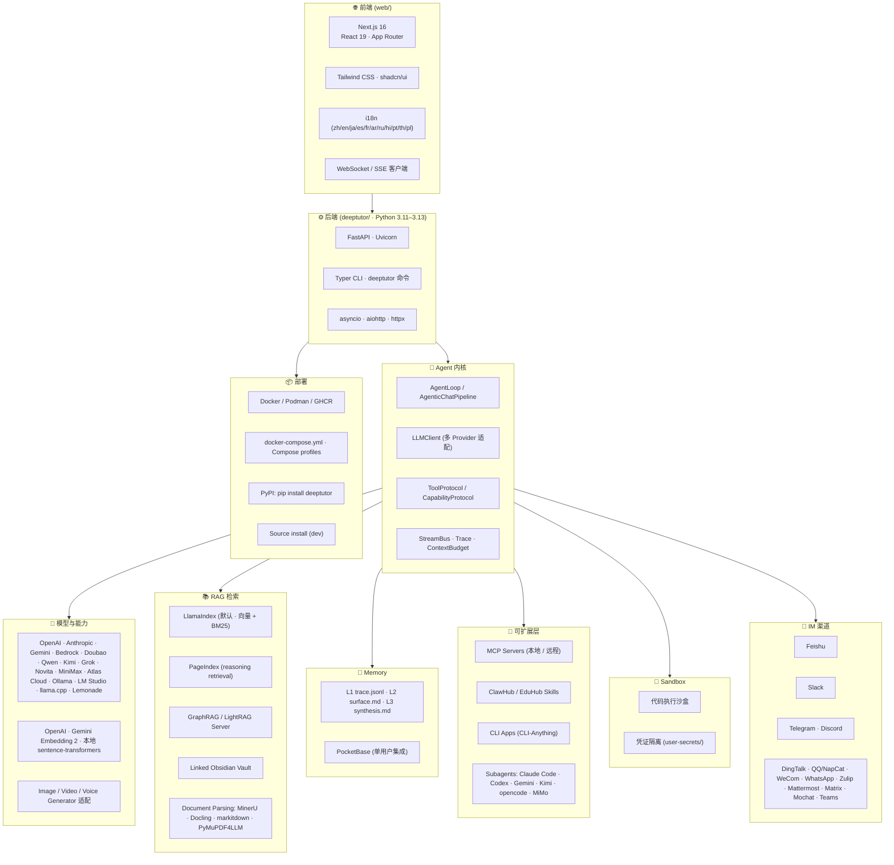

# DeepTutor 技术栈

> 本文档梳理 DeepTutor 在前后端、Agent 框架、检索、存储、部署与扩展点上的技术选型。

---

## 1. 技术栈全景图

---

## 2. 关键依赖与模块

### 2.1 前端依赖（`web/package.json`）
- **Next.js 16**（App Router · Server Components）
- **React 19** + **Tailwind CSS**
- **shadcn/ui / Radix** 组件基础
- **i18n** 多语言（10+ 语种）
- **WebSocket / SSE** 客户端消息流
- **Playwright** E2E 测试

### 2.2 后端依赖（`pyproject.toml`）
| 类别 | 包 |
| --- | --- |
| Web 框架 | `fastapi`, `uvicorn`, `pydantic`, `httpx`, `aiohttp` |
| Agent | `openai` (兼容适配), `anthropic`, `google-generativeai`, 自研 `LLMClient` |
| RAG | `llama-index`, `lightrag-haskell`, 社区 `PageIndex`, `graphrag` |
| 文档解析 | `mineru`, `docling`, `markitdown`, `pymupdf4llm` |
| 记忆 / 存储 | 自研文件分层；可选 `pocketbase-client` |
| 工具协议 | `mcp` (Model Context Protocol) |
| 数学动画 | `manim` (可选 extra `[math-animator]`) |
| IM 渠道 | `lark-oapi`, `telegram-bot`, `slack-sdk`, `matrix-nio`, 自研 schema 路由 |
| 测试 | `pytest`, `asyncio`, `pre-commit` (ruff + black) |

### 2.3 核心模块入口
- `deeptutor.app.DeepTutorApp` — 启动入口
- `deeptutor.api.main` — FastAPI 装配
- `deeptutor.runtime.orchestrator` — 调度核心
- `deeptutor.agents.chat.AgenticChatPipeline` — 主对话流水线
- `deeptutor.agents.base_agent.BaseAgent` — Agent 父类
- `deeptutor.services.llm.LLMClient` — 多 Provider 抽象
- `deeptutor.runtime.registry.tool_registry` — 工具注册中心
- `deeptutor.capabilities.registry` — Loop Capability 注册
- `deeptutor.core.tool_protocol` / `capability_protocol` — 协议层

---

## 3. 部署与分发

| 通道 | 命令 |
| --- | --- |
| **PyPI** | `pip install deeptutor` 后 `deeptutor init && deeptutor start` |
| **源码** | `git clone` → `pip install -e .` → `(cd web && npm ci --legacy-peer-deps)` → `deeptutor start --dev` |
| **Docker (GHCR)** | `docker run --rm -p 127.0.0.1:3782:3782 -v deeptutor-data:/app/data ghcr.io/hkuds/deeptutor:latest` |
| **Compose** | `compose.yaml` · `compose.codex-oauth.yaml` · `docker-compose.ghcr.yml` |
| **可选 extras** | `[dev]` `[partners]` `[matrix]` `[matrix-e2e]` `[math-animator]` |

镜像统一以 Next.js Standalone + FastAPI 单容器发布，仅对外暴露 `3782` (Web)；`8001` 可选以供 API 调试。

---

## 4. 安全与隔离

- **沙盒（Sandbox）**：用户代码执行和 CLI 工具运行在受限环境，**凭证目录与沙盒路径隔离**（OAuth token 写入 `data/system/user-secrets/<owner>/private/...`，沙盒无法读取）。
- **多用户授权**：通过 `auth.json` 开启后，Admin 通过 grants 设定每用户可用的模型 / KB / Skill / 工具。
- **MCP 工具策略**：默认 deny-by-default；非 Admin 用户需授权后才可使用高风险 MCP 工具。
- **OAuth 风险**：Codex OAuth 在远程部署通过 SSH 隧道承载回调，本地部署用临时 Docker bridge 网络；门户上的 `state` 校验在服务端完成。

---

## 5. 性能与可扩展性设计

- **异步 I/O**：FastAPI + asyncio + httpx + aiohttp；工具调度 `MAX_PARALLEL_TOOL_CALLS` 可配。
- **上下文预算**：`context_budget.ContextBudget` 控制 prompt 大小 · token 消耗 · 模型窗口。
- **Re-index 版本化**：RAG 索引以 `version-N` 目录保存，失败不会损坏旧版本。
- **Tool Indexing**：启动时通过 `DeferredToolLoader` 延迟加载重型工具，避免冷启动阻塞。
- **Standalone Next.js**：发布产物为 Next.js 独立服务，减小依赖体积。
- **Cli-Apps 缓存**：CLI App 的 usage doc 懒加载，避免每次聊天都扫描整套 SDK。

---

## 6. 兼容性矩阵

| 项目 | 版本 |
| --- | --- |
| Python | 3.11 – 3.13 (3.14+ 部分可选 RAG extras) |
| Node.js | 20+ (生产) / 22 LTS (开发) |
| 浏览器 | 现代 Evergreen 浏览器（Chrome / Edge / Safari / Firefox） |
| OS | macOS / Linux / Windows（PowerShell 脚本） |
| 容器 | Docker / Podman / rootless / read-only rootfs |
| LLM Provider | OpenAI · Anthropic · Google · Bedrock · OpenAI-兼容（Novita / Atlas / MiniMax / Lemonade / Ollama / LM Studio / llama.cpp …） |
| Embedding | OpenAI · Gemini Embedding 2 · 本地 sentence-transformers |
| TTS / STT / Image / Video | 多 Provider 适配，可任意替换 |

---

## 7. 工程实践

- **pre-commit**：`ruff` + `black` + 自定义 hook（详见 `.pre-commit-config.yaml`）
- **CI / CD**：`.github/workflows` 自动构建 GHCR 镜像、运行测试、发布 PyPI
- **测试**：`pytest` + `asyncio`（单元 / 集成） + `playwright`（E2E）
- **配置管理**：`data/user/settings/*.json|/yaml` 持久化；项目根 `.env` 不被应用读取
- **i18n**：基于 Live Editor 的运行时翻译管理（deepl + 人工）
- **SKILL.md 自描述**：`SKILL.md` 是给外部 Agent 看的握手文档（约 150 行），可被 Claude Code / Codex / OpenCode 自动识别
