# DeepTutor × OpenMAIC 集成可行性分析报告

> **报告日期**：2026-08-06
> **分析对象**：
> - [DeepTutor](https://github.com/HKUDS/DeepTutor) v1.5.9 · License **Apache-2.0** · "Lifelong Personalized Tutoring"
> - [OpenMAIC](https://github.com/THU-MAIC/OpenMAIC) v0.3.1 · License **MIT** · "Open Multi-Agent Interactive Classroom"
>
> **核心结论**：✅ **高度可行且高度互补**。DeepTutor 与 OpenMAIC **不是竞争者**，而是面向"学习"这件事的两个不同切面（**个性化辅导** vs **沉浸式课堂**）。两者的能力栈、数据流、Provider 生态互为补集，可在不破坏各自架构的前提下，通过"Skill / 嵌入式 Runtime / 共享上下文"三种粒度进行集成。

---

## 1. 为什么说"互补"

### 1.1 能力矩阵对比

| 能力维度 | DeepTutor | OpenMAIC | 互补关系 |
| --- | --- | --- | --- |
| **学习场景** | 1-on-1 个性化辅导 | 多 Agent 沉浸式课堂 | ✅ 互补 |
| **内容生成** | 题目 / 报告 / 推理 / 可视化 | 课件（幻灯片 / 测验 / 互动） | ✅ 互补 |
| **互动模式** | Chat 工具调用 | Director Graph + Action Engine | 🟡 互补（粒度不同） |
| **RAG / 知识库** | ⭐ 5 引擎（LlamaIndex / PageIndex / GraphRAG / LightRAG / Obsidian） | ❌ 弱（仅 Document Parsing） | ✅ 可补 |
| **个性化记忆** | ⭐ L1/L2/L3 三层可审计 | ❌ 无显式记忆 | ✅ 可补 |
| **学习路径** | ⭐ Mastery Path（掌握门槛） | ❌ 无显式路径 | ✅ 可补 |
| **沉浸式动画** | Manim / Visualize | ❌ | ✅ 可补 |
| **多模态课件** | ❌ | ⭐ Slides + Quiz + Interactive + PBL | ✅ 可补 |
| **白板** | ❌ | ⭐ 实时 SVG 白板 | ✅ 可补 |
| **TTS / ASR** | 🔵 基础（可挂） | ⭐ 6 个 TTS + 5 个 ASR Provider | ✅ 可补 |
| **动态电子书** | ⭐ Book（typed block） | ❌ | ➖ |
| **选区编辑** | ⭐ Co-Writer | ❌ | ➖ |
| **实时讨论** | 弱（Chat 工具调用） | ⭐ 圆桌 / Q&A / 课堂 | ✅ 可补 |
| **导出 PPTX** | ❌ | ⭐ 自研 pptxgenjs | ✅ 可补 |
| **导出 MP4** | ❌ | ⭐ render-service + Hyperframes | ✅ 可补 |
| **IM 渠道** | ⭐ 15+ 渠道（Partner） | ❌（仅 OpenClaw） | ✅ 可补 |
| **多人协作** | ⚠️ 多人隔离工作区 | ⚠️ 共享 / ACCESS_CODE | 🟡 相似 |
| **CLI / Agent-First** | ⭐ `deeptutor` CLI · NDJSON | ❌ | ✅ 可补 |
| **Subagent** | ⭐ Claude Code / Codex / Gemini / Kimi / …… | ❌ | ✅ 可补 |
| **Skill 市场** | ⭐ ClawHub / EduHub | ⭐ ClawHub（OpenClaw） | ✅ 同生态 |
| **LLM Provider** | 25+ | 16+ | ✅ 大幅重叠 |
| **多语言** | 10+ | 7 | ✅ 兼容 |

### 1.2 互补性直觉图

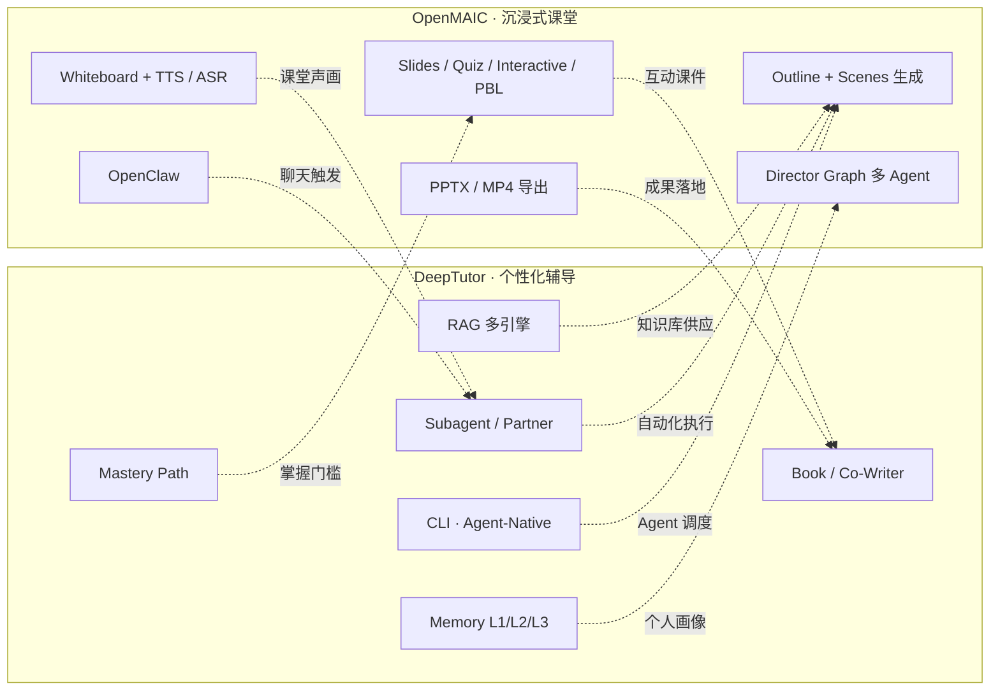

> **一句话总结**：**DeepTutor 解决"我要学什么 / 学到什么程度 / 怎么记得住"；OpenMAIC 解决"课堂怎么讲 / 怎么互动 / 怎么有趣"。**两端打通后形成"个性化沉浸式学习"完整闭环。

---

## 2. 集成可行性总览

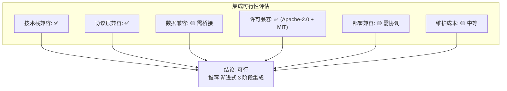

### 2.1 评估维度

| 维度 | 评估 | 备注 |
| --- | --- | --- |
| **目标一致性** | ✅ 高 | 两者均围绕"让学习更有效率" |
| **技术栈兼容** | ✅ 高 | 共同的 LLM Provider / 工具协议 / 部署选项 |
| **协议层兼容** | ✅ 高 | OpenMAIC 暴露 REST API，SaaS 模式可被任何语言调用 |
| **数据 / 状态模型** | 🟡 中 | DeepTutor 文件式 + PocketBase；OpenMAIC IndexedDB + Postgres；需桥接 |
| **许可** | ✅ 高 | Apache-2.0 + MIT 兼容（MIT 是最宽松许可之一） |
| **资源开销** | 🟡 中 | 两个应用同时运行会增加内存与启动时间 |
| **UX 一致性** | 🟡 中 | 需要在视觉语言上做收敛 |
| **维护成本** | 🟡 中 | 需长期维护桥接层与文档 |

---

## 3. 集成层次与方案

### 3.1 整体建议：三层渐进式集成

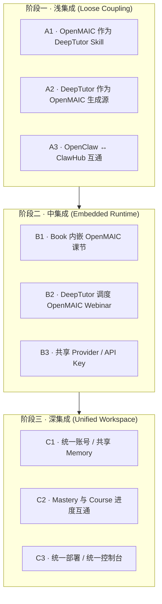

---

### 3.2 阶段一：浅集成（最小可行集成 · 2–4 周）

#### 方案 A1 · OpenMAIC 作为 DeepTutor 的 Skill / Partner

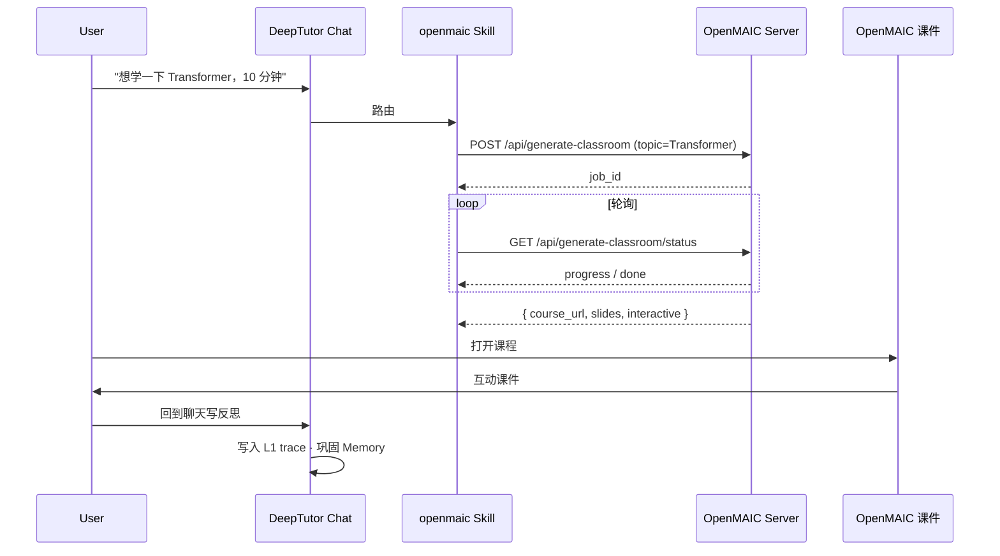

**实现要点**：
- DeepTutor 已有 `LoopCapability` 协议，仅需新增 `openmaic_classroom` Capability
- 利用 DeepTutor 的 `SKILL.md` 自描述机制（被外部 Agent 识别）
- Skill 内部调用 OpenMAIC 的 `generate-classroom` 异步端点
- 完成后把课程链接贴回 Chat 流
- 用户在 DeepTutor 中对课程提问 / 写笔记 → 落 Memory L1

**优点**：
- 不修改 OpenMAIC 任何代码
- 利用 DeepTutor 已有的 Skill 协议
- 在 2 周内可上线

#### 方案 A2 · DeepTutor 作为 OpenMAIC 课件生成源

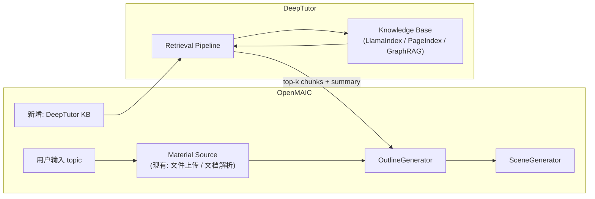

**实现要点**：
- 在 OpenMAIC `parse-pdf` / `extract-document` 之外增加 `extract-from-deeptutor-kb` 端点
- 接收 KB 名 + 主题，返回该主题的 RAG top-k chunk 摘要
- OpenMAIC 用此作为 Outline / Scene 的"事实来源"（减少幻觉）

**优点**：
- 借助 DeepTutor 的多引擎 RAG 提升 OpenMAIC 课件的事实性
- 不影响现有 OpenMAIC 流程

#### 方案 A3 · OpenClaw ↔ ClawHub 互通

- OpenMAIC 已在 ClawHub 公开 `openmaic` Skill
- DeepTutor 也在 ClawHub 上发布 `deeptutor`
- 用户的 OpenClaw 助手可以同时安装两个 skill，在聊天中分别调用
- **无需任何代码改动**，仅需文档说明交叉使用方法

---

### 3.3 阶段二：中集成（嵌入式运行 · 4–8 周）

#### 方案 B1 · DeepTutor Book 内嵌 OpenMAIC 课节

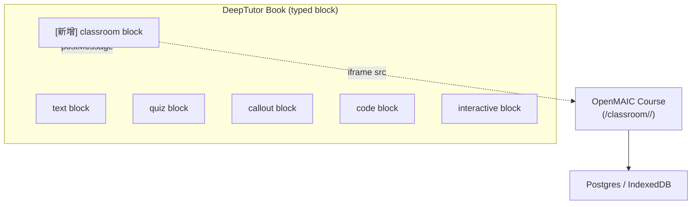

**实现要点**：
- DeepTutor Book 增加 `classroom` 块类型
- 块内嵌一个 iframe 指向 OpenMAIC 课程
- 通过 postMessage 与主 page 互动（接收用户的答题分数、回写到 DeepTutor L1 事件）
- 课程本身的 state 由 OpenMAIC 管理

**优点**：
- 用户在 Book 阅读中遇到"动手环节"直接进入 OpenMAIC 仿真
- 学习路径与互动课件在同一页面
- 不破坏任何已有架构

#### 方案 B2 · DeepTutor 调度 OpenMAIC Webinar

- 在 DeepTutor Chat 中加入 `/webinar` 命令
- 触发 OpenMAIC 的实时多 Agent 课堂模式
- DeepTutor 把来自 OpenMAIC 的 SSE 事件流转发到 Chat
- 会话 ID 同步 → 课程结束自动落 DeepTutor Memory

#### 方案 B3 · 共享 Provider / API Key

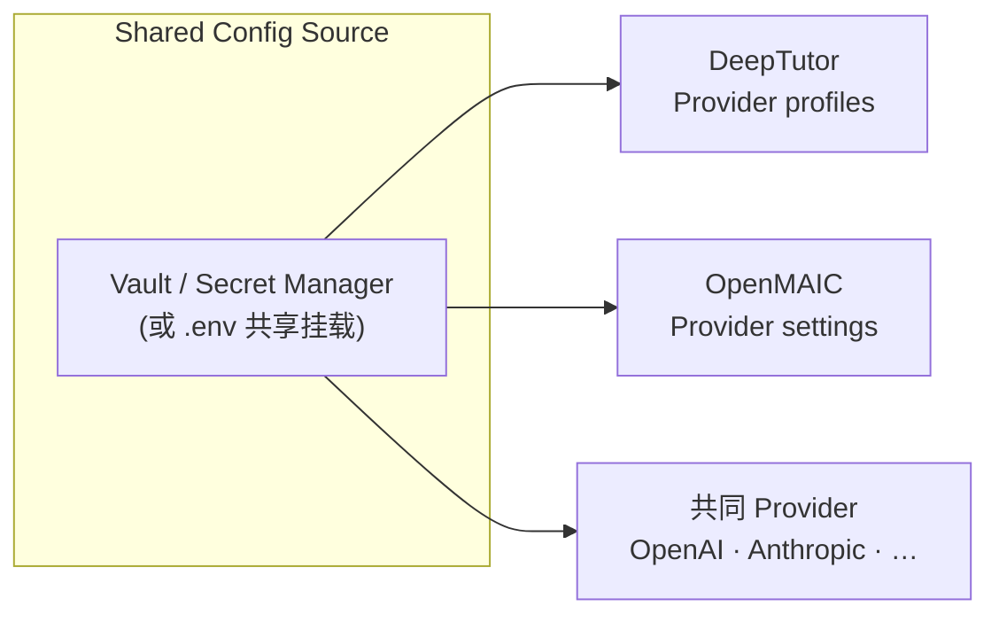

- 通过 docker-compose 把 `.env` 同时挂载给两个服务
- 或用 Vault / 1Password CLI 提供统一凭据
- DeepTutor 已有 `data/user/settings/model_catalog.json` ；OpenMAIC 已有 `server-providers.yml` —— 可开发一个轻量"配置同步器"

---

### 3.4 阶段三：深集成（统一工作区 · 8 周+）

#### 方案 C1 · 统一账号 / 共享 Memory

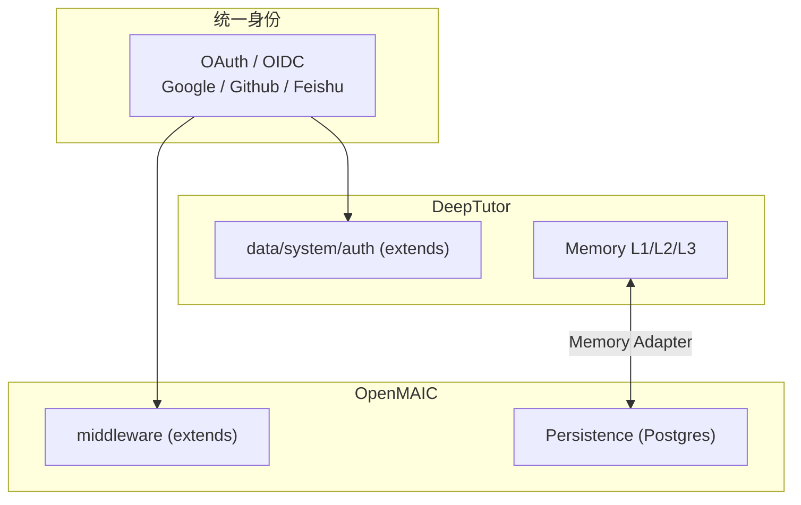

**实现要点**：
- 共同支持 OAuth / OIDC 用户体系
- 在双方服务之间建立 `Memory Adapter`：把 OpenMAIC 的"学习进度 / 答题记录 / 互动参与度"翻译成 DeepTutor 的 L1 事件
- DeepTutor 的 L2 / L3 摘要会自然反映"用户在 OpenMAIC 上的学习画像"

#### 方案 C2 · Mastery 与 Course 进度互通

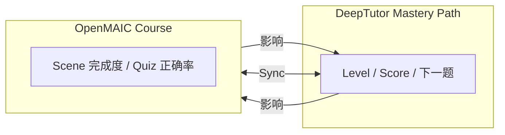

- Mastery Path 中穿插 OpenMAIC 互动课作为"门槛节点"
- 完成 OpenMAIC 课程的 Quiz → Mastery 节点达成
- DeepTutor 的"下一题"自动引用 OpenMAIC 未完成的课件

#### 方案 C3 · 统一部署 / 统一控制台

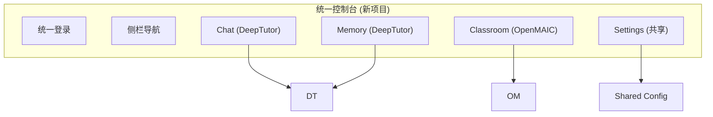

- 一个独立 Next.js Workspace，作为统一入口
- 路由 `/chat` → DeepTutor 后端；`/classroom` → OpenMAIC 后端
- 共享设置、KPI、Memory 总览

---

## 4. 关键技术约束与对策

### 4.1 鉴权 / 用户态

| 约束 | DeepTutor | OpenMAIC | 对策 |
| --- | --- | --- | --- |
| 默认鉴权 | 可选（PocketBase / 自建） | `ACCESS_CODE`（站点级） | 阶段一：保持各自鉴权；阶段三：统一 OAuth |
| 多用户 | 支持（grants 模型） | 不支持（仅共享密码） | 阶段一：OpenMAIC 单独实例；阶段二：可对接 DeepTutor 的 grants |

### 4.2 持久化

| 维度 | DeepTutor | OpenMAIC | 桥接点 |
| --- | --- | --- | --- |
| 数据位置 | `data/user/` / `data/users/<uid>/` | IndexedDB / Postgres (`server-persistence` profile) | 阶段一无需；阶段二抽象 `MemoryAdapter`；阶段三统一 |
| 课程/任务存档 | Book / KB | Classroom | 双向引用即可（无需搬迁） |

### 4.3 实时通信

- DeepTutor 已有 WS（`web/proxy.ts` 转发 `/ws/*`）
- OpenMAIC 主要靠 SSE（`/api/chat`）
- 阶段二可在 DeepTutor 中使用 EventSource / fetch + SSE 接收 OpenMAIC 事件

### 4.4 资源消耗

- DeepTutor 容器 ~1.5 GB（含 FastAPI + Next.js + RAG）
- OpenMAIC 容器 ~700 MB（纯 Node）
- 同时跑两个 ≈ 2.2 GB；可在双容器 Compose 中协调

### 4.5 部署兼容性

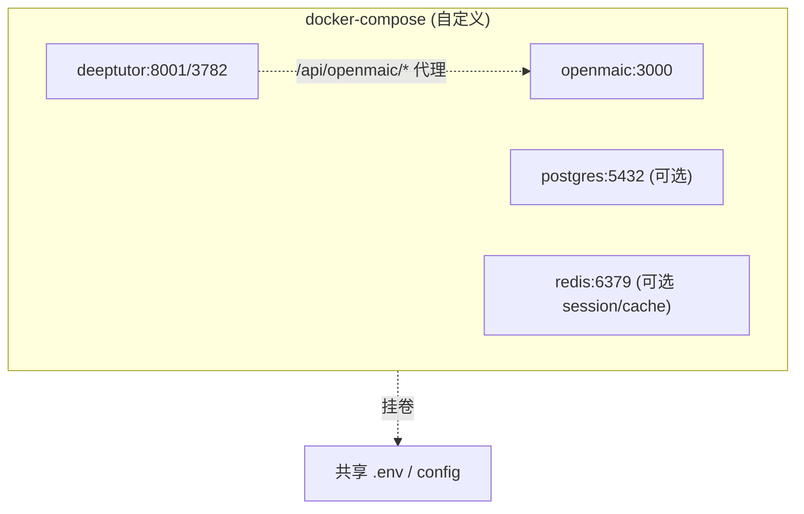

两种部署方式：
1. **同机双容器**：共享 .env、共享 Postgres
2. **分布式**：DeepTutor 调用 OpenMAIC 的公网 URL（Hosted OpenMAIC 实例）

---

## 5. 风险与缓解

| 风险 | 等级 | 缓解策略 |
| --- | --- | --- |
| 单一上游版本升级导致接口破坏 | 🟡 中 | 限制集成范围至 OpenMAIC 三个稳定端点（`generate-classroom`、`classroom`、`chat`）；版本化 API |
| 数据迁移丢失 | 🟡 中 | 阶段一/二不搬迁数据；阶段三用 lazy migration |
| 许可证冲突 | 🟢 低 | MIT + Apache-2.0 完全兼容；保留各自 NOTICE |
| UX 不一致 | 🟡 中 | 先用 iframe 隔离；阶段三统一外壳 |
| 维护人手 | 🟡 中 | 阶段一/二无需专职集成开发；阶段三需要独立小组 |
| 安全（凭证互通） | 🟡 中 | 通过 Vault / 共享挂载；不要明文 .env 同步 |

---

## 6. 推荐的实施路线图

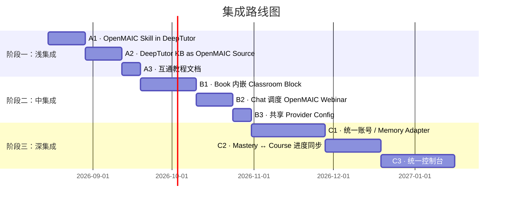

### 6.1 阶段一验收标准
- [ ] DeepTutor Chat 中调用 `openmaic` 技能可在 < 30 秒返回课程链接
- [ ] OpenMAIC Outline 阶段可读取 DeepTutor KB 内容
- [ ] 文档说明交叉使用 + 已有 issue 模板

### 6.2 阶段二验收标准
- [ ] DeepTutor Book 中嵌入 OpenMAIC 课堂可在深交互模式使用
- [ ] 两个应用共享同一组 Provider 凭据
- [ ] 双容器 Compose 一键启动

### 6.3 阶段三验收标准
- [ ] 单一 OAuth 登录后 DeepTutor 和 OpenMAIC 均为同一用户
- [ ] 用户在 OpenMAIC 完成的 Quiz 自动写入 DeepTutor Memory
- [ ] Mastery Path 把 OpenMAIC 课程作为可选节点

---

## 7. 概念交互流程（最终态）

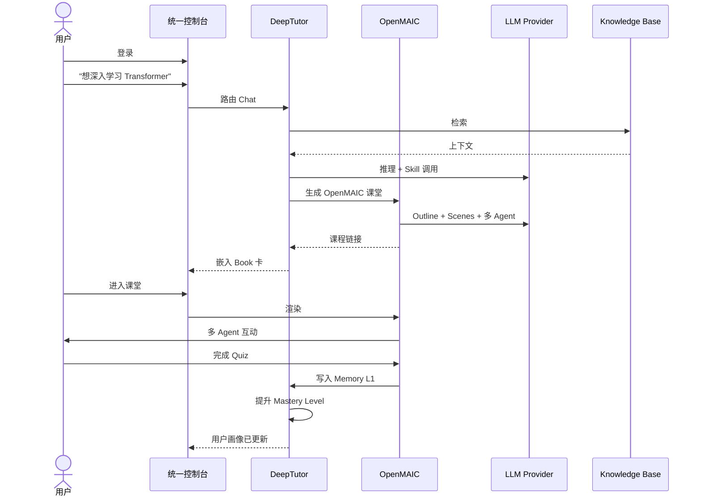

---

## 8. 结论

| 维度 | 结论 |
| --- | --- |
| **是否值得集成** | ✅ **是**。两者高度互补，集成后形成"个性化沉浸式学习"闭环 |
| **是否技术可行** | ✅ **是**。Provider、协议、协议层都兼容 |
| **集成复杂度** | 🟡 阶段一/二简单（2 人周/月），阶段三中等（需要 1 个专职小组持续维护） |
| **建议起步** | 阶段一 A1（OpenMAIC 作为 DeepTutor Skill） |
| **不建议起步** | 上马深集成（数据双向迁移 / 统一账号）—— 风险大、收益要等到用户量验证后 |

> **最终建议**：先用 **A1 方案**（OpenMAIC 作为 DeepTutor Skill）做一个 MVP，根据实际用户反馈决定是否进入阶段二。阶段三（深集成）建议等两个项目都稳定到 v2.0+ 再启动。

---

## 附录 A · 集成相关接口一览

### A.1 OpenMAIC 关键端点（均已在 v0.3.1 公开）

| 端点 | 方法 | 用途 |
| --- | --- | --- |
| `/api/generate-classroom` | POST | 异步生成课堂 |
| `/api/generate-classroom?job_id=…` | GET | 轮询状态 |
| `/api/classroom/[id]` | GET | 课程元数据 |
| `/api/chat` | POST | 多 Agent 互动（SSE） |
| `/api/parse-pdf` | POST | 文档解析 |
| `/api/persistence` | POST/GET | 服务端持久化 |
| `/classroom/[id]/` | GET | 公开课程 URL（可直接 iframe） |

### A.2 DeepTutor 关键端点

| 端点 | 方法 | 用途 |
| --- | --- | --- |
| `/api/chat` | POST/WS | Agent Loop |
| `/api/knowledge` | GET/POST | 知识库管理 |
| `/api/book` | POST | 编译 Book |
| `/api/skill` | POST | 加载 Skill |
| `/api/partner` | * | Partner 管理 |
| `/api/memory` | * | Memory 读写 |
| `deeptutor run <capability>` | CLI | Agent-Native 入口 |

### A.3 共享 Provider 列表（双方均支持）

- LLM：OpenAI · Anthropic · Google · DeepSeek · Qwen · Kimi · MiniMax · Grok · OpenRouter · Doubao · Tencent · Xiaomi · GLM · Ollama · Bedrock · Lemonade
- TTS：OpenAI · Azure · VoxCPM2 · Lemonade · MiniMax · Edge
- ASR：OpenAI · Azure · FunASR · Lemonade · Browser
- Image/Video：OpenAI · Azure · Google · MiniMax · ComfyUI · Lemonade

---

## 附录 B · 术语对照

| 概念 | DeepTutor | OpenMAIC |
| --- | --- | --- |
| 学习单元 | Chat 回合 / Session / Book 章节 | Course / Scene |
| 掌握度 | Mastery Path Level | Course Progress |
| 知识库 | Knowledge Base (KB) | （无对应，通过 Document Parsing 替代） |
| 教学风格 | Persona | SOUL / Persona |
| 多代理 | Subagent / Partner | Director Graph Agent |
| 实时互动 | Chat 工具调用 | Director Graph + Action Engine |
| 记忆 | Memory L1/L2/L3 | （无） |
| 课件导出 | 无（Markdown） | PPTX / MP4 / HTML / ZIP |
| 教学舞台 | 无 | Stage / Whiteboard |
| 评估 | Quiz / Grading | Quiz + AI 判分 |
