# DeepTutor × OpenMAIC 组件级集成分析（全新项目）

> **报告日期**：2026-08-06
> **报告定位**：不同于前一份"服务级集成"（双方作为独立服务互相调用），本文档讨论**源码级组件集成**——把两个项目的技术组件抽出来，重新组装成一个**完全新**的项目。
>
> **核心结论**：✅ **可行且收益大**。OpenMAIC 已经在 workspace 内发布了 5 个 npm 包（`@openmaic/dsl/generation/importer/renderer/storage`），是"组件化"先驱；DeepTutor 当前以单仓 FastAPI 形态发布，需要做"提取 → 打包 → 复用"三步走。整体思路是采用 **Monorepo + 双语言（Python + Node）混合架构**，把可复用组件下沉为 npm / PyPI 包，把新项目作为薄薄的"用户体验壳"。
>
> **建议项目代号**：`InnateTutor`（沿用当前目录名）。

---

## 1. 总体策略：从"两个独立应用"到"一个组件化生态"

### 1.1 三种集成路径对比

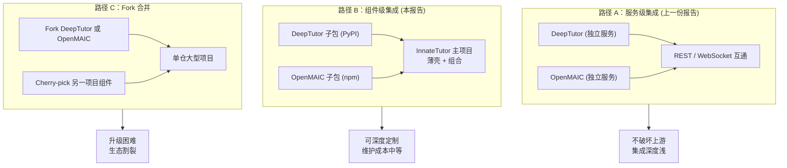

### 1.2 推荐路径：**路径 B（组件级集成）**

理由：
- 沿用 OpenMAIC 已经建立的 npm 包边界（DSL / Generation / Storage / Importer / Renderer）
- 对 DeepTutor 做精准"提取 + 包装"，发布为独立 PyPI 包
- 新项目只是一个**主进程 + 装配器**，组合两侧组件
- 上游两个项目可以各自持续演进，新项目可以渐进式升级

---

## 2. 组件可复用性盘点

### 2.1 OpenMAIC — 五个已发布 npm 包（开箱即用）

| 包名 | 当前版本 | 内部路径 | 暴露能力 |
| --- | --- | --- | --- |
| `@openmaic/dsl` | 0.6.2 | `packages/@openmaic/dsl/src` | 课件 DSL（schema / stage / slides / action / runtime / guards / validate） |
| `@openmaic/generation` | 待核 | `packages/@openmaic/generation/src` | Outline + Scene 生成 pipeline、prompt 模板 |
| `@openmaic/storage` | 待核 | `packages/@openmaic/storage/src` | RuntimeStore / DocumentStore HTTP 合约 |
| `@openmaic/importer` | 待核 | `packages/@openmaic/importer/src` | 从外部资源导入课件 |
| `@openmaic/renderer` | 待核 | `packages/@openmaic/renderer/src` | 场景渲染器（与 Web 端解耦） |

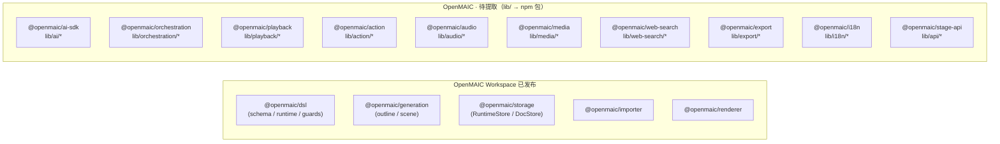

### 2.2 DeepTutor — `deeptutor/` 子包（需提取 + 打包）

| 候选包名 | 内部路径 | 主要内容 | 提取难度 |
| --- | --- | --- | --- |
| `deeptutor-core` | `core/` | agentic / tool_protocol / capability_protocol / stream_bus / trace / context | 🟡 中 |
| `deeptutor-llm` | `services/llm/` | 多 Provider LLM 客户端 + 上下文窗口 + reasoning | 🟡 中 |
| `deeptutor-rag` | `services/rag/` + `services/embedding/` + `services/parsing/` | 多引擎 RAG（LlamaIndex / PageIndex / GraphRAG / LightRAG / Obsidian） | 🟠 高 |
| `deeptutor-memory` | `services/memory/` | L1/L2/L3 + Memory Graph | 🟢 低 |
| `deeptutor-skill` | `services/skill/` + `services/mcp/` | Skill + MCP client | 🟢 低 |
| `deeptutor-knowledge` | `knowledge/` | KB 管理 / 命名 / 进度 / Manifest | 🟡 中 |
| `deeptutor-learning` | `learning/` | Mastery Path / 评分 / 调度 | 🟢 低 |
| `deeptutor-book` | `book/` | 电子书引擎 | 🟡 中 |
| `deeptutor-cowriter` | `co_writer/` | 选区编辑 | 🟢 低 |
| `deeptutor-partner` | `services/partner/` + `services/cli_apps/` | IM 渠道 + CLI Apps | 🟠 高 |
| `deeptutor-runtime` | `runtime/` | 编排 / tool registry / provider view | 🟠 高 |
| `deeptutor-agents` | `agents/` | base_agent + chat / research / question / notebook / visualize / math_animator / vision_solver | 🟠 高 |
| `deeptutor-i18n` | `i18n/` | 翻译 | 🟢 低 |
| `deeptutor-protocol` | `core/tool_protocol.py` + `core/capability_protocol.py` | 协议层（纯类型，可作 dep） | 🟢 低 |

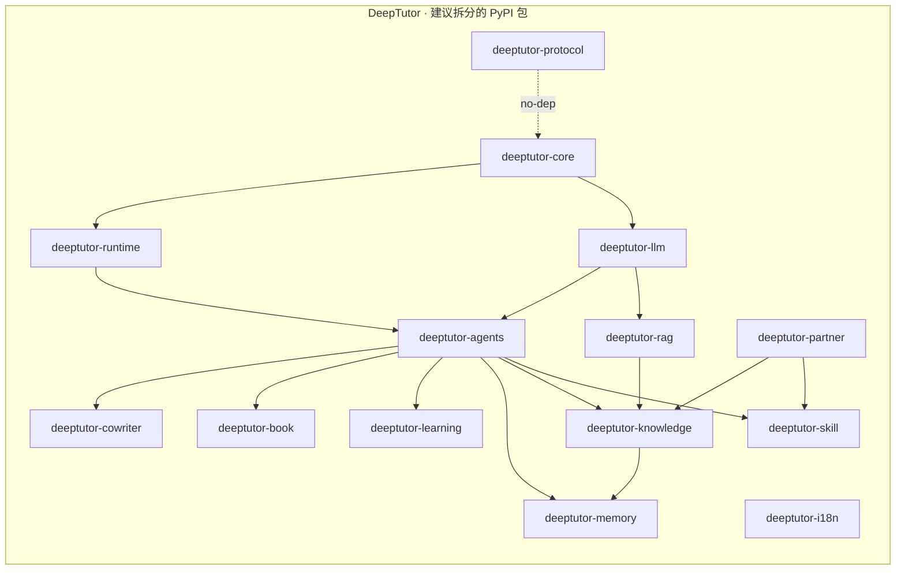

### 2.3 不可复用 / 需重写的部分

| 来源 | 不可复用部分 | 原因 |
| --- | --- | --- |
| OpenMAIC | `app/`（Next.js App Router） | 路由与 UI 高度定制 |
| OpenMAIC | `components/`（slide-renderer / scene-renderers / whiteboard） | 强耦合 OpenMAIC Stage API |
| OpenMAIC | `lib/store/`（Zustand stores） | 与特定 UI 流程绑定 |
| OpenMAIC | `lib/hooks/` | 通过 Stage API 间接耦合 |
| DeepTutor | `web/`（Next.js App Router） | 路由 / Context / i18n 高耦合 |
| DeepTutor | `deeptutor_cli/` | 单一入口 |
| DeepTutor | `multi_user/` | 文件系统布局强耦合 |
| DeepTutor | `deeptutor/api/routers/*` | 路由层 |

---

## 3. 新项目架构（InnateTutor）

### 3.1 顶层架构

```mermaid
flowchart TB
  subgraph Consumer["🎨 消费层 · The Application Shell"]
    UI["Next.js UI (App Router)<br/>InnateTutor Frontend"]
    BFF["BFF (Node.js)<br/>路由编排 / 鉴权 / 权限"]
  end

  subgraph Composite["🧩 业务装配层 (InnateTutor 自身编写的层)"]
    TutorSvc["TutorService<br/>Mastery Path / 1-on-1 辅导"]
    ClassroomSvc["ClassroomService<br/>Live 课堂 / 教学编排"]
    ContentSvc["ContentService<br/>Book / Co-Writer / Quiz"]
    AgentSvc["AgentService<br/>统一 Agent 接入口"]
  end

  subgraph Compile["📦 编译时 / 运行时依赖"]
    subgraph DTPkg["DeepTutor 拆分包 (PyPI)"]
      DTCore["deeptutor-core"]
      DTLLM["deeptutor-llm"]
      DTRAG["deeptutor-rag"]
      DTMem["deeptutor-memory"]
      DTSkill["deeptutor-skill"]
      DTLearn["deeptutor-learning"]
      DTBook["deeptutor-book"]
      DTCW["deeptutor-cowriter"]
    end
    subgraph OMPkg["OpenMAIC 拆分包 (npm)"]
      OMDSL["@openmaic/dsl"]
      OMGen["@openmaic/generation"]
      OMAI["@openmaic/ai-sdk"]
      OMOrch["@openmaic/orchestration"]
      OMPlay["@openmaic/playback"]
      OMAct["@openmaic/action"]
      OMAud["@openmaic/audio"]
      OMMed["@openmaic/media"]
      OMWS["@openmaic/web-search"]
      OMExp["@openmaic/export"]
      OMI18N["@openmaic/i18n"]
      OMStage["@openmaic/stage-api"]
      OMStore["@openmaic/storage"]
    end
  end

  subgraph Runtime["🤖 运行时基础设施"]
    PyRuntime["Python Service (FastAPI)<br/>封装 deeptutor-* 包"]
    NodeRuntime["Node Service (可选)<br/>封装 OpenMAIC 高级能力"]
    LSP["LangGraph Studio / Studio"]
  end

  subgraph Ext["🌐 外部"]
    LLM["LLM Providers"]
    Storage["Postgres / Redis / S3"]
    Idx["向量库 / RAG"]
  end

  UI --> BFF
  BFF --> TutorSvc
  BFF --> ClassroomSvc
  BFF --> ContentSvc
  BFF --> AgentSvc
  TutorSvc --> DTCore
  TutorSvc --> DTLearn
  TutorSvc --> DTLLM
  TutorSvc --> DTMem
  TutorSvc --> DTSkill
  ClassroomSvc --> OMDSL
  ClassroomSvc --> OMGen
  ClassroomSvc --> OMOrch
  ClassroomSvc --> OMPlay
  ClassroomSvc --> OMAct
  ClassroomSvc --> OMAI
  ContentSvc --> DTBook
  ContentSvc --> DTCW
  ContentSvc --> OMExp
  ContentSvc --> OMAud
  ContentSvc --> OMMed
  AgentSvc --> DTRAG
  AgentSvc --> OMWS
  AgentSvc --> OMAI
  AgentSvc --> DTLLM
  BFF --> PyRuntime
  BFF --> NodeRuntime
  PyRuntime --> DTPkg
  NodeRuntime --> OMPkg
  PyRuntime --> LLM
  NodeRuntime --> LLM
  PyRuntime --> Storage
  NodeRuntime --> Storage
  PyRuntime --> Idx
```

### 3.2 仓库结构

```
innate-tutor/                       # 项目根
├── pyproject.toml                  # Python 工作区 (uv / poetry)
├── package.json                    # Node 工作区 (pnpm)
├── pnpm-workspace.yaml
├── README.md
├── apps/
│   ├── web/                        # Next.js (主前端)
│   │   ├── app/
│   │   ├── components/
│   │   │   ├── chat/               # 自己写
│   │   │   ├── classroom/          # 自己写
│   │   │   ├── book/
│   │   │   └── ui/                 # shadcn / Radix
│   │   ├── hooks/
│   │   ├── lib/                    # BFF 调用 / 客户端 SDK
│   │   └── styles/
│   └── docs/                       # Storybook / Docusaurus
├── services/
│   ├── python-bff/                 # FastAPI · 封装 deeptutor-* 包
│   │   └── main.py
│   └── node-bff/                   # 可选 · 封装 @openmaic/* 高级能力
│       └── main.ts
├── packages/                       # 自研 npm 包
│   ├── @innate-tutor/              # 业务接口门面
│   ├── @innate-tutor-ui/           # UI 组件
│   ├── @innate-tutor-sdk/          # 客户端 SDK
│   └── @innate-tutor-config/       # 共享配置
├── libs/                           # 内部 Python 库（可发布为 PyPI）
│   ├── tutor-core/                 # 业务核心逻辑
│   ├── classroom-orchestrator/     # 多 Agent 编排（基于 OpenMAIC）
│   ├── tutor-rag/                  # 知识库（基于 DeepTutor）
│   ├── tutor-memory/               # L1/L2/L3（基于 DeepTutor）
│   └── tutor-export/               # PPTX/HTML 导出（基于 OpenMAIC）
├── infra/
│   ├── docker/                     # Dockerfile(s)
│   ├── compose/                    # docker-compose.yml
│   ├── helm/                       # K8s Helm chart
│   └── terraform/                  # 基础设施
├── tests/
│   ├── unit/
│   ├── integration/
│   └── e2e/
├── pyproject.toml
└── package.json
```

### 3.3 部署形态

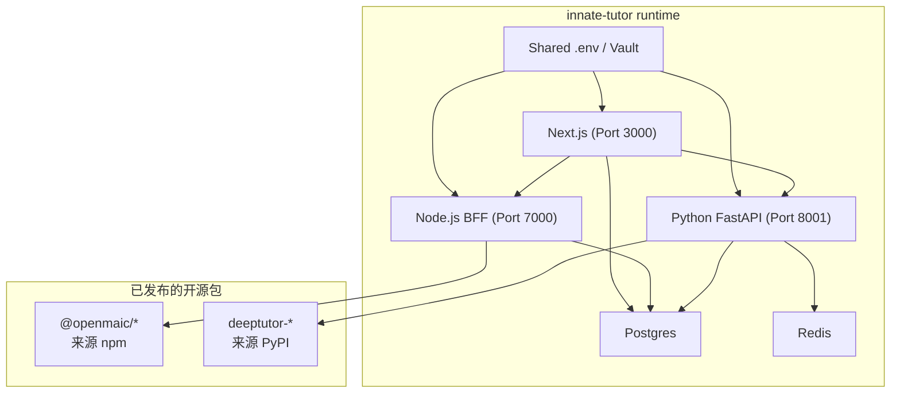

---

## 4. 核心抽象层设计

### 4.1 统一 Agent 接口

两个项目最大的差异是"Agent 抽象"：DeepTutor 用 `LoopCapability` + Python class；OpenMAIC 用 LangGraph `Director Graph`。新项目需要一个**统一 Agent 接口**：

```typescript
// packages/@innate-tutor/agent/src/types.ts
export interface UnifiedAgent {
  /** 唯一标识 */
  readonly id: string;
  /** 展示名 */
  readonly name: string;
  /** 所属 capabilities（可挂多个） */
  readonly capabilities: Capability[];

  /** 用户输入 → 决策/动作 */
  think(ctx: AgentContext): Promise<Decision>;

  /** 执行动作（python: tool_calls, node: action） */
  act(decision: Decision, ctx: AgentContext): Promise<ActionResult>;

  /** 关闭 / 资源回收 */
  close(): Promise<void>;
}

export interface AgentContext {
  /** 当前会话 / 课程 / 任务 */
  session: SessionId;
  /** 上一轮记忆 */
  memory: MemoryLayer;  // L1/L2/L3
  /** 可用工具 / 动作 */
  tools: ToolRegistry;
  /** 终止判断 */
  shouldContinue: () => boolean;
  /** 流式输出 */
  stream: StreamSink;
}
```

**两种实现**：
- `PythonAgentAdapter`：内部委托给 `deeptutor-core/AgentLoop`
- `LangGraphAgentAdapter`：内部委托给 `@openmaic/orchestration/Agent`

### 4.2 统一内容模型

```typescript
// packages/@innate-tutor/sdk/src/content.ts
export type ContentNode =
  | TextNode
  | QuizNode
  | InteractiveNode  // OpenMAIC DSL
  | RAGNode          // DeepTutor KB
  | WhiteboardNode
  | CodeNode
  | VideoNode
  | AnimationNode    // DeepTutor MathAnimator
  | BookChapter;     // DeepTutor Book block

export interface Document {
  id: string;
  source: 'openmaic' | 'deeptutor' | 'native';
  nodes: ContentNode[];
  metadata: Record<string, unknown>;
}
```

### 4.3 统一记忆模型

```typescript
// packages/@innate-tutor/sdk/src/memory.ts
export interface MemoryLayer {
  /** L1: 原始事件 */
  l1: MemoryEvent[];
  /** L2: 场景摘要 */
  l2: Map<string, string>;  // surface -> summary
  /** L3: 跨场景合成 */
  l3: Map<string, string>;  // profile/recent/scope/preferences
  /** 引用链（用于审计） */
  citations: CitationGraph;
}
```

### 4.4 统一 Provider 抽象

```typescript
// packages/@innate-tutor/sdk/src/providers.ts
export interface ILlmProvider {
  chat(req: ChatRequest): Promise<ChatResponse>;
  stream?(req: ChatRequest): AsyncIterable<StreamChunk>;
  embed?(input: string[]): Promise<number[][]>;
  reasoning?(): ReasoningConfig;
}

export interface ITtsProvider {
  synthesis(text: string, opts: VoiceOptions): Promise<AudioBuffer>;
  voiceList?(): Promise<Voice[]>;
}

export interface IAsrProvider {
  transcribe(audio: AudioBuffer | Blob): Promise<Transcript>;
}
```

> 这一层由 OpenMAIC `@openmaic/ai-sdk` + DeepTutor `deeptutor-llm` 共同支撑。新项目在它们之上做"二级包装"。

---

## 5. 实施路线图

### 5.1 阶段化实施计划

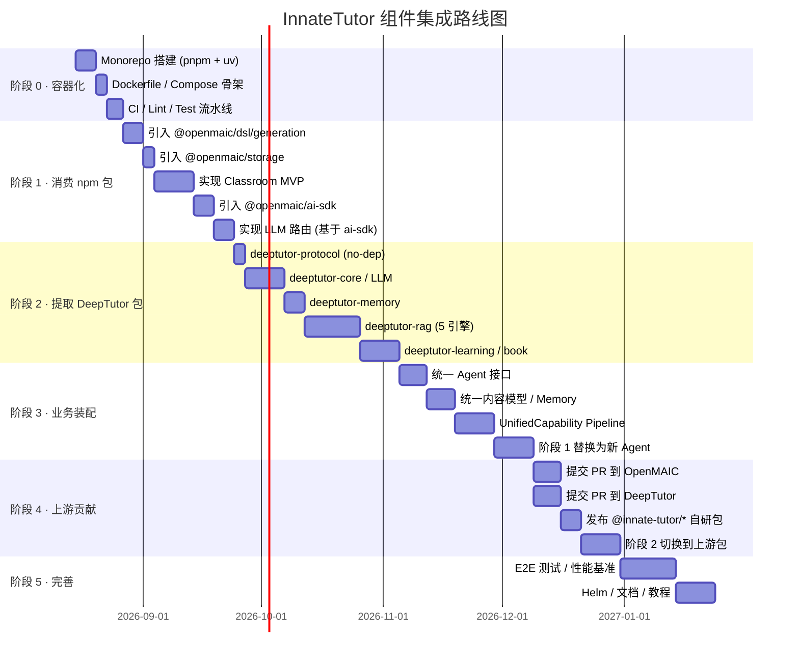

### 5.2 阶段 0 — 容器化（1 周）

目标：搭建 monorepo 并跑通"空壳 Next.js + FastAPI"。

```bash
# 1. 创建工作区
mkdir innate-tutor && cd innate-tutor
pnpm init
pnpm dlx create-next-app apps/web

# 2. Python 后端骨架
uv init services/python-bff
cd services/python-bff
uv add fastapi uvicorn

# 3. docker-compose
docker compose up
```

### 5.3 阶段 1 — 消费 OpenMAIC npm 包（3 周）

直接 `pnpm add` 五个已开源包：

```json
{
  "dependencies": {
    "@openmaic/dsl": "^0.6.2",
    "@openmaic/generation": "^0.x",
    "@openmaic/storage": "^0.x",
    "@openmaic/importer": "^0.x",
    "@openmaic/renderer": "^0.x"
  }
}
```

**MVP 目标**：用 OpenMAIC 组件实现一个"课程生成 → 播放"完整流程，验证组件可用性。

### 5.4 阶段 2 — 提取 DeepTutor 包（4–6 周）

对 DeepTutor 关键目录做"提取 → 拆依赖 → 打包"三步走。

#### 5.4.1 拆包策略

**Step 1 · 识别边界依赖**

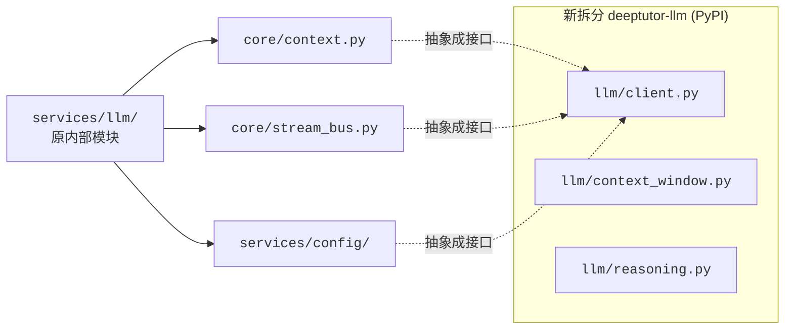

**Step 2 · 引入反转依赖**

```python
# deeptutor-core (新包) — 接口定义
from typing import Protocol

class StreamBus(Protocol):
    async def publish(self, event: Event) -> None: ...

class UsageTracker(Protocol):
    def record(self, tokens: int) -> None: ...

# deeptutor-llm (新包) — 依赖接口
from deeptutor_core import StreamBus, UsageTracker

class LLMClient:
    def __init__(self, bus: StreamBus, tracker: UsageTracker):
        self._bus = bus
        self._tracker = tracker
    ...
```

**Step 3 · 发布到 PyPI**

```toml
# pyproject.toml · deeptutor-llm
[project]
name = "deeptutor-llm"
version = "0.1.0"
dependencies = [
    "deeptutor-protocol>=0.1",
    "openai>=1.0",
    "anthropic>=0.20",
    "google-generativeai>=0.5",
]

[project.optional-dependencies]
dev = ["pytest", "pytest-asyncio", "ruff"]
```

#### 5.4.2 关键包的提取顺序

```mermaid
flowchart LR
  P0["deeptutor-protocol<br/>(协议层)"] --> P1
  P1["deeptutor-core<br/>(核心流)"] --> P2
  P2["deeptutor-llm<br/>(多 Provider)"] --> P3
  P3["deeptutor-memory<br/>(L1/L2/L3)"] --> P4
  P4["deeptutor-skill<br/>(Skill + MCP)"] --> P5
  P5["deeptutor-knowledge<br/>(KB 管理)"] --> P6
  P6["deeptutor-learning<br/>(Mastery Path)"] --> P7
  P7["deeptutor-rag<br/>(5 引擎)"] --> P8
  P8["deeptutor-book<br/>(电子书)"] --> P9
  P9["deeptutor-cowriter<br/>(选区编辑)"]
```

### 5.5 阶段 3 — 业务装配（3–4 周）

实现 `InnateTutor` 自身的"装配层"：

```typescript
// packages/@innate-tutor/agent/src/tutor-capability.ts
import { LoopCapability } from 'deeptutor-core';
import { DirectorGraph, Agent } from '@openmaic/orchestration';

export class TutorCapability implements LoopCapability {
  name = 'tutor';
  
  // 内部用 OpenMAIC Director Graph 做"AI 教师"
  async buildTeacher(): Promise<Agent> {
    return new DirectorGraph({
      nodes: [/* 编排 */],
      tools: ['ask_question', 'explain', 'quiz'],
    });
  }
  
  // 同时使用 DeepTutor Mastery Path 决定下一步
  async decideNext(session: Session): Promise<MasteryStep> {
    return new MasteryPath().nextStep(session);
  }
}
```

### 5.6 阶段 4 — 上游贡献（2 周）

向 OpenMAIC 仓库提交 PR：建议抽取 `lib/ai`、`lib/orchestration`、`lib/audio` 等为新的 npm 包（沿用现有 `@openmaic/*` 命名）。

向 DeepTutor 仓库提交 PR：建议拆分 `core/`、`services/llm/`、`services/rag/` 等为独立 PyPI 包。

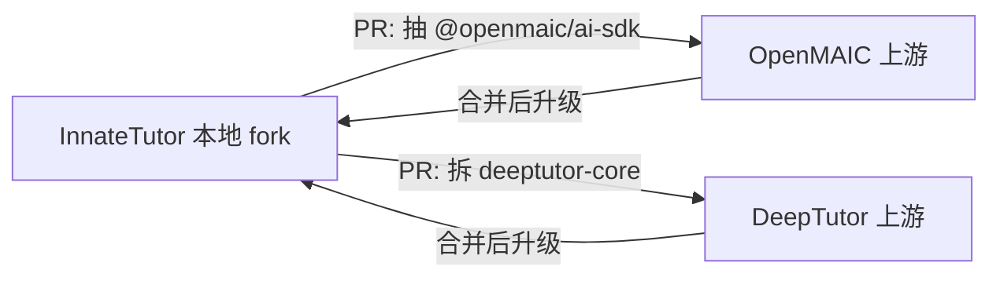

### 5.7 阶段 5 — 完善（4 周）

- 全量 E2E 测试（Playwright + pytest）
- 性能基准（启动时间 / 课件生成延迟 / Memory 查询性能）
- Helm Chart / Terraform
- 文档站点 / 教程

---

## 6. 关键技术决策

### 6.1 决策矩阵

| 决策项 | 选项 A | 选项 B | 选项 C | 推荐 |
| --- | --- | --- | --- | --- |
| 单一语言 | 全 Node (重写 DeepTutor) | 全 Python (重写 OpenMAIC) | 双语言（推荐） | **C** |
| 状态管理 | 客户端 (IndexedDB) | 服务端 (Postgres) | 混合 | **C** |
| 鉴权 | OAuth | ACCESS_CODE | JWT + 多角色 | **C** |
| 持久化 | Postgres | MongoDB | 文件 + DB | **C** |
| Agent 编排 | DeepTutor Loop | OpenMAIC Director Graph | 统一抽象 | **C** |
| 渲染 | 服务端渲染 | 客户端渲染 | 混合 | **C** |
| 包管理 | pnpm | npm | yarn | **A** |
| Python 管理 | uv | pip | poetry | **A** |
| 部署 | Docker | Vercel | K8s | **C** |

### 6.2 双语言架构的取舍

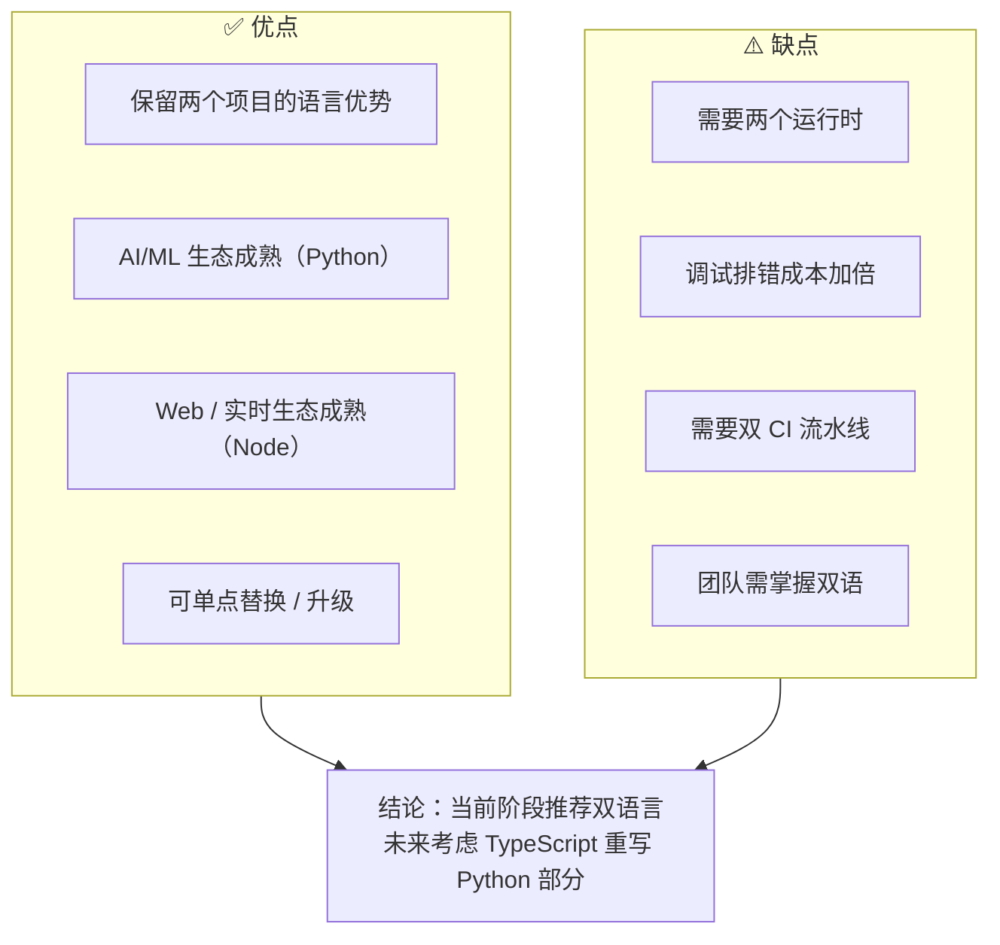

**双语言边界**：
- **Python 服务**：RAG / Agent Loop / Memory / Mastery Path / Book 引擎
- **Node 服务**：DSL / Generation / Playback / Action / TTS / ASR / Stage API / UI
- **统一接口**：BFF 用 TypeScript 编排

### 6.3 客户端 / 服务端边界

| 能力 | 客户端 | 服务端 |
| --- | --- | --- |
| PPTX / HTML 导出 | ✅（拟合导出） | ❌ |
| 流式课件生成 | ❌ | ✅ |
| 实时 Agent 互动 | ✅（消费 SSE） | ✅（产生 SSE） |
| Memory 写入 | ❌ | ✅ |
| RAG 检索 | ❌ | ✅ |
| Skill 安装 | ❌ | ✅ |

---

## 7. 风险与对策

| 风险 | 等级 | 缓解策略 |
| --- | --- | --- |
| 上游包版本破坏性更新 | 🟠 高 | 锁版本号；为关键包做 fork 镜像 |
| 提取过程中丢功能 | 🟡 中 | 每个包都跑 e2e + 单元测试；与上游同步测试 |
| 双语言调试难 | 🟡 中 | 集中接入 OpenTelemetry；统一 trace ID |
| 团队双语能力 | 🟡 中 | 培训 / 文档先行 |
| 上游不接受 PR | 🟡 中 | 保留 fork；阶段性合并 |
| 单一上游不再维护 | 🟢 低 | 自身已成为独立生态 |
| 包依赖膨胀 | 🟡 中 | 暴露可选依赖；按需 `extras_require` |

---

## 8. 数据迁移与互操作

### 8.1 三层桥接器

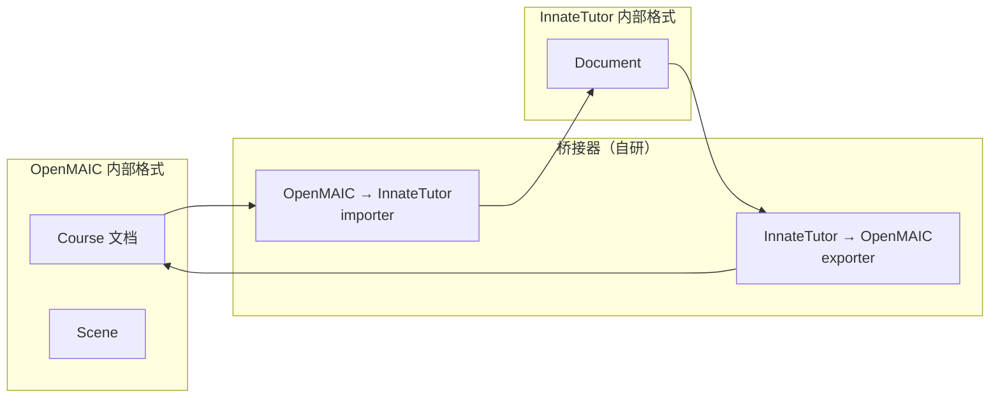

桥接器实现在 `packages/@innate-tutor/sdk/src/bridges/`：

```typescript
// bridges/openmaic.ts
export function fromOpenMaicCourse(course: OpenMAIC.Course): InnateTutor.Document {
  return {
    id: course.id,
    source: 'openmaic',
    nodes: course.scenes.map(sceneToNode),
    metadata: { ...course.metadata, adapted: 'v0.3.1' },
  };
}
```

### 8.2 DeepTutor 桥接

```python
# libs/tutor-core/src/bridges/deeptutor.py
from deeptutor_book import Book as DTBook
from innate_tutor_sdk import Document

def from_deeptutor_book(book: DTBook) -> Document:
    return Document(
        id=book.id,
        source='deeptutor',
        nodes=[block_to_node(b) for b in book.blocks],
        metadata=book.metadata,
    )
```

---

## 9. 上游贡献策略（推荐）

### 9.1 三个原则

1. **不破坏上游**：所有 PR 必须能向后兼容
2. **先本地使用**：在 InnateTutor 中跑通再提 PR
3. **小步快跑**：每个包一个 PR，避免巨型 PR

### 9.2 推荐的 PR 顺序

| 顺序 | 目标仓库 | 内容 | 价值 |
| --- | --- | --- | --- |
| 1 | OpenMAIC | 抽取 `lib/ai` → `@openmaic/ai-sdk` | 中（已有命名规范） |
| 2 | OpenMAIC | 抽取 `lib/audio` → `@openmaic/audio` | 中 |
| 3 | OpenMAIC | 抽取 `lib/orchestration` → `@openmaic/orchestration` | 高（核心） |
| 4 | DeepTutor | 拆分 `core/` → `deeptutor-core` | 高（核心） |
| 5 | DeepTutor | 拆分 `services/llm` → `deeptutor-llm` | 中 |
| 6 | DeepTutor | 拆分 `services/rag` → `deeptutor-rag` | 高（核心） |
| 7 | DeepTutor | 拆分 `services/memory` → `deeptutor-memory` | 中 |

### 9.3 改名 vs 沿用

- **OpenMAIC**：沿用 `@openmaic/*` 命名 → 新增 `@openmaic/ai-sdk`、`@openmaic/orchestration` …
- **DeepTutor**：建议 PyPI 沿用 `deeptutor-*` 命名 → `deeptutor-core`、`deeptutor-llm`、`deeptutor-rag` …

---

## 10. 验收标准

### 10.1 阶段 1 验收（3 周）
- [ ] `pnpm dev` 启动 Next.js + FastAPI（无错误）
- [ ] 用户能在 InnateTutor 界面输入主题 → 生成 OpenMAIC 课堂
- [ ] 课程可播放、可导出 PPTX
- [ ] Memory 在 Chat 中可写可读

### 10.2 阶段 2 验收（10 周）
- [ ] `deeptutor-core/llm/rag/memory` 五个包已发布到 PyPI
- [ ] 上游相关 PR 已合并
- [ ] InnateTutor 全量功能跑通

### 10.3 阶段 3 验收（14 周）
- [ ] 统一 Agent 接口已实现
- [ ] 切换 Agent 底层实现（DeepTutor Loop / OpenMAIC Director）无需改 UI
- [ ] 已有 50+ Markdown 文档 / 5 段上手教程

### 10.4 阶段 4 验收（16 周）
- [ ] 上游贡献 6+ PR 合并
- [ ] `InnateTutor` 自身发布 3+ npm 包
- [ ] 双语言 CI 跑通

### 10.5 阶段 5 验收（20 周）
- [ ] E2E / 性能基准达标
- [ ] Helm / Terraform 就绪
- [ ] 文档站点上线

---

## 11. 总结

| 维度 | 结论 |
| --- | --- |
| **是否可行** | ✅ **完全可行** |
| **核心思路** | Monorepo + 双语言 + 组件下沉为 npm/PyPI 包 |
| **起步建议** | 阶段 1 — 直接 `pnpm add @openmaic/*`，跑通最小闭环 |
| **后续路径** | 阶段 2-3 系统性拆分 DeepTutor 包 + 引入协议层 |
| **战略价值** | "InnateTutor" 既是产品，也是上游两个项目的"用户级反馈场" |
| **终极目标** | 三个项目维持独立运行时，但共享一个"组件生态" |

> **最终建议**：如果团队有 3-5 人专门的工程力量，可立刻启动该方案；如果是 1-2 人兼职，建议先做 **阶段 1（消费 OpenMAIC npm 包）+ 阶段 2 的"deeptutor-protocol"** 两个最小动作，验证收益后再扩展。

---

## 附录 A · 建议的新项目技术栈

### A.1 运行时
- **Node.js 20+**（Next.js / BFF / OpenMAIC 子包）
- **Python 3.11–3.13**（DeepTutor 子包）
- **Postgres 16**（持久化）
- **Redis 7**（缓存 / Session）
- **可选**：MinIO（S3 兼容）/ FaissDB（向量）/ Tigris（图）

### A.2 框架
- **Next.js 16**（App Router）
- **FastAPI**（Python BFF）
- **LangGraph 1.1**（Director Graph）
- **Zustand 5**（客户端状态）
- **shadcn/ui + Radix**（UI 基础）

### A.3 关键包
- `@openmaic/{dsl,generation,storage,importer,renderer}`（OpenMAIC 已发布）
- `deeptutor-{core,llm,rag,memory,learning,book,cowriter,skill}`（待发布）
- `@innate-tutor/{agent,sdk,ui,config}`（自研）

### A.4 工具
- **包管理**：pnpm（Node）+ uv（Python）
- **测试**：Vitest + Playwright + pytest
- **CI**：GitHub Actions（lint + unit + e2e + 镜像构建）
- **可观测**：OpenTelemetry + Sentry + Grafana
- **IaC**：Helm + Terraform（可选）

---

## 附录 B · 与"服务级集成"对比

| 维度 | 服务级集成（上一份报告） | 组件级集成（本文） |
| --- | --- | --- |
| 集成深度 | 🟡 浅（API 调用） | 🟢 深（源码复用） |
| 上游版本影响 | 🟢 低（各自独立） | 🟡 中（需关注升级） |
| 部署复杂度 | 🟡 中（双服务） | 🟠 高（双运行时 + monorepo） |
| 启动门槛 | 🟢 低（2 周） | 🟠 高（10-20 周） |
| 长期收益 | 🟡 中 | 🟢 高（掌握组件生态） |
| 维护成本 | 🟢 低 | 🟡 中 |
| 适合规模 | 单团队试验 | 长期产品路线 |

> **建议**：先用服务级集成验证用户需求；产品方向确定后，再切换到组件级集成。
