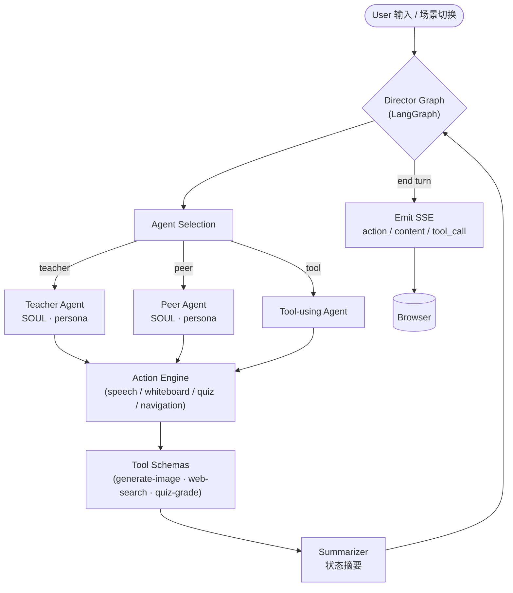
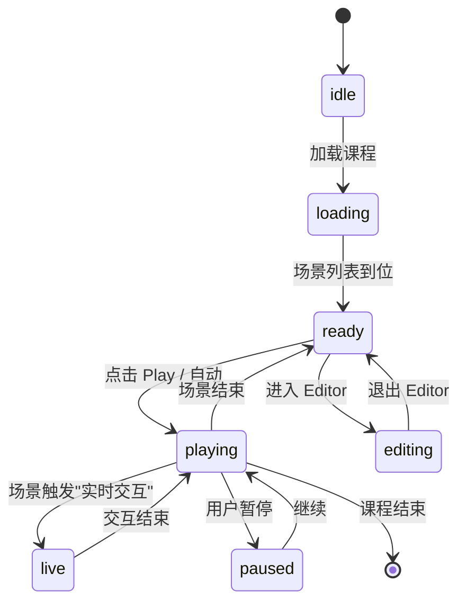
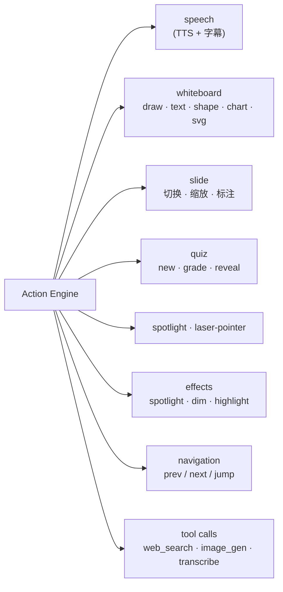
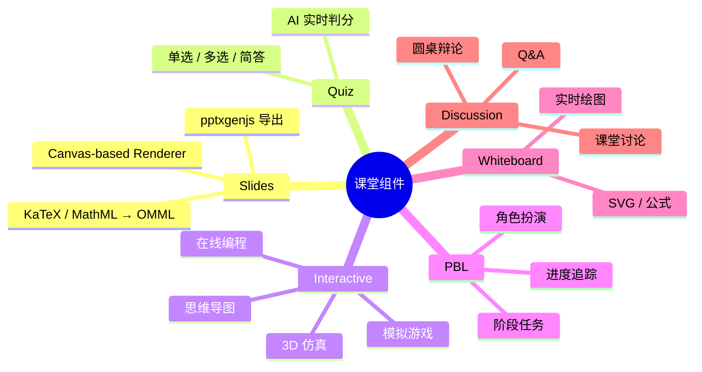
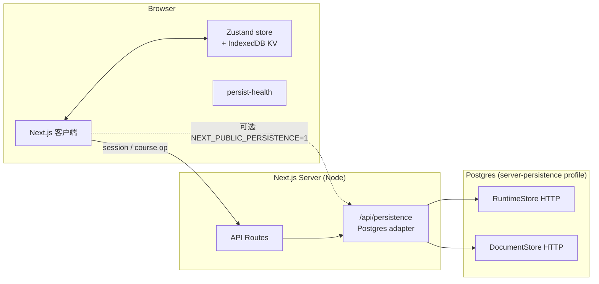
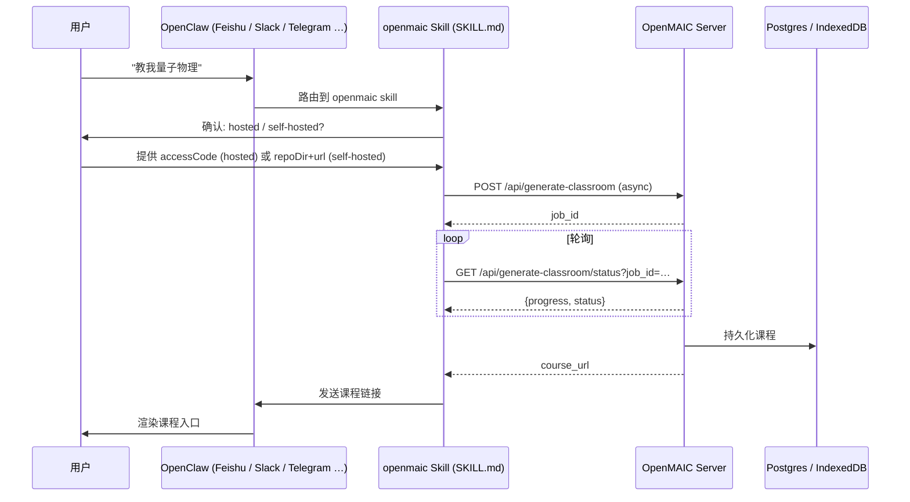
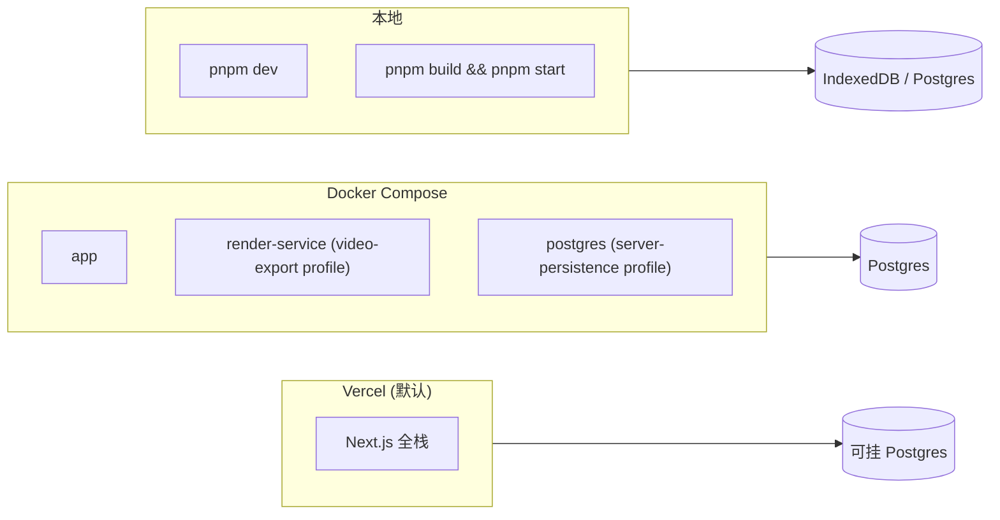

# OpenMAIC 系统架构图

> **OpenMAIC**（Open Multi-Agent Interactive Classroom）是一个开源、多代理的 AI 课堂平台。它把任意主题或文档，通过多代理编排，一键生成包含幻灯片、测验、互动模拟、项目式学习（PBL）的沉浸式课堂。AI 教师与 AI 同学可以语音讲解、白板绘图，与你实时讨论。

---

## 1. 总体架构（System Architecture）

```mermaid
flowchart TB
  subgraph Client["🖥️ Browser / 客户端"]
    UI["Next.js 16 · React 19 UI<br/>(Classroom / Slide Editor / Whiteboard / Settings)"]
    TTSClient["Browser TTS / ASR<br/>Web Speech API + MediaRecorder"]
    IframePool["Interactive Scene iframe Pool"]
  end

  subgraph Edge["🚪 Next.js Server (App Router)"]
    APIRoutes["app/api/* (~18 endpoints)<br/>generate · generate-classroom · chat · pbl<br/>quiz-grade · parse-pdf · web-search · tts · asr …"]
    PBLApi["PBL endpoints"]
    AccessCode["access-code 中间件"]
    ServerPersist["/api/persistence<br/>(Postgres · RuntimeStore / DocumentStore)"]
  end

  subgraph LibCore["🧠 核心库 (lib/)"]
    Generation["generation/<br/>Outline → Scenes 两阶段流水线"]
    Orchestration["orchestration/<br/>LangGraph Director Graph"]
    Playback["playback/<br/>状态机: idle → playing → live"]
    Action["action/<br/>Action Engine (28+ 动作)"]
    AI["ai/<br/>Provider 抽象 (LLM / TTS / ASR)"]
    Media["media/<br/>Image · Video Provider"]
    Audio["audio/<br/>TTS & ASR · VoxCPM2"]
    StageAPI["api/<br/>Stage API (slide / canvas / scene)"]
    Store["store/<br/>Zustand 全局状态"]
    Export["export/<br/>PPTX · HTML · Classroom ZIP"]
    Persistence["persistence/<br/>Browser + Server KV/Document"]
    WebSearch["web-search/<br/>多 Provider 网络搜索"]
    PDFParse["pdf/document parsing<br/>MinerU · AliDocMind"]
    i18n["i18n/<br/>7 语种 多语言"]
  end

  subgraph AIBridges["🤖 外部 AI 服务"]
    LLMProviders["OpenAI · Anthropic · Google · DeepSeek · Qwen · Kimi · MiniMax · Grok · OpenRouter · Doubao · Tencent · Xiaomi · GLM · Ollama · Bedrock · Lemonade"]
    TTSProviders["OpenAI TTS · Azure TTS · VoxCPM2 · Lemonade · MiniMax · Edge"]
    ASRProviders["OpenAI Whisper · Azure · FunASR · Lemonade · Browser"]
    ImageProviders["OpenAI · Azure · Google · MiniMax · ComfyUI · Lemonade"]
    VideoProviders["OpenAI Sora · MiniMax · Lemonade"]
  end

  subgraph Storage["💾 存储"]
    ServerStore["Postgres (server-persistence profile)"]
    BrowserStore["IndexedDB · KV-Persist"]
    Snapshots["Snapshots / classroom ZIP"]
  end

  subgraph External["🌐 外部工具 / 客户端"]
    OpenClaw["OpenClaw / ClawHub Skills<br/>(Feishu · Slack · Telegram · Discord · …)"]
    Hyperframes["Hyperframes Producer<br/>(MP4 渲染 · render-service)"]
    PPTXG["pptxgenjs workspace 包"]
    MathML["mathml2omml 包"]
    Packages["@openmaic/{dsl,generation,importer,renderer,storage} SDK"]
  end

  UI --> APIRoutes
  UI --> TTSClient
  UI --> IframePool
  IframePool -- "postMessage / data:" --> UI
  APIRoutes --> Generation
  APIRoutes --> Orchestration
  APIRoutes --> Playback
  APIRoutes --> Action
  APIRoutes --> PBLApi
  APIRoutes --> WebSearch
  APIRoutes --> PDFParse
  APIRoutes --> ServerPersist
  APIRoutes --> Audio
  APIRoutes --> Media
  APIRoutes --> Export
  APIRoutes --> AccessCode
  Generation --> Orchestration
  Orchestration --> AI
  AI --> LLMProviders
  Audio --> TTSProviders
  Audio --> ASRProviders
  Media --> ImageProviders
  Media --> VideoProviders
  ServerPersist --> ServerStore
  UI --> BrowserStore
  Export --> PPTXG
  Export --> MathML
  Export --> Snapshots
  Export --> Hyperframes
  OpenClaw --> APIRoutes
  Packages --> Generation
  Packages --> Orchestration
  Packages --> Playback
  UI --> Store
```

---

## 2. 课程生成流水线（两阶段生成）

OpenMAIC 把课程生成拆成 **Outline → Scenes** 两个阶段。

```mermaid
flowchart LR
  Input["Topic / Material / Documents"] --> Parse["Document Parsing<br/>(MinerU · AliDocMind · markitdown · 默认)"]
  Parse --> Outline["OutlineGenerator<br/>生成结构化大纲 (可编辑)"]
  Outline --> Confirm{"用户确认大纲?"}
  Confirm -- 否 --> Outline
  Confirm -- 是 --> SceneBuilder["SceneBuilder<br/>按阶段路由模型 / 模板"]
  SceneBuilder --> SceneGen["SceneGenerator<br/>逐场景生成 (slides / quiz / interactive / PBL)"]
  SceneGen --> PostProc["Interactive Post-Processor<br/>JSON Repair · Retry"]
  PostProc --> Images["媒体任务<br/>Image / TTS / Audio"]
  Images --> Compose["Course Document<br/>(Scenes + Media Refs)"]
  Compose --> Idx["Classroom Index<br/>(持久化到 Postgres / IndexedDB)"]
  Idx --> Play["Playback 引擎"]
```

---

## 3. 多代理编排（Director Graph · LangGraph）

课堂互动由一个 **Director Graph** 协调多个 Agent 发言 / 动作 / 离场。

---

## 4. 播放状态机（Playback Engine）

---

## 5. Action Engine（28+ 动作类型）

---

## 6. 课堂组件（Classroom Components）

---

## 7. 服务端 / 客户端渲染与持久化

> **注意**：默认浏览器端持久化（IndexedDB）；启用 `NEXT_PUBLIC_PERSISTENCE=1` 切换到服务端 Postgres 持久化（嵌入式 endpoint，无独立 persistence 容器）。

---

## 8. OpenClaw 集成（从聊天平台生成课堂）

---

## 9. 部署形态

---

## 10. 关键架构特点

| 特性 | 体现 |
| --- | --- |
| **多代理编排** | LangGraph Director Graph 控制 Agent 发言轮次与动作 |
| **两阶段生成** | Outline 可编辑 → Scene 串行生成、可重试 |
| **行动引擎** | Action Engine 解释 28+ 类型动作（speech / whiteboard / quiz …） |
| **多 Provider LLM** | OpenAI / Anthropic / Google / DeepSeek / Qwen / Kimi / MiniMax / Grok / OpenRouter / Doubao / Tencent / Xiaomi / GLM / Ollama / Bedrock / Lemonade |
| **多模态 I/O** | TTS / ASR / Image / Video / 3D 仿真 / 在线编程 |
| **可嵌入外部 Agent** | OpenClaw Skill 在聊天平台调用生成 / 状态查询 |
| **持久化可切换** | 默认 IndexedDB；启用 `NEXT_PUBLIC_PERSISTENCE` 切换 Postgres |
| **可导出 PPTX / HTML / ZIP** | 自研 `pptxgenjs` 工作区包 + `mathml2omml` |
| **可离线播放** | 导出 `.maic.zip` 时把外部 CDN 资源内联为 `data:` URI |
| **工作站 SDK** | `@openmaic/dsl` · `@openmaic/generation` · `@openmaic/importer` · `@openmaic/renderer` · `@openmaic/storage` 已发布到 npm |
