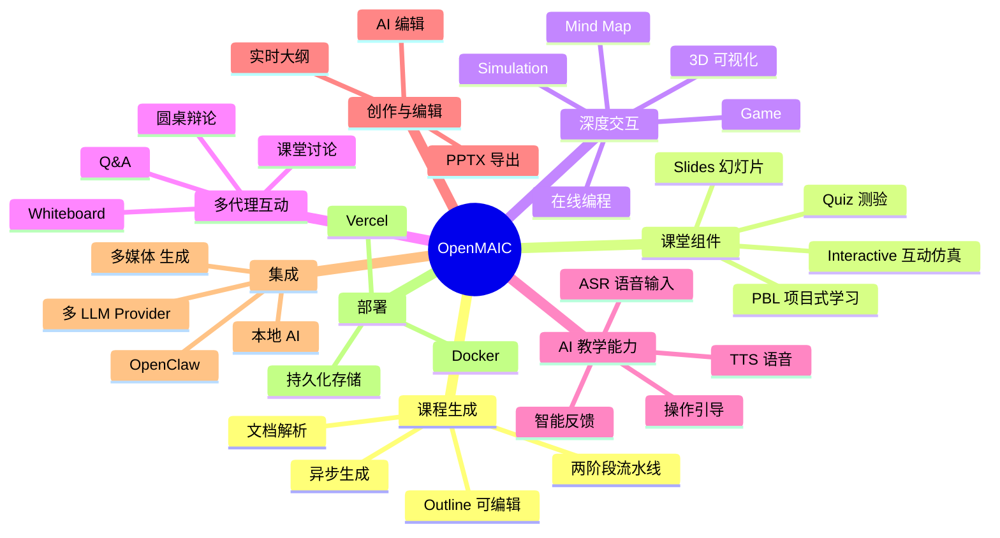
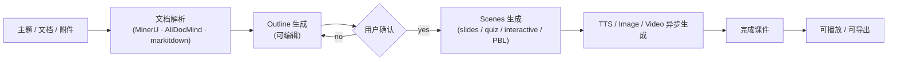
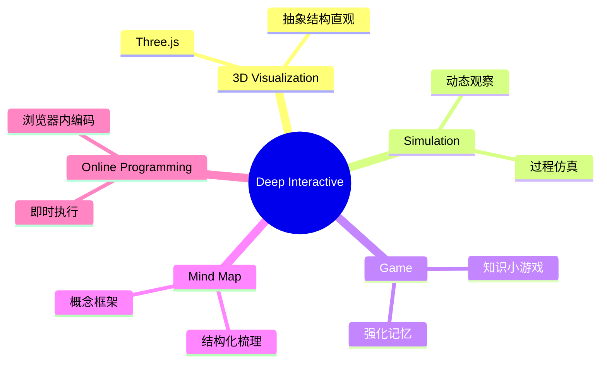
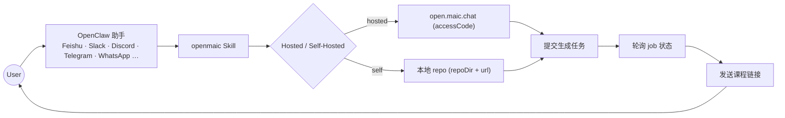
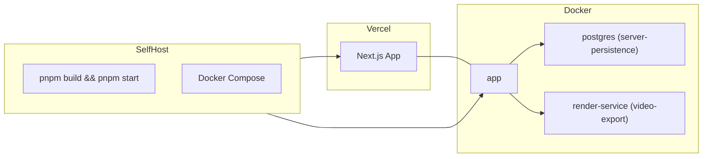

# OpenMAIC 功能介绍

> **OpenMAIC**（Open Multi-Agent Interactive Classroom）是一个开源多代理 AI 课堂平台，源自清华 THU-MAIC 团队。它把任意主题或文档，通过多代理编排，自动生成包含幻灯片、测验、互动模拟、PBL（项目式学习）的沉浸式课堂。AI 教师与 AI 同学可以语音讲解、白板绘图，与你实时讨论。

---

## 1. 功能总览



---

## 2. 🚀 课程生成（Lesson Generation）

### 2.1 两阶段流水线


### 2.2 文档解析（Document Parsing）
- **多格式上传**：PDF / Word / PPT / Markdown / 网页 / 音视频
- **音视频提取**：自动切片并提取关键内容
- **MinerU**：复杂表格 / 公式 / OCR 增强
- **AliDocMind**：阿里云文档智能
- **默认内置**：轻量文本提取

### 2.3 异步生成（Async Classroom）
- `generate-classroom` endpoint 投递 job，客户端轮询进度
- 适合 OpenClaw 等外部 Agent 调用

---

## 3. 🎓 课堂组件（Classroom Components）

| 组件 | 描述 |
| --- | --- |
| **🎓 Slides** | AI 教师语音讲解 + Spot Light + 激光笔动画；可缩放切换 |
| **🧪 Quiz** | 单选 / 多选 / 简答，AI 实时判分 + 反馈 |
| **🔬 Interactive Simulation** | HTML 互动实验：物理模拟、流程图等 |
| **🏗️ Project-Based Learning (PBL)** | 角色扮演 + 阶段任务 + 交付物 |
| **🧭 Whiteboard** | 共享白板（SVG）— 实时讲解、画图、解方程 |
| **💬 Discussion** | 圆桌 / 课堂讨论 / Q&A |

---

## 4. ✨ 深度交互模式（Deep Interactive Mode）

> 被动收听 ❌ → 动手探索 ✅

### 4.1 五种互动 UI 类型


### 4.2 AI 教师引导
- AI 教师可主动操作 UI：圈重点、设条件、给提示
- 在合适的时机引导注意力

### 4.3 自适应设备
- 自适应桌面 / 平板 / 手机 / iPad
- 同一课件跨设备体验一致

---

## 5. 🤖 多代理互动（Multi-Agent Interaction）

### 5.1 互动模式
- **Classroom Discussion**：Agent 主动发起讨论；用户可随时介入 / 被点名
- **Roundtable Debate**：多 persona 围绕主题辩论 + 白板辅助
- **Q&A Mode**：自由提问，AI 教师用幻灯片 / 图表 / 白板回答

### 5.2 编排机制
- **LangGraph Director Graph** 控制每回合 Agent 发言与动作
- **SOUL / Persona** 决定 Agent 个性与口吻
- **Action Engine** 把发言拆解为 28+ 动作（speech / whiteboard / quiz / spotlight / navigation…）

---

## 6. 🗣️ 语音与白板

### 6.1 TTS（Text-to-Speech）
| Provider | 特点 |
| --- | --- |
| **OpenAI TTS** | 云端主力 |
| **Azure TTS** | 多音色，企业级 |
| **VoxCPM2** | 自托管 + 声音克隆 + Auto/Prompt/Clone 三种模式 |
| **Lemonade** | 本地推理 |
| **MiniMax** | 多角色 |
| **Edge** | 浏览器内置 |

### 6.2 ASR（Speech Recognition）
- **OpenAI Whisper**
- **Azure STT**
- **FunASR**（本地 SenseVoiceSmall / Paraformer / Fun-ASR-Nano）
- **Lemonade**
- **Browser Web Speech API**

### 6.3 Whiteboard
- SVG 实时绘图
- 公式 / 流程图 / 概念图
- 多人协作（多 Agent 同步）

---

## 7. 🌐 媒体生成（Image / Video）

### 7.1 Image
- OpenAI（含 GPT-Image-2） / Azure / Google / MiniMax / ComfyUI / Lemonade

### 7.2 Video
- OpenAI Sora / MiniMax / Lemonade

### 7.3 ComfyUI 集成
- 支持自托管 ComfyUI 工作流
- 通过 `comfyui-workflows/` API 统一接入

---

## 8. 🔍 网络搜索（Web Search）

| Provider | 特点 |
| --- | --- |
| **Tavily** | 通用研究 |
| **Brave** | 隐私友好 |
| **Baidu** | 中文 |
| **Bocha** | 中文 |
| **MiniMax** | 多模态 |
| **SearXNG** | 自托管元搜索 |
| **Responses Web Search** | OpenAI Responses API |

- Agent 在课堂中实时搜索最新资料

---

## 9. ✍️ 创作与编辑（MAIC Editor）

### 9.1 大纲可编辑
- 生成前先检查 + 编辑大纲
- 避免盲目一刀切

### 9.2 AI 编辑（Edit with AI）
- **Pro Mode**：JSON Patch 验证 + 多会话历史
- **直接操作**：拖拽 / 缩放 / 旋转 / 多选
- 每次改动都可回溯

### 9.3 导出
| 格式 | 说明 |
| --- | --- |
| **PowerPoint (.pptx)** | 可在 PowerPoint 继续编辑（含图片 / 图表 / LaTeX 公式） |
| **Interactive HTML** | 自包含互动网页 |
| **Classroom ZIP** | 完整课堂（结构 + 媒体）可分享或备份 |
| **MP4 视频** | `video-export` profile · render-service 渲染 |

### 9.4 离线 / 内网播放
- 导出 `.maic.zip` 时把外部 CDN 资源（KaTeX / Three.js / Tailwind / Google Fonts / 图片）内联为 `data:` URI
- 已导入的离线课堂可在隔离网内直接播放

---

## 10. 🤖 OpenClaw 集成（聊天应用一键生成）



### 10.1 安装
```bash
# 一键
clawhub install openmaic

# 手动
mkdir -p ~/.openclaw/skills
cp -R /path/to/OpenMAIC/skills/openmaic ~/.openclaw/skills/openmaic
```

### 10.2 工作流
- **Clone**：检测现有 checkout / 询问是否 clone
- **Startup**：选择 `pnpm dev` / `pnpm build && start` / Docker
- **Provider Keys**：建议路径，用户自己编辑 `.env.local`
- **Generation**：异步提交 + 轮询
- 所有步骤征求用户确认

---

## 11. 🌍 多语言（i18n）

支持 7 种语言：
- **zh-CN**（简体中文）
- **zh-TW**（繁体中文）
- **en-US**（英语）
- **ja-JP**（日语）
- **ru-RU**（俄语）
- **ar-SA**（阿拉伯语）
- **pt-BR**（巴西葡萄牙语）

UI 自动判断输入语言；课件语言与 UI 语言可独立设置。

---

## 12. 🎨 主题与外观

- **Dark Mode** — 夜间学习
- 主题 / 字体 / 配色自定义
- 课件语言独立设置

---

## 13. 🧪 Provider 生态

支持 16+ LLM Provider（云端 + 本地）：
- **OpenAI** · **Azure OpenAI** · **Anthropic** · **Google Gemini** · **Amazon Bedrock**
- **DeepSeek** · **Qwen** · **Kimi** · **MiniMax** · **Grok (xAI)**
- **OpenRouter** · **Doubao** · **Tencent Hunyuan/TokenHub** · **Xiaomi MiMo** · **GLM (Zhipu)**
- **Ollama**（本地）· **Lemonade**（本地 LLM / Image / TTS / ASR）· **Bedrock** 自定义模型

### 13.1 Lemonade 本地 AI
- 统一 OpenAI 兼容接口
- 同一 endpoint 可同时提供 LLM / 图 / TTS / ASR
- 无需 API key

### 13.2 FunASR 本地 ASR
- 自托管 OpenAI 兼容 Server
- 预置模型：SenseVoiceSmall / Paraformer / Fun-ASR-Nano
- CPU / GPU 模式均可

### 13.3 推荐模型
- **Gemini 3 Flash** — 质量与速度平衡
- **Gemini 3.1 Pro** — 高质量（较慢）
- **MiniMax M2.7-highspeed** — 性价比

---

## 14. 🔐 访问控制

| 模式 | 配置 |
| --- | --- |
| **公开访问** | 不设 `ACCESS_CODE` |
| **共享密码** | `ACCESS_CODE=your-secret-code` |
| **持久化** | `NEXT_PUBLIC_PERSISTENCE=1` + `DATABASE_URL` + `PERSISTENCE_DEV_TOKEN` |

---

## 15. 📦 持久化

| 模式 | 存储 | 用途 |
| --- | --- | --- |
| **浏览器默认** | IndexedDB | 单用户、本地 |
| **服务端** | PostgreSQL | 共享 / 跨设备 / 跨会话 |

- Persistence HTTP 端点嵌入在 App 中（无需独立容器）
- 通过 `NEXT_PUBLIC_PERSISTENCE` 编译开关切换
- 已有浏览器数据 **懒迁移**（首次访问时按课程迁移）

---

## 16. 💡 典型使用场景

| 场景 | 关键能力 |
| --- | --- |
| **30 分钟学 Python** | Outline → Slides + Quiz + 编程场景 |
| **桌游 Avalon 玩法** | 互动仿真 + 规则讲解 |
| **股票分析（Zhipu / MiniMax）** | 网络搜索 + 数据可视化 |
| **DeepSeek 论文拆解** | 文档解析 + 大纲 + 互动问答 |
| **企业内训** | 私有化部署 + ACCESS_CODE |
| **从聊天群直接生成** | OpenClaw + openmaic skill |
| **离线教学** | 导出 `.maic.zip` + 内网 OpenMAIC 实例 |

---

## 17. 📚 学术与生态

- 论文：**JCST 2026**（[10.1007/s11390-025-6000-0](https://jcst.ict.ac.cn/en/article/doi/10.1007/s11390-025-6000-0)）
- 团队：**THU-MAIC**（清华）
- 姊妹项目：**MAIC-UI**（更专业的 UI 生成增强版）
- 上游生态：**OpenClaw** / **ClawHub** / **Hyperframes**

---

## 18. ⚙️ 部署总览



| 通道 | 适用 |
| --- | --- |
| **Vercel** | 零运维 / 自动扩容 |
| **本地 pnpm** | 开发 / 自测 |
| **Docker** | 私有化 / 内网 |
| **Server-Persistence Profile** | 共享部署 |
| **Video-Export Profile** | 含 MP4 渲染 |

---

## 19. 设计哲学

- **沉浸式 + 交互式**：从被动收听走向动手探索
- **多代理协作**：教师与同学共同演绎知识
- **开放与可扩展**：Provider / 解析 / 渲染都可替换
- **生态兼容**：OpenClaw / Hyperframes / 自研 SDK
- **离线优先**：导出课件可在隔离环境内播放
