# OpenMAIC 模块图

> 本文档从代码视角梳理 OpenMAIC 各模块的职责与依赖关系。所有路径相对仓库根 `OpenMAIC/`。

---

## 1. 仓库结构总览

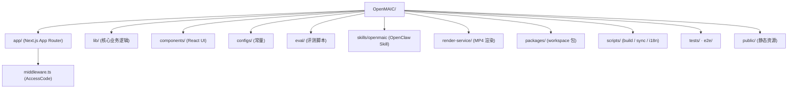

---

## 2. app/ — Next.js 路由层

```mermaid
flowchart LR
  subgraph AppDir["app/"]
    Page["page.tsx (Home · 课程输入)"]
    Classroom["classroom/[id]/ (课堂播放页)"]
    Editor["generation-preview"]
    Layout["layout.tsx · globals.css"]
  end

  subgraph APIRoutes["app/api/"]
    Generate["generate/ (场景生成)"]
    GenClassroom["generate-classroom/ (异步生成)"]
    Chat["chat/ (多代理 · SSE)"]
    PBL["pbl/ (PBL endpoints)"]
    ExportVideo["export-video/"]
    ExtractDoc["extract-document/"]
    ParsePDF["parse-pdf/"]
    QuizGrade["quiz-grade/"]
    WebSearch["web-search/"]
    Transcription["transcription/"]
    Provider["provider/ · server-providers/"]
    VerifyImg["verify-image-provider/"]
    VerifyVideo["verify-video-provider/"]
    VerifyPDF["verify-pdf-provider/"]
    VerifyModel["verify-model/"]
    ProxyMedia["proxy-media/ (SSRF 加固)"]
    ClassAPI["classroom/ · classroom-media/"]
    Agent["agent/"]
    Comfy["comfyui-workflows/"]
    AzureVoices["azure-voices/"]
    AccessCode["access-code/"]
    Health["health/"]
    Usage["usage/"]
    Persistence["persistence/"]
  end

  AppDir --> APIRoutes
```

### 2.1 API 路由职责
| 路由 | 职责 |
| --- | --- |
| `generate/` | 同步场景生成（Outline / Scene 阶段） |
| `generate-classroom/` | 异步课堂生成（带 job_id） |
| `chat/` | 多代理互动 SSE 流 |
| `pbl/` | Project-Based Learning endpoints |
| `export-video/` | 触发 MP4 渲染 |
| `extract-document/` · `parse-pdf/` | 文档解析入口 |
| `quiz-grade/` | 实时评分 |
| `web-search/` | 多 Provider 网络搜索 |
| `transcription/` | ASR 入口 |
| `provider/` · `server-providers/` | 运行时 provider 状态 |
| `verify-*/` | 各种 provider 健康/连通性验证 |
| `proxy-media/` | 媒体代理（SSRF 加固） |
| `classroom/` · `classroom-media/` | 课堂元数据 |
| `agent/` | Agent 配置 |
| `comfyui-workflows/` | ComfyUI 工作流 |
| `azure-voices/` | Azure TTS 语音列表 |
| `access-code/` | ACCESS_CODE 校验 |
| `health/` | 健康检查 |
| `usage/` | 用量统计 |
| `persistence/` | 服务端持久化 HTTP |

---

## 3. lib/ — 核心业务

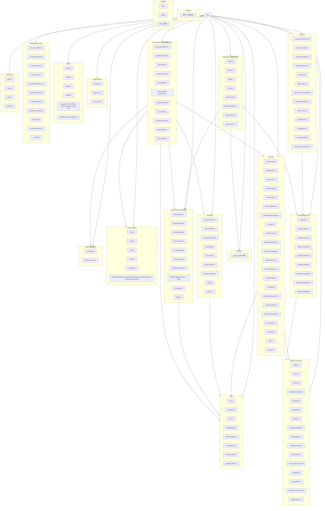

---

## 4. components/ — React UI 组件

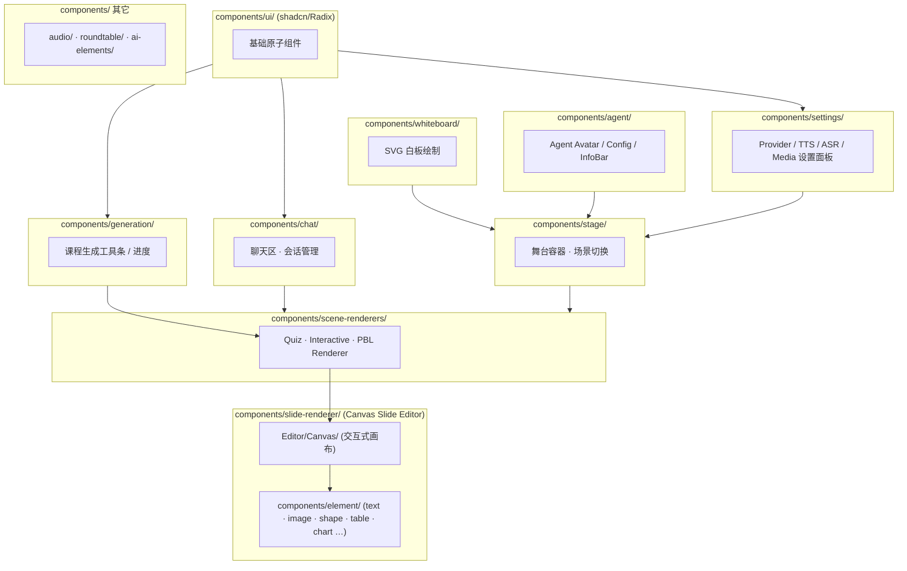

---

## 5. configs/ — 常量与配置

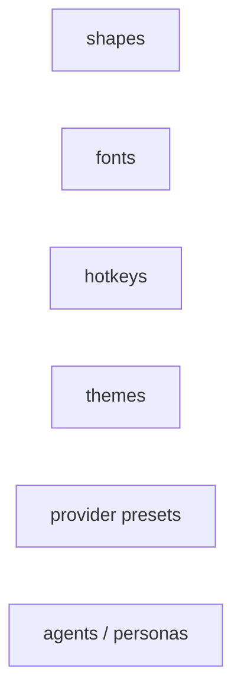

---

## 6. eval/ — 评估脚本

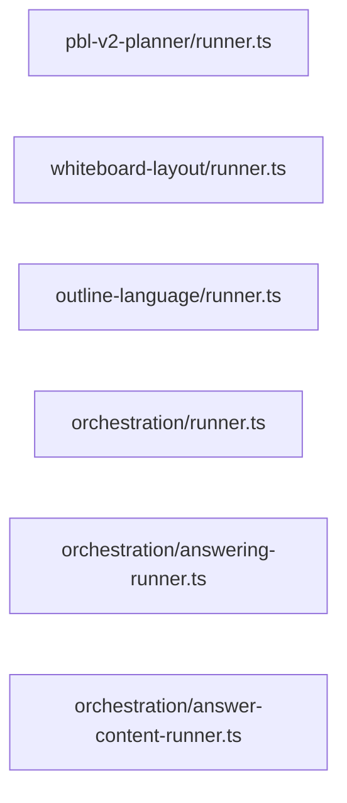

- `eval:pbl-v2-planner` · `eval:whiteboard` · `eval:outline-language` · `eval:orchestration` · `eval:orchestration:answering` · `eval:orchestration:answer-content`

---

## 7. skills/openmaic — OpenClaw Skill

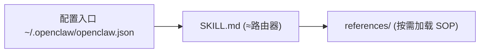

- **路由模式**：skill 开头讲规则 + 列出 references；
- **确认优先**：每步都让用户确认（不会自动 clone / 启动 / 提交）；
- **运行模式**：Hosted（accessCode）或 Self-Hosted（repoDir + url）。

---

## 8. render-service/ — MP4 渲染服务

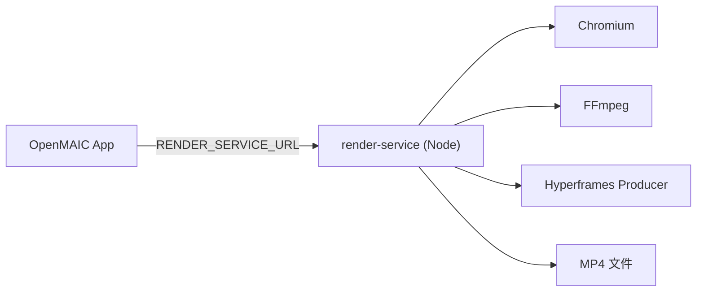

- 由 `video-export` compose profile 启动；
- 与 app 容器独立，配置 `RENDER_MAX_CONCURRENCY` 等参数。

---

## 9. packages/ — Workspace SDK

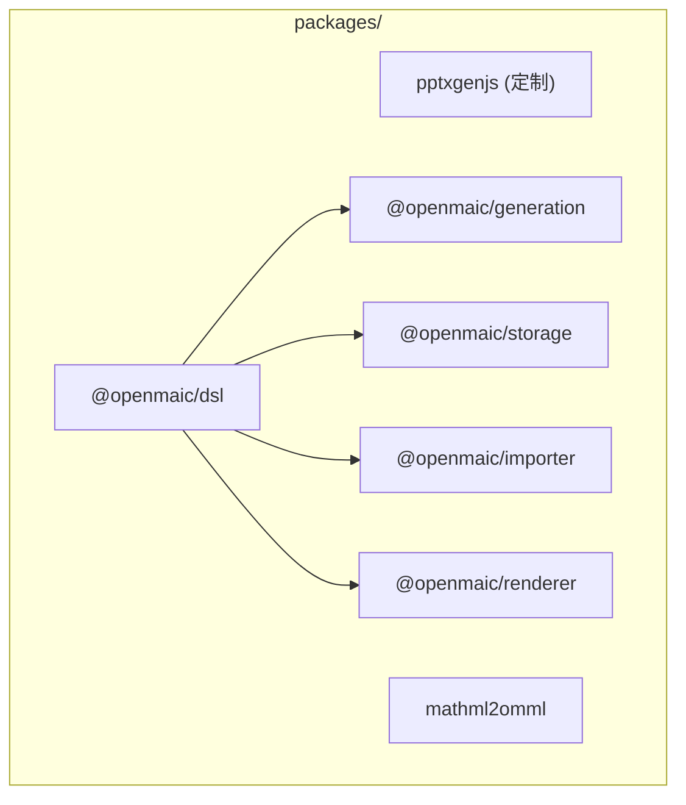

- **DSL**：课程场景的描述语言（schema）
- **generation**：服务端生成引擎
- **storage**：RuntimeStore / DocumentStore 合约
- **importer**：把外部资源（课件 / 文档）导入到 OpenMAIC
- **renderer**：场景渲染器（与 Web 端解耦）

---

## 10. middleware.ts — 接入层

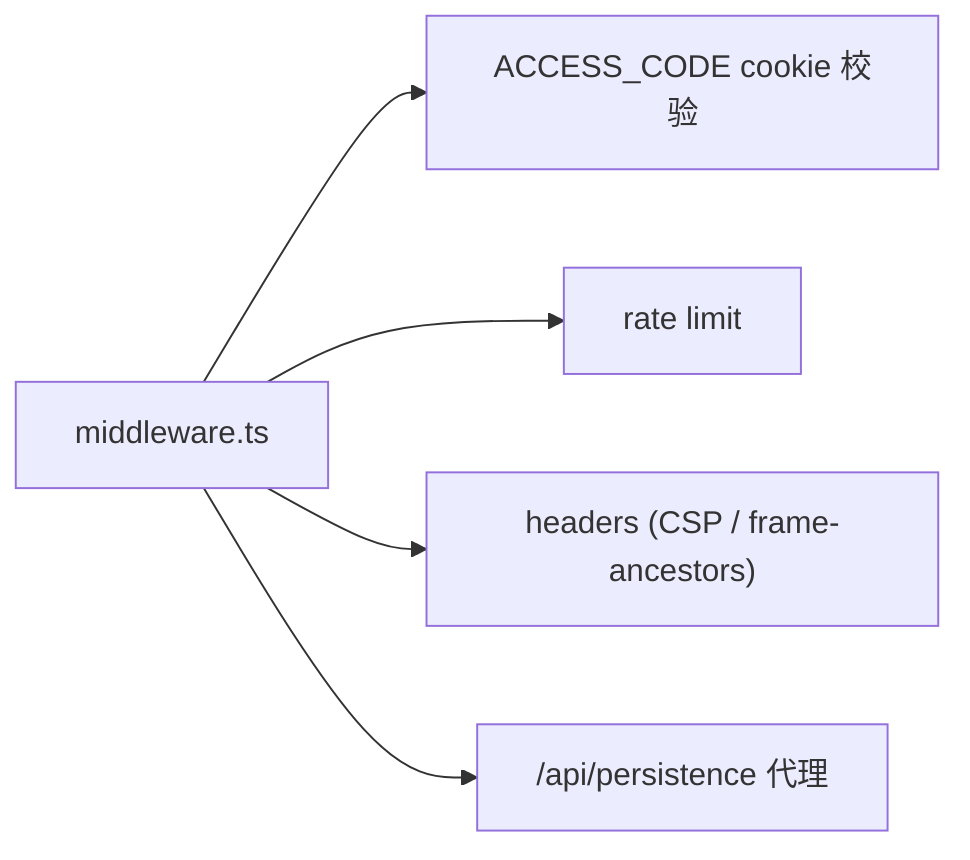

---

## 11. 关键数据流（一次课堂生成）

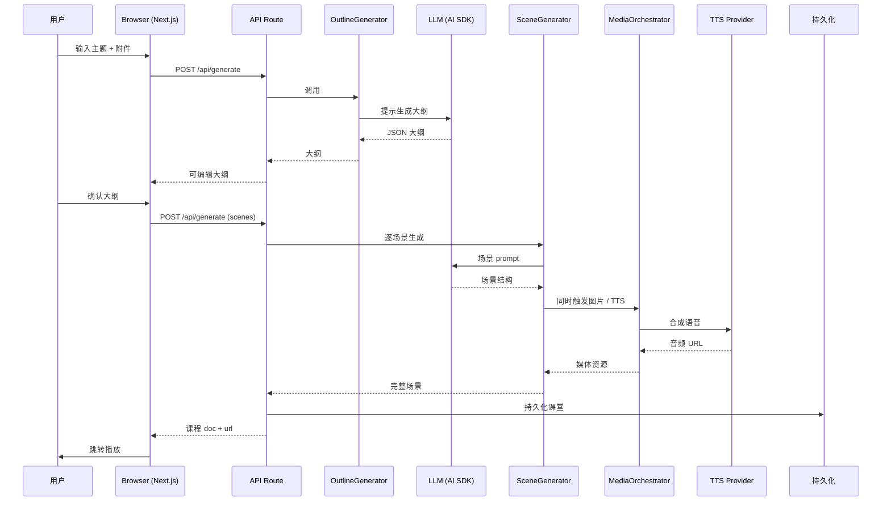

---

## 12. 一次课堂播放（多代理）

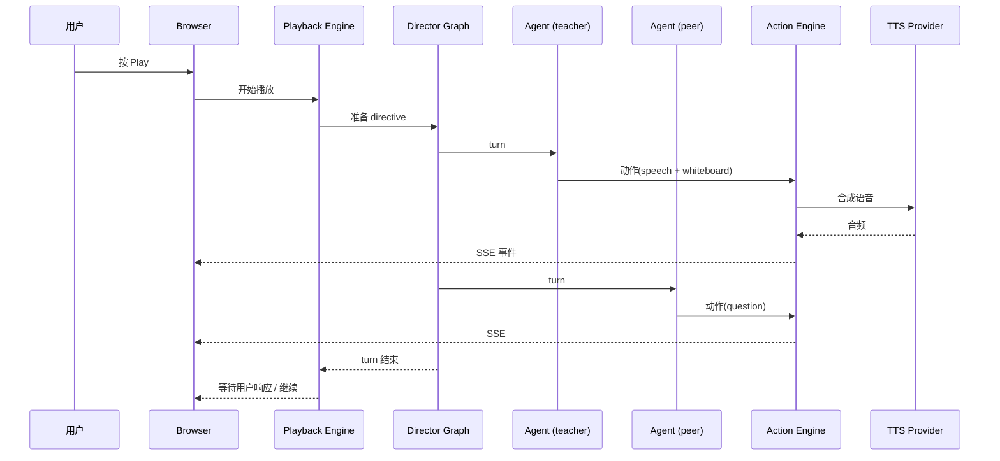

---

## 13. 进程结构

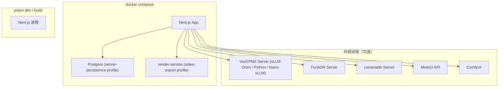

---

## 14. 文件 / 资源布局

```
OpenMAIC/
├── app/                        # Next.js App Router
│   ├── api/                    #   Server API routes (~18 endpoints)
│   ├── classroom/[id]/         #   Classroom playback page
│   └── page.tsx                #   Home page (generation input)
├── lib/                        # Core business logic
│   ├── generation/ · orchestration/ · playback/ · action/
│   ├── ai/ · api/ · store/ · types/ · audio/ · media/
│   ├── export/ · hooks/ · i18n/ · persistence/ · storage/
│   └── web-search/ · pdf/ · prosemirror/ · utils/
├── components/                 # React UI
│   ├── slide-renderer/ · scene-renderers/ · generation/
│   ├── chat/ · settings/ · whiteboard/ · agent/ · ui/
├── packages/                   # Workspace packages
│   ├── pptxgenjs/ · mathml2omml/
│   └── @openmaic/{dsl,generation,storage,importer,renderer}/
├── skills/openmaic/            # OpenClaw / ClawHub skill
├── configs/                    # Shared constants
├── render-service/             # MP4 rendering (video-export profile)
├── public/                     # Static assets
└── middleware.ts               # AccessCode / proxy
```
