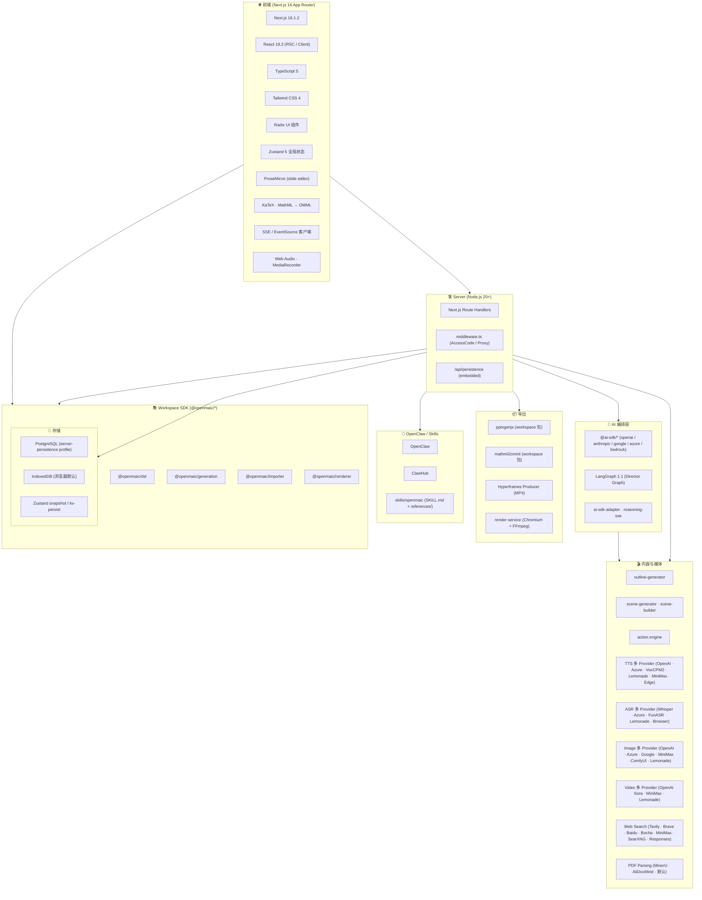
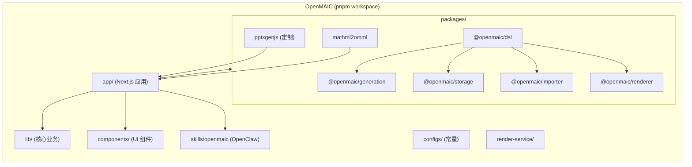

# OpenMAIC 技术栈

> 本文档梳理 OpenMAIC 在前端、API、AI 编排、媒体、存储、导出与部署上的技术选型。

---

## 1. 技术栈全景图

---

## 2. 关键依赖与版本

### 2.1 前端 / 全栈
- **Next.js 16.1.2**（App Router · RSC · Route Handlers）
- **React 19.2** · **TypeScript 5** · **Tailwind CSS 4**
- **Radix UI** · **shadcn/ui** 风格基础组件
- **Zustand 5** 状态管理（多 store 划分）
- **ProseMirror** 系列（commands、dropcursor、gapcursor、history、inputrules、keymap、model、schema-basic、schema-list、state、view）— 用于 Slide Editor
- **KaTeX 0.16** · **mathml2omml** — 数学公式渲染与 Office Math 转换

### 2.2 AI Provider（统一 AI SDK）
- `@ai-sdk/openai` · `@ai-sdk/anthropic` · `@ai-sdk/google` · `@ai-sdk/azure` · `@ai-sdk/amazon-bedrock` · `@ai-sdk/react`
- 适配 Bedrock / Azure / OpenAI / Anthropic / Google，统一切换
- 自研 `ai-sdk-adapter.ts` 与 `reasoning-sse.ts` 处理不同模型的不同 SSE 协议

### 2.3 多代理编排
- **LangGraph 1.1** — Director Graph 状态机
- 自研 `director-graph.ts` · `director-prompt.ts` · `prompt-builder.ts` · `tool-schemas.ts`
- `orchestration/registry/` 管理 Agent 选择和 Tool Schema

### 2.4 媒体层
- **TTS**：OpenAI / Azure / VoxCPM2（自托管，支持 voice cloning）/ Lemonade / MiniMax / Edge
- **ASR**：OpenAI Whisper / Azure / FunASR（自托管）/ Lemonade / Browser Web Speech API
- **Image**：OpenAI (incl. GPT-Image-2) / Azure / Google / MiniMax / ComfyUI（自托管工作流）/ Lemonade
- **Video**：OpenAI Sora / MiniMax / Lemonade
- **Web Search**：Tavily / Brave / Baidu / Bocha / MiniMax / SearXNG / Responses Web Search
- **PDF Parsing**：MinerU / AliDocMind / default

### 2.5 导出 / 渲染
- **pptxgenjs**（workspace 包 · 自定义版本） — PowerPoint 导出
- **mathml2omml**（workspace 包） — MathML → Office Math (OMML) 转换
- **Hyperframes Producer** — 浏览器内项目化（用于 MP4 导出）
- **render-service**（独立 Node 容器） — Chromium + FFmpeg 把项目烘焙成 MP4
- **inline-assets** — 把外部 CDN 资源内联为 `data:` URI，确保离线可播

### 2.6 持久化
- **客户端默认** — IndexedDB + `lib/persistence` + `lib/store/kv-persist.ts`
- **服务端可选** — PostgreSQL，通过 `NEXT_PUBLIC_PERSISTENCE=1` 编译开关 + `server-persistence` compose profile
- **RuntimeStore / DocumentStore** HTTP 合约（见 `packages/@openmaic/storage/docs/`）

### 2.7 国际化
- **i18n**（`lib/i18n`）— 7 语种：zh-CN · zh-TW · en-US · ja-JP · ru-RU · ar-SA · pt-BR
- 自动判断输入语言；UI 与课件语言都可独立设置

### 2.8 工程 / 测试
- **Vitest**（单元 / 集成）
- **Playwright**（E2E）
- **ESLint** · **Prettier** · 自定义 i18n key / package version / sync 脚本
- **pnpm workspace**（`pnpm-workspace.yaml` + `packages/*`）

---

## 3. Workspace 包结构

> `@openmaic/*` SDK 已发布到 npm，可被外部生态复用。

---

## 4. 部署形态

| 模式 | 命令 | 用途 |
| --- | --- | --- |
| **Vercel** | 一键 Deploy | 默认 Web 部署 |
| **本地开发** | `pnpm dev` | 开发模式 |
| **本地生产** | `pnpm build && pnpm start` | 测试生产产物 |
| **Docker 默认** | `docker compose up --build` | Next.js 容器 |
| **Server-Persistence** | `docker compose --profile server-persistence up --build` | + Postgres |
| **Video-Export** | `docker compose --profile video-export up --build` | + render-service（MP4） |

环境变量：
- `OPENAI_API_KEY` · `ANTHROPIC_API_KEY` · `GOOGLE_API_KEY` · `GROK_API_KEY` · `OPENROUTER_API_KEY` · `TENCENT_API_KEY` · `XIAOMI_API_KEY` · `MINIMAX_API_KEY` · `GLM_API_KEY`
- `AZURE_OPENAI_*` · `BEDROCK_REGION` · `BEDROCK_MODELS` · `AWS_*`
- `LEMONADE_BASE_URL` · `ASR_FUNASR_BASE_URL` · `TTS_VOXCPM_BASE_URL`
- `PDF_MINERU_BASE_URL` · `PDF_MINERU_API_KEY`
- `IMAGE_*` · `VIDEO_*` · `TTS_*` · `ASR_*` Provider 旁路
- `ACCESS_CODE` · `DATABASE_URL` · `PERSISTENCE_DEV_TOKEN` · `NEXT_PUBLIC_PERSISTENCE` · `NEXT_PUBLIC_PERSISTENCE_TOKEN`
- `RENDER_SERVICE_URL` · `RENDER_MAX_CONCURRENCY`

---

## 5. 性能与可扩展性

- **流式生成**：Outline / Scene 阶段均支持 SSE / 流式输出，渐进渲染。
- **GENERATE 异步任务**：Long-job 走 `generate-classroom` endpoint，OpenClaw 前端 polling。
- **iframe 池**：每场景独立 iframe（`interactive-iframe-pool.ts`），并行加载、无干扰切换。
- **Widget iframe**：CMS-like 嵌入模块，`widget-iframe.ts` 隔离第三方脚本。
- **媒体任务编排**：Media Orchestrator（`media-orchestrator.ts`）+ `polled-task.ts` 异步生成 + 缓存。
- **思考配置（Thinking）**：per-model、per-stage `thinking-config.ts` + `thinking-context.ts`，支持 GPT-5.x / Claude Opus / Gemini 3 思考模型。
- **Model Routing**：可选 per-stage model 路由生成（不同 scene 用不同模型）。
- **AI SDK 抽象**：统一 SSE / 响应格式（`ai-sdk-adapter.ts`）。

---

## 6. 安全与合规

- **ACCESS_CODE**：站点级密码（`.env.local`），未配置时关闭。
- **SSRF 加固**：`proxy-media` 端点防御服务端请求伪造。
- **Provider 凭证旁路**：Image / Video / TTS / ASR 均可独立 Provider 密钥，避免单点爆光。
- **持久化认证**：`PERSISTENCE_DEV_TOKEN` 仅作为可信网络下"非秘密"标识；生产环境建议替换为真正的会话校验（见 `lib/persistence/server-auth.ts`）。
- **离线导出**：资源内联 + 显式 CORS 失败回退到 URL（不静默丢资源）。
- **OpenClaw Skill**：所有步骤征求用户确认；不会黑盒自动化。

---

## 7. 兼容性与运行要求

| 项目 | 版本 |
| --- | --- |
| Node.js | >= 20.9 |
| pnpm | >= 10 |
| Python（可选 FunASR） | 3.10+ |
| GPU（可选 MinerU / VoxCPM2 / FunASR-Nano） | NVIDIA（vLLM / CUDA） |
| 浏览器 | Chromium / Firefox / Safari / Edge（modern evergreen） |
| OS | macOS / Linux / Windows |

---

## 8. 集成生态

- **OpenClaw / ClawHub** — 一键安装 OpenMAIC skill，从 Feishu / Slack / Discord / Telegram 等聊天应用触发
- **THU-MAIC** — 学术出品（JCST'26 论文）
- **MAIC-UI** — 教学 UI 增强版（姊妹项目）
- **Hyperframes** — MP4 渲染
- **CLI-Anything / EduHub**（与 DeepTutor 共享生态）

---

## 9. 工程实践

- **Workspace + 包边界**：核心算法 / DSL / 渲染 / 存储下沉为 `@openmaic/*` npm 包
- **CI 校验脚本**：`check:i18n-keys` · `check:package-versions` · `assert-vendor-maic-importer.mjs` · `sync-maic-importer.mjs`
- **测试矩阵**：Vitest（单元） + Playwright（E2E） + 多个 eval 脚本（`eval:pbl-v2-planner`、`eval:whiteboard`、`eval:outline-language`、`eval:orchestration:answering` 等）
- **文档集中**：`README.md` · `README-zh.md` · `CHANGELOG.md` · `CONTRIBUTING.md` · `SECURITY.md` · `comfyui-setup-instructions.md`
