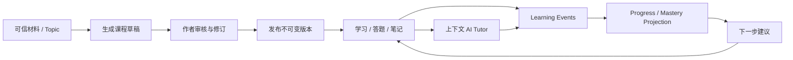

# 01 · 总体目标与范围

## 1. 产品定义

InnateTutor 是一个“**可生产、可消费、可陪伴、可追踪**”的 AI 互动学习系统：

- 内容作者从主题或可信材料生成课程草稿，检查事实、结构和互动设计后发布版本。
- 学习者消费 Slide、Quiz、Interactive、PBL 等教学场景，并产生可审计的学习轨迹。
- AI Tutor 始终知道用户当前所看的课程版本、场景、选区、答题结果和历史偏好，给出带证据的解释、提示与扩展。
- Progress/Mastery 从事实事件计算，而不是由 LLM 随意“判断已掌握”。

产品不是“DeepTutor UI + OpenMAIC UI 的菜单合并”，也不是一个通用 Agent 平台。两套上游是能力供应方，InnateTutor 拥有产品身份、内容生命周期、学习事实和体验闭环。

## 2. 目标用户与核心任务

| 角色 | 核心任务 | MVP 权限 |
| --- | --- | --- |
| 内容作者 / 教师 | 导入材料、生成草稿、编辑/审核、发布课程 | 创建、编辑、预览、发布自己组织内的课程 |
| 学习者 | 学习、答题、做笔记、向 Tutor 提问、继续上次进度 | 消费已发布版本、写自己的学习数据 |
| 组织管理员 | 管理成员、Provider、配额、审计 | 管理组织配置与访问策略 |
| 平台运维 | 查看任务、成本、错误、质量回归 | 不默认读取学习内容；通过审计授权排障 |

## 3. 北极星闭环

MVP 必须证明整条链路，而不是单独证明“能生成课件”或“能聊天”。

## 4. MVP 用户旅程

### 4.1 作者旅程

1. 登录并进入组织空间。
2. 上传 1–5 份 PDF/Markdown/文本材料，或输入主题。
3. 选择目标受众、语言、时长、场景类型上限和模型预算。
4. 提交生成任务并查看 durable progress；失败后可重试或从失败步骤继续。
5. 查看 Outline 与课程草稿，核对来源、Quiz 答案和不确定项。
6. 修订标题、顺序、文本与 Quiz；MVP 可暂时通过 OpenMAIC 编辑面完成复杂 Slide 编辑。
7. 通过发布检查后生成不可变 `CourseVersion`，供学习者访问。

### 4.2 学习者旅程

1. 打开已发布课程，从最近进度继续。
2. 学习 Slide / Quiz / Interactive 场景；每次关键动作写入 Learning Event。
3. 选中文本或针对当前场景提问，Tutor 回答并引用课程材料或 KB 来源。
4. Quiz 提交后得到结果和解释，进度 projection 更新。
5. 课程结束后看到完成度、薄弱点和下一步建议。

### 4.3 管理员旅程

1. 配置组织级模型/搜索/Embedding Provider，不向浏览器泄露密钥。
2. 配置单任务与单用户预算、允许的内容功能和数据保留期限。
3. 查看生成成功率、LLM 用量、失败原因和安全审计，不直接暴露敏感 prompt 内容。

## 5. MVP 功能范围

### 5.1 Must Have

| 能力 | 范围 |
| --- | --- |
| 身份与租户 | 单一登录、组织成员、author/learner/admin 三类 RBAC、服务间身份 |
| 材料与 KB | PDF/Markdown/文本；状态化 ingest；chunk 可追溯到文档/页码 |
| 课程生产 | 主题/材料 → Outline → 3–8 个 Scene；Slide + Quiz 为必选，Interactive 可灰度 |
| 异步任务 | durable queue、幂等、重试、取消、超时、预算、可恢复状态 |
| 版本与发布 | Draft / Review / Published / Archived；发布版本不可变 |
| 课堂消费 | 复用 OpenMAIC 完整 Player；独立 Runtime Origin（本地可同源代理）；基础响应式支持 |
| 学习轨迹 | scene view/complete、quiz submit/grade、note、agent question、course complete |
| AI Tutor | 当前 courseVersion/scene/selection/progress + RAG；流式输出、引用、取消 |
| 基础进度 | 课程/场景完成度、Quiz 结果、继续学习 |
| 审计与成本 | generation/agent 调用 trace、token/cost ledger、关键管理操作审计 |

### 5.2 Should Have（Beta）

- 课程级 Source Coverage 报告与自动事实检查。
- 基于规则 + Quiz 证据的初版 Mastery 与推荐。
- PBL 场景和 DeepTutor Mastery Path 的受控接入。
- TTS（先一种 Provider）与有限图片生成。
- 作者协作评论、发布回滚、课程复制。
- 匿名学习者登录后进度合并。

### 5.3 Could Have（验证后）

- 完整离线课程包和离线学习事件回放。
- MP4/PPTX 生产链路。
- 多 Agent 圆桌、实时白板协作、Partner/IM 入口。
- 多区域/Edge 推理、小模型缓存。
- 商业计费、学校 SIS/LMS、LTI/xAPI 外部集成。

## 6. 明确非目标

以下项目不应成为 MVP 的前置条件：

- 把 DeepTutor 的所有模块拆成独立 PyPI 包。
- 把 OpenMAIC 的整个应用改写成通用 npm SDK。
- 一开始就拆成三个仓库、十多个微服务或上 Kubernetes。
- 同时支持所有 RAG、LLM、TTS、ASR、Image、Video Provider。
- 承诺完整离线编辑、多端 CRDT 或多人实时协作。
- 让 LLM 直接写入“已掌握”状态而没有测验/行为证据。
- 用 iframe `postMessage('*')` 或浏览器提交的 `learnerKey` 作为身份依据。
- 将 DeepTutor Memory 或 OpenMAIC IndexedDB 当作统一业务事实源。

## 7. 成功指标与质量护栏

Phase 0 先建立 baseline，Phase 1 后才冻结目标。推荐初始目标如下：

| 维度 | Pilot 目标 | 说明 |
| --- | --- | --- |
| 核心闭环 | ≥ 90% 测试任务完成“生成→发布→学习→提问→进度” | 基于固定测试材料集，不等同生产 SLA |
| 课程生成 | 3–8 Scene 无媒体课程 P90 ≤ 10 分钟 | 先测量再优化；不承诺原文档的固定 5 分钟 |
| 生成可靠性 | 非 Provider 故障导致的任务成功率 ≥ 95% | 支持断点重试；不重复计费 |
| Agent 响应 | 网关 ACK P95 < 500ms；首个有意义 token P95 < 3s | 200ms 仅适用于连接/缓存，不适用于云 LLM 推理 |
| 引用 | 有来源问题的回答 citation coverage ≥ 90% | 自动判定 + 人工抽检 |
| 数据隔离 | tenant/user 越权用例 100% 拒绝 | Release blocker |
| 进度 | 重放同一事件集得到相同 projection | 幂等、可重建 |
| 成本 | 每个生成/对话请求均有 usage/cost 记录 | 允许 Provider 暂时只返回估算值 |

产品指标在小规模 pilot 中观察：作者草稿到发布用时、课程开始到完成率、Quiz 改善率、Tutor 问答后继续学习率、作者对生成草稿的平均修改量。不要在缺少用户 baseline 时预设“AI 一定提升学习效果”。

## 8. 约束与工作假设

- 初始团队假设为 3–5 名工程人员，其中至少 1 名能维护 Python/AI，1–2 名能维护 Next.js/Node。
- Pilot 优先单区域、受控组织、最多数百学习者；不以 10k 并发作为初始架构输入。
- 浏览器端只保存缓存和离线 outbox，服务端是已登录用户最终数据源。
- 上游版本固定，不自动跟随 `main`；升级以 adapter contract test 为门槛。
- 课程材料可能含版权内容、个人信息或 prompt injection，ingest 与生成必须有安全边界。
- 面向未成年人或正式教学时，隐私、内容审核、家长/学校同意与数据驻留需要单独合规评审。

## 9. MVP Definition of Done

只有同时满足以下条件，才能称为 InnateTutor MVP，而不是技术 Demo：

- 两类真实账号能完成作者和学习者旅程，数据互相隔离。
- 至少 10 份固定教材样本可重复跑通端到端流程。
- 生成任务在进程重启后不会丢失，重试不会生成重复版本或重复扣费记录。
- 发布版本不可被后台生成任务或客户端编辑静默覆盖。
- 学习事件可重放，Quiz 与进度在刷新、换设备后仍一致。
- Tutor 的课程上下文、来源引用和当前学习者身份均由服务端校验。
- 关键路径有 E2E、adapter contract test、AI eval、安全隔离测试和可观测 trace。
- 完成备份恢复演练、上游升级演练和失败回滚演练。
