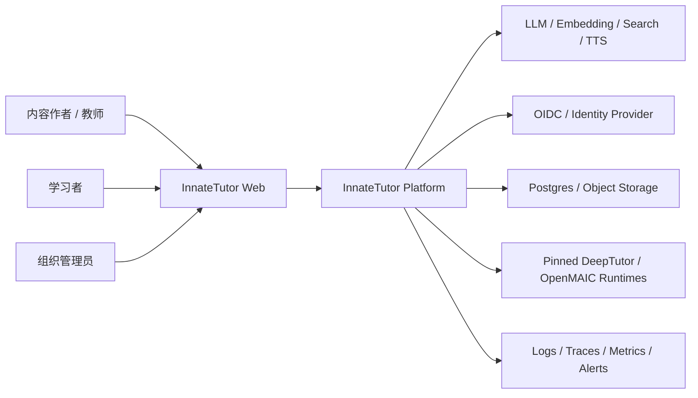
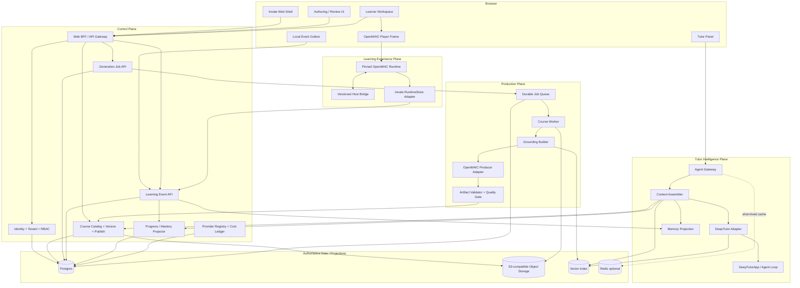
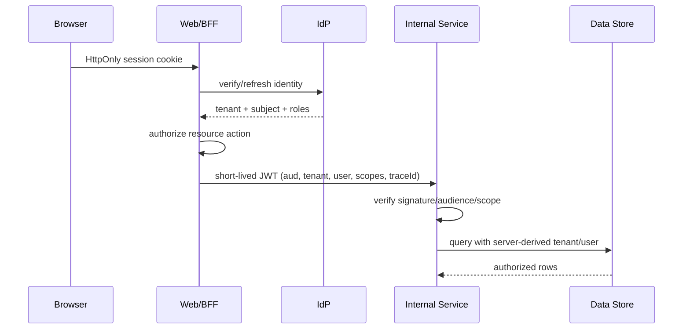
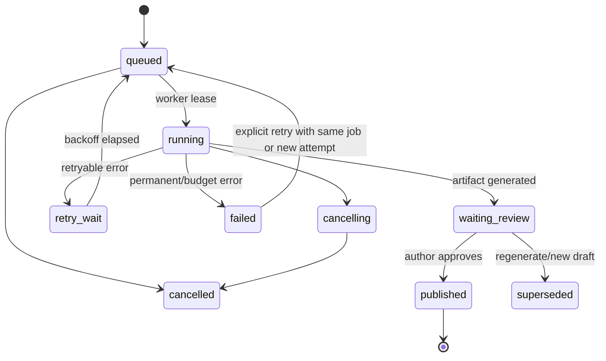
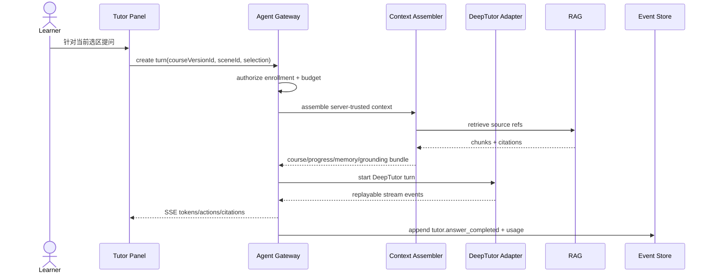

# 03 · 目标架构

## 1. 架构原则

1. **先统一产品事实，不统一所有实现。** 身份、课程版本、学习事件和权限统一；OpenMAIC Director 与 DeepTutor Agent Loop 不强行抽象成同一个 `UnifiedAgent`。
2. **逻辑三 Plane，物理少部署。** Production、Learning Experience、Tutor Intelligence 是职责边界；MVP 可以共用 monorepo、网关和 Postgres。
3. **上游隔离。** 所有上游调用经过 adapter；业务代码禁止深层 import `vendor/*/lib/...`。
4. **事件是学习事实，Memory 是派生结果。** 事件 append-only、幂等、可重放；进度、掌握度、推荐和画像均可重建。
5. **发布版本不可变。** Draft 可以改，Published `CourseVersion` 只能归档或被新版本替代。
6. **重任务异步，交互任务流式。** 课程生产使用 durable queue；Tutor 使用 SSE/WebSocket；二者不混用生命周期。
7. **身份由服务端派生。** 永不信任浏览器提交的 tenant/user/learner key。
8. **成本与质量是合同的一部分。** 每个 AI 操作都有 budget、trace、模型版本、输入来源和评估结果。

## 2. 系统上下文



## 3. 逻辑架构



## 4. MVP 物理部署单元

| 部署单元 | 技术 | 主要职责 | 初始伸缩 |
| --- | --- | --- | --- |
| `web` | Next.js 16 / TypeScript | UI、BFF、身份、课程/事件 API、runtime launch | 2 副本或平台托管 |
| `course-worker` | Node.js 20+ | durable generation job、OpenMAIC producer adapter、artifact 校验 | 1–N worker，按队列伸缩 |
| `openmaic-runtime` | 固定 OpenMAIC Next.js | 完整课堂播放/编辑、Quiz/PBL/Action runtime | Pilot 1 副本；无状态化后扩容 |
| `agent-service` | Python 3.11 + DeepTutor | Agent turn、RAG、Memory projection、工具策略 | Pilot 1 副本 + 持久卷 |
| `postgres` | PostgreSQL 16 | 身份映射、课程、job、event、projection、audit、cost | 托管单主 + PITR |
| `object-store` | S3/OSS/MinIO | 原材料、不可变 artifact、媒体、导出 | 托管或单 MinIO |

MVP 使用 Postgres-backed queue（如 pg-boss/Graphile Worker 一类）即可，减少 Redis + BullMQ + Celery 的多套运维。只有吞吐或 Python 后台任务证明需要时，再拆独立 broker。

## 5. 三 Plane 的职责

### 5.1 Production Plane

负责“材料如何成为可发布课程”，不是课堂播放：

- SourceDocument ingest 与 GroundingBundle。
- 课程 Outline/Scene/Quiz 生成。
- 异步步骤、预算、重试、取消与恢复。
- Artifact schema、引用、资产、质量检查。
- Draft、Review、Publish 和 immutable version。

不负责用户学习进度或 Tutor 长期会话。

### 5.2 Learning Experience Plane

负责“学习者看见和操作什么”：

- 课程加载、播放、Quiz、Interactive/PBL UI。
- Player 与 Innate Shell 的 Host Bridge。
- 本地 outbox、断线恢复、跨设备同步。
- 把上游 runtime record 转为标准 LearningEvent。

不直接计算最终 Mastery，也不持有 Provider secret。

### 5.3 Tutor Intelligence Plane

负责“此时此人需要怎样的辅导”：

- 组装当前课程/场景/选区/Quiz/进度/Memory 上下文。
- RAG、引用、Agent turn、取消与恢复。
- 按策略提供解释、提示、反问、扩展、下一步建议。
- 消费 LearningEvent 生成可审计 Memory projection。

不直接修改 Published CourseVersion，不直接把 LLM 结论写成 mastery fact。

## 6. 数据所有权

| 数据 | 权威写入方 | 权威存储 | 其他副本/投影 |
| --- | --- | --- | --- |
| Tenant/User/Membership | Identity module | Postgres | IdP claims/cache |
| SourceDocument metadata | Knowledge module | Postgres | DeepTutor KB manifest |
| 原始文件 | Upload service | Object Storage | parser temp cache |
| Course/Draft/Version | Course Catalog | Postgres + immutable artifact object | OpenMAIC browser cache |
| GenerationJob/Step | Job module/worker | Postgres queue tables | UI progress cache |
| LearningSession/Event | Event API/Runtime adapter | Postgres append-only tables | Client outbox、OpenMAIC view state |
| Progress/Mastery | Projector | Postgres projection tables | Redis/read model |
| Agent session mapping | Agent Gateway | Postgres | DeepTutor internal session |
| Agent raw execution trace | Agent Service + Gateway | controlled trace store | observability backend |
| Memory L1/L2/L3 | Memory projector | DeepTutor workspace + metadata | 可从事件/对话重建的派生层 |
| Provider secret | Secret Manager | Secret Manager | 服务端短期内存 |
| Usage/Cost | Provider/Agent/Worker | Postgres CostLedger | metrics aggregation |

规则：下游 projection 不能反向覆盖主数据；删除主数据时通过明确的 cascade/tombstone 触发 projection 清理。

## 7. 版本化 CourseArtifact

不建议把 DeepTutor Book 和 OpenMAIC Scene 强行压进一个宽泛 `ContentNode`。MVP 使用 envelope 隔离上游格式：

```typescript
interface CourseArtifactEnvelope {
  artifactSchemaVersion: '1.0';
  id: string;
  courseId: string;
  courseVersionId: string;
  renderer: {
    kind: 'openmaic';
    appVersion: '0.3.1';
    upstreamCommit: string;
    dslVersion: string;
    adapterVersion: string;
  };
  content: {
    stage: unknown;
    scenes: unknown[];
  };
  sourceMap: SourceReference[];
  assetManifest: AssetReference[];
  generationManifest: {
    modelRoutes: Record<string, string>;
    promptSetVersion: string;
    generatedAt: string;
  };
  checksum: string;
}
```

发布流程对 `content` 使用与 adapter 版本匹配的 OpenMAIC app validator；跨语言/公共部分再用 `@openmaic/dsl` schema。Interactive/PBL 不属于纯 DSL 的完整内容类型，不能只靠 DSL schema 宣称整个 artifact 有效。

## 8. LearningEvent 架构

统一事件 envelope：

```typescript
interface LearningEvent {
  id: string;                  // server ULID/UUID
  tenantId: string;            // server-derived
  userId: string;              // server-derived
  sessionId: string;
  courseVersionId: string;
  sceneId?: string;
  seq: number;                 // per session monotonic
  eventType:
    | 'course.started'
    | 'scene.viewed'
    | 'scene.completed'
    | 'quiz.submitted'
    | 'quiz.graded'
    | 'note.created'
    | 'tutor.question_asked'
    | 'tutor.answer_completed'
    | 'course.completed'
    | 'openmaic.raw';
  occurredAt: string;          // client observation
  recordedAt: string;          // server clock
  idempotencyKey: string;
  payload: Record<string, unknown>;
  source: 'innate-web' | 'openmaic' | 'deeptutor' | 'import';
  sourceVersion: string;
}
```

投影器按 `tenantId + userId + courseVersionId` 消费事件，产生：

- scene status / course completion；
- quiz attempt 与 best/latest score；
- skill evidence；
- mastery state；
- recommendation candidates；
- Memory ingest candidates。

同一事件重复提交返回已有事件；乱序事件按 session seq 检测，允许离线批次补传但不得静默覆盖。

## 9. 身份与服务信任



要求：

- 浏览器不直接访问 DeepTutor/OpenMAIC 管理 API。
- iframe 使用一次性 launch code 换取独立 Runtime Origin 的短期 HttpOnly session；RuntimeStore server 从该 session 派生 learner。
- Service token 5–15 分钟过期、audience 单一、密钥可轮换。
- 表级查询始终包含 tenant；关键表可加 PostgreSQL RLS 作为第二道防线。
- Provider API Key 只在 worker/agent 内解析，Web 返回 provider alias 和能力，不返回 secret。

## 10. Durable Generation 设计



每个步骤至少保存：`status`、`attempt`、`lease_owner`、`lease_expires_at`、`input_hash`、`output_ref`、`usage`、`error_code`。关键步骤为：

1. validate input；
2. parse/ingest source；
3. build grounding bundle；
4. generate outline；
5. generate scenes；
6. validate/repair artifact；
7. generate optional media；
8. quality gate；
9. persist draft。

Scene 级 output 独立 checkpoint，worker 崩溃后从缺失 Scene 继续。外部调用必须带 deterministic idempotency key；重试只重跑失败步骤，CostLedger 记录 attempt。

## 11. Player 集成方案

MVP 复用完整 OpenMAIC Runtime，但生产环境优先放在独立、同站点的 Runtime Origin，避免课堂脚本与主应用共享 DOM/Origin 权限：

- 用户访问 `https://app.example.com/learn/...`。
- Web/BFF 创建 30–60 秒有效、单次使用、绑定 tenant/user/courseVersion 的 launch code。
- iframe 加载 `https://runtime.example.com/classroom/...?launch=<one-time-code>`。
- Runtime 服务端兑换 code 后设置短期 HttpOnly session；后续 RuntimeStore 身份只从该 session 派生。
- OpenMAIC 通过 `ALLOWED_FRAME_ANCESTORS=https://app.example.com` 允许宿主嵌入。
- Published artifact 由 Innate Artifact API 提供，不从 OpenMAIC 本地 JSON 目录读取。
- Host Bridge 只接受固定 `https://app.example.com` / `https://runtime.example.com` origin 和正确 window source，消息包含 `protocolVersion`、`messageId`、`courseVersionId`。

P0/本地环境可以使用同源 reverse proxy 简化启动，但这不是生产安全边界。若浏览器的 iframe cookie 策略导致 session 不稳定，使用受众限定的短期 bearer/DPoP 类 runtime token；不要退回到可伪造的 `learnerKey` 或长效 URL token。

Host Bridge 最小消息：

- Runtime → Host：`ready`、`scene.changed`、`quiz.submitted`、`quiz.graded`、`scene.completed`、`course.completed`、`tutor.open_requested`、`error`。
- Host → Runtime：`context.set`、`navigate.scene`、`playback.pause`、`theme.set`、`locale.set`、`ack`。

不要使用 `'*'` 作为外层协议的 target origin。Interactive 内部 iframe 的现有消息机制应继续隔离在 OpenMAIC Runtime 内。

## 12. Tutor 请求流



课程正文、Quiz 正确答案、其他用户数据不能由浏览器自由拼入“trusted context”。浏览器只提交定位信息，Context Assembler 从授权数据源读取真实内容。

## 13. Provider 与模型路由

统一的不是 SDK，而是策略：

- `ProviderConnection`：tenant、modality、provider、secretRef、region、status。
- `ModelPolicy`：任务类型、primary/fallback model、token/timeout/retry/cost ceiling。
- Worker/Agent 各自使用原生 SDK 或上游 provider adapter，但只接收 policy snapshot。
- 课程 artifact 和 agent trace 保存 policy/model/prompt 版本，保证可复现与成本追踪。
- MVP 每种 modality 只承诺一个 primary + 可选 fallback；UI 不暴露上游支持的全部 Provider。

## 14. 仓库建议

```text
innate-tutor/
├── apps/
│   └── web/                       # Shell + BFF + control API
├── services/
│   ├── course-worker/             # durable worker + OpenMAIC producer adapter
│   ├── openmaic-runtime/          # pinned fork wrapper/config, not copied UI
│   └── agent-service/             # DeepTutor adapter service
├── packages/
│   ├── contracts/                 # OpenAPI/JSON Schema/event contracts
│   ├── domain/                    # course/job/event/projection pure domain logic
│   ├── openmaic-adapter/          # artifact/runtime/host bridge adapters
│   ├── deeptutor-adapter-client/  # gateway client + event translation
│   ├── authz/                     # scopes and policy helpers
│   ├── observability/             # trace/log/usage envelope
│   └── test-fixtures/             # pinned upstream fixtures
├── vendor/
│   ├── OpenMAIC/                  # submodule or pinned fork worktree
│   └── DeepTutor/                 # submodule or pinned package source
├── infra/
│   ├── compose/
│   ├── migrations/
│   └── deployment/
├── evals/
├── tests/
│   ├── contract/
│   ├── integration/
│   └── e2e/
└── docs/
```

当前目录中的 `DeepTutor/` 和 `OpenMAIC/` 可在 Phase 0 继续作为 clean upstream checkout；正式建仓时再迁移到 `vendor/` 或外部 pinned fork。不要在未确定上游同步策略前直接修改其 `main`。

## 15. 分阶段部署演进

| 阶段 | 部署策略 |
| --- | --- |
| Local/Spike | Docker Compose；所有服务单副本；本地 Postgres/MinIO；无公网 |
| Pilot | 单区域；托管 Postgres/Object Store；Web 2 副本；Worker/Runtime/Agent 各 1 副本；内部网络 |
| Beta | Worker 按队列伸缩；OpenMAIC Runtime 无状态化；Agent 按 owner shard；集中 secret/trace |
| Scale-out | 根据实测拆 control API、独立 broker、vector service、多区域只读 artifact CDN；不预先承诺 Edge Agent |

## 16. 核心架构决策记录

| ADR | 决策 | 原因 |
| --- | --- | --- |
| ADR-001 | 三 Plane 单 monorepo 起步 | 保留职责边界，减少跨仓契约和发布开销 |
| ADR-002 | Adapter 隔离两个上游 | 上游内部 API 活跃变化，避免业务代码被版本锁死 |
| ADR-003 | Published CourseVersion immutable | 支持审计、恢复、缓存和学习进度稳定引用 |
| ADR-004 | LearningEvent 为学习事实源 | 跨 Player/Agent，幂等、可重放、可解释 |
| ADR-005 | 不实现通用 UnifiedAgent | 两种 Agent 语义不同，过度抽象会丢失能力和增加耦合 |
| ADR-006 | 完整 OpenMAIC Runtime 隔离复用 | renderer 不是完整 Player，自建会重复大量复杂逻辑 |
| ADR-007 | DeepTutor stable facade 优先 | 避免把上游拆包变成产品关键路径 |
| ADR-008 | Postgres-backed queue 起步 | 统一事务/备份，降低早期基础设施数量 |
| ADR-009 | Provider Policy 统一、SDK 不强制统一 | 保留两边能力，同时控制 secret、预算与模型漂移 |
| ADR-010 | Memory/Vector/Cache 都是 projection | 防止非确定结果覆盖业务事实 |
