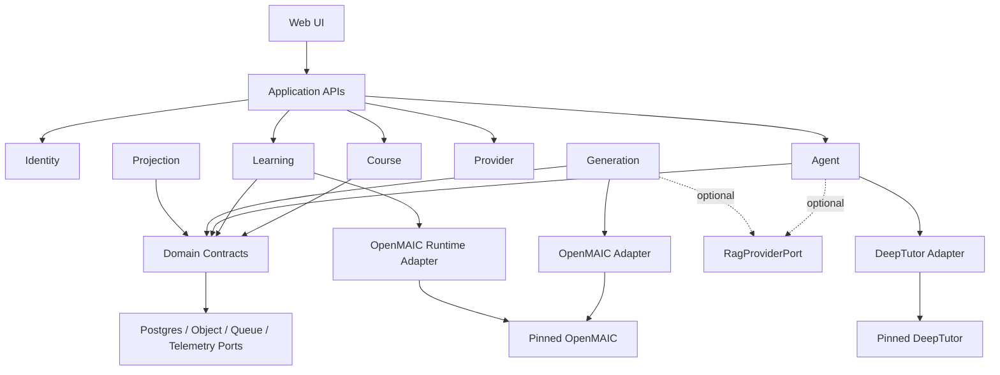
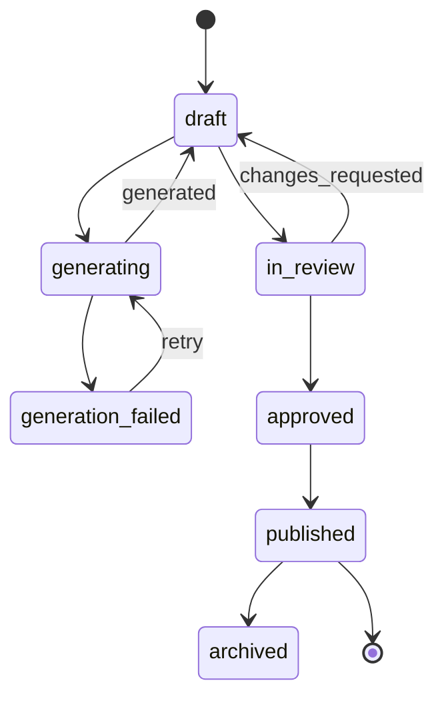

# 04 · 模块与契约设计

## 1. 模块边界总览

| 模块 | 拥有的数据/行为 | 不负责 | 主要复用来源 |
| --- | --- | --- | --- |
| Identity & Tenant | tenant、user、membership、role、service token | 课程内容、Provider secret 本体 | 自研 + OIDC |
| Knowledge Ingest | upload、parse job、SourceDocument、SourceRef、KB binding | 生成课程、回答问题 | DeepTutor parser/RAG adapter |
| Retrieval Provider | ingest/retrieve/delete/health、SourceRef normalize | 课程主数据、用户身份、业务授权 | 可选 DeepTutor local/LightRAG/其他服务 |
| Course Catalog | Course、Draft、Version、Review、Publish、Enrollment | LLM 生成执行 | 自研 |
| Generation Orchestrator | Job/Step、lease、retry、budget、checkpoint | UI 编辑、学习进度 | 自研 + OpenMAIC producer adapter |
| Artifact Quality | schema、引用、Quiz、资产、安全校验 | 业务审批决定 | `@openmaic/dsl` + app validator + 自研 eval |
| Player Gateway | runtime launch、artifact 读取、Host Bridge、runtime auth | Mastery 计算 | OpenMAIC Runtime |
| Learning Runtime | LearningSession/Event、idempotency、offline batch | 内容生成 | 自研 + `@openmaic/storage` 合同 |
| Progress Projector | completion、quiz、mastery evidence、recommendation read model | 原始事件修改 | 自研 + DeepTutor learning 思路 |
| Agent Gateway | session/turn、context auth、stream、cancel、usage | Provider secret 下发、主数据修改 | DeepTutor facade/WS adapter |
| Memory Projector | L1/L2/L3 ingest、证据链、删除/重建 | 事实源 | DeepTutor memory |
| Provider & Cost | provider alias、model policy、quota、usage/cost | 在浏览器保存 Key | 自研 + 两边 provider adapter |
| Audit & Operations | audit log、trace link、dead-letter、admin actions | 业务内容默认读取 | 自研 |

模块间只通过公开 contract 通信。同一进程内也遵守边界，禁止跨模块直接写表。

## 2. 依赖方向



`domain/contracts` 不依赖 Next.js、FastAPI、OpenMAIC 或 DeepTutor。Adapter 可以依赖上游，业务模块只依赖 adapter interface。

## 3. 核心实体

### 3.1 身份与授权

| 实体 | 关键字段 |
| --- | --- |
| `tenants` | `id`, `name`, `status`, `data_region`, timestamps |
| `users` | `id`, `idp_subject`, `display_name`, `status` |
| `memberships` | `tenant_id`, `user_id`, `role`, `scopes`, unique pair |
| `service_identities` | `service`, `audience`, `allowed_scopes`, key version |
| `resource_acl` | 仅在超出 tenant/owner/role 简单模型时引入 |

所有业务表包含 `tenant_id`；用户所有资源再包含 `owner_user_id` 或显式 enrollment/membership。ID 只定位资源，不证明权限。

### 3.2 知识与来源

| 实体 | 关键字段 |
| --- | --- |
| `knowledge_bases` | `id`, `tenant_id`, `name`, `engine`, `embedding_policy_id`, `status` |
| `source_documents` | `id`, `kb_id`, `object_key`, `mime`, `checksum`, `status`, `parser_version` |
| `source_fragments` | `id`, `document_id`, `page/section`, `text_hash`, `locator`, `embedding_ref` |
| `grounding_bundles` | `id`, `input_hash`, `query`, `source_ref_ids`, `summary`, `token_count`, `version` |

`SourceRef` 必须至少能回到文档、页码/段落、checksum 和抽取版本。课程和 Tutor 引用都使用同一稳定 ID。

### 3.3 课程生命周期

| 实体 | 关键字段 |
| --- | --- |
| `courses` | `id`, `tenant_id`, `owner_user_id`, `title`, `visibility`, `current_published_version_id` |
| `course_drafts` | `id`, `course_id`, `revision`, `artifact_ref`, `base_version_id`, `status`, `updated_by` |
| `course_versions` | `id`, `course_id`, `version_no`, `artifact_ref`, `checksum`, `published_at`, `publisher_id` |
| `course_sources` | `course_id/version_id`, `source_document_id`, `usage`, `coverage` |
| `reviews` | `draft_id`, `reviewer_id`, `decision`, `check_results`, `comment` |
| `enrollments` | `tenant_id`, `course_id`, `user_id`, `status`, timestamps |

状态机：



Published row 和 artifact object 均 immutable。编辑已发布内容会创建新 draft/version，不执行原地更新。

### 3.4 Job 与费用

| 实体 | 关键字段 |
| --- | --- |
| `generation_jobs` | `id`, `tenant_id`, `course_id`, `status`, `input_hash`, `idempotency_key`, `budget`, `priority` |
| `generation_job_steps` | `job_id`, `step`, `attempt`, `status`, `lease`, `input_ref`, `output_ref`, `usage_id`, `error_code` |
| `provider_calls` | `trace_id`, `tenant_id`, `job/turn_id`, `provider`, `model`, tokens, latency, status |
| `cost_ledger` | `tenant_id`, `subject_type/id`, `amount`, `currency`, `estimated`, `pricing_version` |

`input_hash + idempotency_key + tenant_id` 有唯一约束。费用记录 append-only；纠正价格用 adjustment，不覆盖原记录。

### 3.5 Learning Runtime

| 实体 | 关键字段 / 索引 |
| --- | --- |
| `learning_sessions` | `id`, `tenant_id`, `user_id`, `course_version_id`, `kind`, `status`, `next_seq`; index by user/course |
| `learning_events` | `id`, session fields, `seq`, `event_type`, `idempotency_key`, `payload`, timestamps; unique `(session_id, seq)` and `(tenant_id, idempotency_key)` |
| `progress_snapshots` | `user_id`, `course_version_id`, `projection_version`, `last_event_seq/ref`, completion fields |
| `quiz_attempts` | derived read model，保留 event IDs |
| `mastery_states` | `user_id`, `competency_id`, `level`, `confidence`, `evidence_event_ids`, `policy_version` |
| `recommendations` | candidate, reason/evidence, rank, status, expiry |

LearningEvent payload 允许保留上游原始 record，但跨模块查询只依赖标准 `event_type` 和标准字段。

### 3.6 Agent 与 Memory

| 实体 | 关键字段 |
| --- | --- |
| `agent_sessions` | `id`, `tenant/user`, `course_version`, `deeptutor_session_id`, `status`, `context_version` |
| `agent_turns` | `id`, `session_id`, `status`, `request_ref`, `response_ref`, `trace_id`, usage |
| `memory_documents` | `user_id`, `layer`, `key`, `version`, `source_event_ids`, `content_ref`, status |
| `memory_tombstones` | deletion scope、reason、requester、applied version |

Agent Gateway 中心表保存映射和审计；完整上游执行状态可留在 DeepTutor 工作区。关键对话文本按隐私策略决定是中心保存、加密保存还是只保存 hash/摘要。

## 4. GroundingBundle

OpenMAIC 当前 `pdfContent.text` 不是足够的证据合同。Innate 增加：

```typescript
interface GroundingBundle {
  version: '1';
  id: string;
  query: string;
  audience?: string;
  language: string;
  excerpts: Array<{
    sourceRefId: string;
    text: string;
    documentTitle: string;
    locator: { page?: number; section?: string };
    score?: number;
  }>;
  constraints: {
    maxTokens: number;
    allowedSourceIds: string[];
    webSearchAllowed: boolean;
  };
}
```

Producer Adapter 将其转成上游 prompt/context；生成后把 `sourceRefId` 写入 `sourceMap`。如果上游 content 没有 citation 字段，不直接改每种 Scene 类型，而是在 envelope 中保存 `sceneId -> sourceRefs[]` 映射。

## 5. Adapter 设计

### 5.1 OpenMAIC Producer Adapter

```typescript
interface CourseProducerPort {
  capabilities(): Promise<ProducerCapabilities>;
  generateOutline(input: OutlineInput, ctx: JobContext): Promise<OutlineResult>;
  generateScene(input: SceneInput, ctx: JobContext): Promise<SceneResult>;
  validateArtifact(input: unknown): Promise<ArtifactValidationResult>;
  packageArtifact(input: PackageInput): Promise<CourseArtifactEnvelope>;
}
```

实现规则：

- `packages/openmaic-adapter` 是唯一允许使用 OpenMAIC app internal module 的 Innate 包。
- Adapter 的公开类型来自 `packages/contracts`，不得直接把 `@/lib/types` 暴露给业务层。
- 每次上游升级对固定 fixture 生成/validate/package，比较 schema 和语义差异。
- Scene checkpoint 粒度由 Innate worker 控制，不依赖上游一键 Route 的 job 状态。
- Pilot 如果先调用 `/api/generate-classroom`，也必须包在同一 port 后面，便于替换。

### 5.2 OpenMAIC Player/Runtime Adapter

职责：

- 把 `CourseArtifactEnvelope` 转为 OpenMAIC 可加载文档。
- 实现生产级 RuntimeStore server auth。
- 将 RuntimeSession/Record 映射到 `learning_sessions/events`。
- 提供 versioned Host Bridge。
- 处理 artifact schema migration 或明确返回 `UNSUPPORTED_ARTIFACT_VERSION`。

不把 OpenMAIC 的 localStorage/IndexedDB 当跨设备事实源。浏览器 store 只作为 cache/outbox。

### 5.3 DeepTutor Adapter

Agent Service 的内部合同：

```python
class TutorEnginePort(Protocol):
    async def start_turn(self, request: TutorTurnRequest) -> TutorTurnHandle: ...
    async def stream_turn(self, turn_id: str, after_seq: int = 0) -> AsyncIterator[TutorEvent]: ...
    async def cancel_turn(self, turn_id: str) -> bool: ...
    async def submit_user_reply(self, turn_id: str, answers: list[dict]) -> bool: ...
    async def get_session(self, session_id: str) -> TutorSession | None: ...
```

第一实现委托给 `DeepTutorApp`；Adapter 负责：

- internal claims → DeepTutor owner context；
- `TutorTurnRequest` → `TurnRequest`；
- DeepTutor stream event → `TutorEvent`；
- source citation 和 usage 规范化；
- session/turn ID 映射；
- timeout/cancel/reconnect；
- 工具和 Knowledge Base allowlist。

业务层不调用 `plugins/.../execute-stream` playground route，也不依赖具体内部 class path。

### 5.4 可选 Retrieval Provider

无 RAG 模式使用当前课程版本、scene 和 selection 作为 direct context，不调用该 port。需要长文档、跨资料或引用时，Agent/Generation 只依赖统一合同：

```python
class RagProviderPort(Protocol):
    async def health(self) -> RagHealth: ...
    async def ingest(self, source: SourceDocumentRef) -> IngestHandle: ...
    async def retrieve(self, request: RetrievalRequest) -> list[RetrievalChunk]: ...
    async def delete(self, source_id: str) -> None: ...
```

`RetrievalChunk` 只暴露稳定字段：`sourceRefId`、`text`、`locator`、`score`、`contentHash`、`providerTraceRef`。业务层不能读取 Provider 私有 collection/table/vector ID。

替换 Provider 时必须重新索引原始 SourceDocument，不能假设不同 Embedding/Vector/Graph 引擎的索引兼容。推荐使用 shadow ingest/retrieve → citation/quality 对比 → tenant feature flag cutover → 保留旧索引回滚的迁移顺序。

## 6. API 设计

外部 API 统一 `/api/v1`，JSON 使用 camelCase；错误使用稳定 code；长任务返回 `202`。

### 6.1 课程与生成

| 方法 | 路径 | 说明 |
| --- | --- | --- |
| `POST` | `/courses` | 创建课程容器 |
| `POST` | `/courses/{courseId}/drafts` | 从空白或 published version 创建 draft |
| `POST` | `/generation-jobs` | 提交生成；`Idempotency-Key` 必填 |
| `GET` | `/generation-jobs/{jobId}` | job + steps + usage summary |
| `POST` | `/generation-jobs/{jobId}/cancel` | 请求取消 |
| `POST` | `/generation-jobs/{jobId}/retry` | 只重试允许步骤 |
| `POST` | `/course-drafts/{draftId}/submit-review` | 进入审核 |
| `POST` | `/course-drafts/{draftId}/reviews` | approve/request changes |
| `POST` | `/course-drafts/{draftId}/publish` | 生成 immutable version |
| `GET` | `/course-versions/{versionId}/artifact` | 经鉴权返回 artifact/signed URL |

### 6.2 学习与进度

| 方法 | 路径 | 说明 |
| --- | --- | --- |
| `POST` | `/learning-sessions` | 服务端确认 enrollment 后创建/恢复 session |
| `POST` | `/learning-events:batch` | 批量提交，逐项返回 accepted/duplicate/rejected |
| `GET` | `/courses/{courseId}/progress/me` | 当前用户 projection |
| `GET` | `/learning-sessions/{id}/events?afterSeq=` | 恢复/诊断，范围受限 |
| `POST` | `/notes` | 创建笔记并产生 event |
| `GET` | `/recommendations/me` | 下一步候选及证据 |

批量事件响应必须允许部分成功，客户端只删除已 accepted/duplicate 的 outbox 项。

### 6.3 Agent

| 方法 | 路径 | 说明 |
| --- | --- | --- |
| `POST` | `/agent/sessions` | 创建/恢复某 course context 的会话 |
| `POST` | `/agent/sessions/{id}/turns` | 创建 turn，返回 `turnId` 与 stream URL |
| `GET` | `/agent/turns/{turnId}/events?afterSeq=` | SSE replay/continue |
| `POST` | `/agent/turns/{turnId}/cancel` | 取消 |
| `POST` | `/agent/turns/{turnId}/replies` | 回答 ask-user 型事件 |

Tutor request 中的 `courseVersionId/sceneId/selection locator` 是定位提示；服务端重新加载授权内容。禁止客户端直接提交可信 `memory`、`quizAnswer` 或 system prompt。

## 7. Stream Event 合同

```typescript
type TutorEvent = {
  protocolVersion: '1';
  turnId: string;
  seq: number;
  type:
    | 'turn.started'
    | 'status'
    | 'content.delta'
    | 'citation'
    | 'tool.started'
    | 'tool.completed'
    | 'user_input.required'
    | 'usage'
    | 'turn.completed'
    | 'turn.failed'
    | 'turn.cancelled';
  timestamp: string;
  payload: Record<string, unknown>;
};
```

SSE 使用 `id: <seq>` 支持 `Last-Event-ID`；网关对 DeepTutor event 做翻译并保留未知 metadata 在 namespaced 字段中。终止事件只能有一个。

## 8. Progress 与 Mastery 规则

### 8.1 Progress

- `scene.viewed` 只表示进入，不代表完成。
- Slide 完成需要满足最低停留/播放结束或用户明确继续；具体规则可按 scene type 配置。
- Quiz 完成由已接受 attempt 决定；分数由 deterministic grader 或可审计 AI grader 产生。
- Course completion 由所有 required scenes 的 projection 计算，不能只信客户端 `course.completed`。

### 8.2 Mastery

`MasteryState` 由 competency、evidence 和 policy 计算：

- 强证据：Quiz/任务结果、重复间隔后的正确回答。
- 中证据：有 rubric 的开放题、PBL evaluator 结果。
- 弱证据：阅读完成、Tutor 对话、自我声明。
- LLM 可以提取 evidence candidate 或解释状态，但不能单独把状态改为 mastered。
- 每次变化保存 `policyVersion` 和 `evidenceEventIds`，支持重放和解释。

DeepTutor Mastery Path 在 Phase 5 通过 adapter 消费标准 evidence，而不是直接读取 OpenMAIC 内部 state。

## 9. 错误分类

所有服务映射到以下稳定类别：

| 类别 | 示例 | 默认重试 |
| --- | --- | --- |
| `AUTHENTICATION_REQUIRED` | session 过期 | 否，先重新登录 |
| `FORBIDDEN_RESOURCE` | 跨 tenant/course | 否 + audit |
| `VALIDATION_FAILED` | artifact/event schema 错误 | 否 |
| `VERSION_UNSUPPORTED` | adapter/schema 版本不兼容 | 否，执行 migration/升级 |
| `PROVIDER_RATE_LIMITED` | LLM 429 | 是，指数退避 |
| `PROVIDER_UNAVAILABLE` | timeout/5xx | 有界重试/fallback |
| `BUDGET_EXCEEDED` | token/cost/scene cap | 否，需明确提高预算 |
| `JOB_LEASE_LOST` | worker 失去 lease | 当前 attempt 停止，由队列恢复 |
| `ARTIFACT_QUALITY_FAILED` | 引用/Quiz/安全门不通过 | 修复或人工审核 |
| `UPSTREAM_CONTRACT_BROKEN` | fixture 不兼容 | Release blocker |

外部响应不泄露 Provider key、prompt、文件系统路径或其他用户 ID。详细 cause 只进入受控 trace。

## 10. 配置边界

配置分四类：

1. build-time：代码 feature flag、schema 版本；不可存 secret。
2. deployment：数据库、对象存储、service audience；由环境/secret manager 提供。
3. tenant policy：允许的 Provider、模型预算、工具、数据保留；存 Postgres。
4. user preference：语言、主题、Tutor 风格；存 Postgres/客户端 device scope。

不把两边 `.env` 文件相互复制。Adapter 把统一 `ModelPolicySnapshot` 转换为各自运行时配置。

## 11. Contract 与迁移规则

- 外部 API、LearningEvent、CourseArtifact、HostBridge、TutorEvent 分别独立版本化。
- 数据库 migration 只向前；破坏性变更使用 expand → backfill → cutover → contract。
- Published artifact 永不原地迁移；读取时迁移到内存，必要时发布新 CourseVersion。
- 上游 fixture 至少包含 slide、quiz、interactive、PBL、generated agents 和媒体引用。
- 不支持的未来版本 fail loud，禁止“尽量解析后静默丢字段”。
