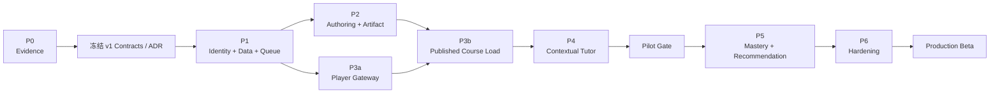

# 05 · 实施路线图

## 1. 计划假设

- 团队：3–5 名工程人员，至少覆盖 Web/Node、Python/AI、测试/Eval；产品/设计兼职参与。
- 节奏：2 周一个 iteration；每个 Phase 以 Gate 验收，不以“代码已合并”结束。
- 目标：约第 12–16 周形成受控 Pilot，约第 18–24 周达到生产 Beta 基线。
- 1–2 人团队不要机械套用并行时间，建议按 28–36 周规划并进一步削减 Interactive/PBL/Memory 范围。
- AI 生成质量、上游 adapter 与身份是最高不确定性，整体预留 20%–30% contingency。

## 2. Phase 总览

| Phase | 日历时间（3–5 人） | 主要结果 | 可发布里程碑 |
| --- | --- | --- | --- |
| P0 · Evidence & Spikes | 2 周 | 事实基线、4 个集成 spike、成本/延迟数据、ADR | Technical Go/No-Go |
| P0.5 · Artifact-first Validation | 3–7 工程日 | OpenMAIC 快速生成、URL Catalog、Player 查看、产出物基线 | Product Signal Demo |
| P1 · Platform Foundation | 2–3 周 | monorepo、身份、DB、queue、contracts、telemetry | Internal Alpha Foundation |
| P2 · Authoring & Production | 3–4 周 | 材料 → durable job → draft → review → publish | Author Alpha |
| P3 · Learner Runtime | 3–4 周 | 完整 Player、Host Bridge、events、progress、continue | Learner Alpha |
| P4 · Contextual Tutor | 3–4 周 | DeepTutor adapter、RAG/citation、stream/cancel、usage | End-to-End Pilot |
| P5 · Adaptive Learning | 3 周 | evidence-based mastery、recommendation、Memory projection | Adaptive Beta |
| P6 · Hardening & Pilot | 3–4 周 | 安全、性能、DR、AI eval、运营手册、真实 pilot | Production Beta Gate |
| P7 · Scale/Expansion | 按证据立项 | 离线、媒体、导出、PBL、多区域、LMS | 可选 |

P0.5 是可选但推荐的快速产品验证线，不要求先完成 DeepTutor/RAG 集成。它与 P0 中的 DeepTutor context/RAG spike 可以并行，汇合契约和细化任务见 `08`。P2 的 UI 工作与 P1 后半可以并行；P3 的 Player spike 可与 P2 worker 并行；P4 的 Agent adapter 可提前开发，但完整上下文验收依赖 Published CourseVersion 与 LearningEvent。

## 3. 依赖与关键路径

关键路径是：

`Contract/Identity → Durable Job → Immutable Artifact → Player/Event → Trusted Agent Context → Pilot Evidence → Hardening`

“拆上游包”“Edge Agent”“全量 Provider”“完整离线”都不在关键路径。

## 4. Phase 0 · Evidence & Spikes

### 目标

用代码和数据验证集成边界，消除文档中的关键假设。

### 交付物

- 两个上游的 commit/version/license/SBOM baseline。
- `CourseArtifact v1`、`LearningEvent v1`、`TutorEvent v1`、HostBridge v1 草案。
- 四个可重复 spike：
  1. 10 份材料生成无媒体课程并记录质量/耗时/调用/费用。
  2. 从受控 runtime origin 嵌入完整 OpenMAIC Player，捕获 scene/quiz/complete 事件。
  3. DeepTutor 用当前场景与 SourceRef 回答并返回引用。
  4. 统一身份阻断跨用户读取的原型。
- ADR-001 至 ADR-010 的 accept/reject 记录。
- 风险登记、MVP feature flags 与 provider shortlist。

### Exit Gate

- 三条主链路各连续跑通 20 次；所有失败有分类。
- 生成样本中至少 8/10 通过人工“可进入编辑”rubric；不是要求无需编辑。
- Player 事件刷新/重放不重复；Tutor 引用可解析到 SourceRef。
- 跨 tenant/user 的负向测试全部拒绝。
- 得到可支撑 P1–P4 排期的 P50/P90 baseline。

若不能通过，选择缩小场景（例如只做 Slide + Quiz、单租户、无 Interactive），或改为服务级 Demo；不得直接进入生产实现。

### Phase 0.5 · Artifact-first Validation（推荐快速线）

该阶段只验证“生成课程并在统一入口查看”，不把深度集成设为前置条件：

- 用本地 Compose 或现有 OpenMAIC 环境生成 3–10 门短课程；
- 记录 job/course ID、标题、状态、URL、耗时、费用和错误；
- 使用薄 Catalog APP 或最小目录页打开原始 OpenMAIC Player；
- 保留 `.maic.zip` 或等价 manifest/media snapshot，建立 CourseArtifact v0 fixture；
- DeepTutor、LightRAG、身份、进度和 Memory 均可独立并行验证。

Exit Gate：10 个样本至少 8 个达到“可进入编辑”，课堂可重复打开，失败可以分类，且至少一类目标用户认为值得继续。完整双轨任务和汇合 Gate 见 [08](./08-fast-validation-parallel-evolution.md)。

## 5. Phase 1 · Platform Foundation

### 目标

建立之后所有模块共享的安全、数据和工程基础。

### 交付物

- 正式 monorepo/workspace，两个上游的 pin/fork 同步规则。
- 本地 Compose 和 CI：lint、typecheck、unit、contract、镜像、migration check。
- OIDC/session、tenant/membership/RBAC、内部 service token。
- Postgres schema：course/job/event/provider/audit 基础表。
- Object Storage、上传签名、checksum、保留策略。
- Postgres-backed queue、worker lease、idempotency、dead-letter 基线。
- OpenAPI/JSON Schema 生成与 TS/Python client。
- OpenTelemetry trace、结构化日志、基础 dashboard。
- Provider Registry、ModelPolicy 和 SecretRef；先支持一个主 LLM/Embedding。

### Exit Gate

- 两个 tenant、三种角色的集成测试通过。
- 服务仅凭内部 token 可调用；错误 audience/scope/tenant 全部拒绝。
- Job 在 worker 进程重启后能恢复；重复请求只产生一个逻辑 job。
- 数据库可从空库 migrate，也可回滚应用版本而不破坏已写数据。
- traceId 从 Browser/BFF 贯穿 worker/agent stub/provider mock。

## 6. Phase 2 · Authoring & Production

### 目标

交付可恢复、可审核、可版本化的课程生产链路。

### 范围

- 输入：Topic + PDF/Markdown/Text，1–5 个文档。
- 输出：3–8 个 Scene；Slide + Quiz；Interactive feature flag 默认关闭。
- 媒体：默认关闭，使用占位图或作者提供资产。

### 交付物

- SourceDocument upload/parse/status 与 LlamaIndex 基线 KB。
- GroundingBundle Builder 和 stable SourceRef。
- OpenMAIC Producer Adapter；Outline、Scene checkpoint、retry/error mapping。
- Artifact envelope、validator、source map、checksum、object persistence。
- Job progress/cancel/retry UI。
- Draft/Review/Publish 状态机和最小作者编辑/预览入口。
- 发布质量门：schema、Quiz 答案、source coverage、安全扫描、预算完整性。
- generation fixture/contract tests 和 10 份 golden dataset。

### Exit Gate

- worker 重启可从 scene checkpoint 继续，已成功 scene 不重复调用模型。
- 同一个 idempotency key 不产生重复 CourseVersion 或重复费用。
- Published artifact byte-immutable、checksum 可校验、可回到使用的 SourceRef/模型/prompt 版本。
- 作者可以对失败项明确选择修订、重试或继续发布；系统不把 partial artifact 标成成功。
- 10 份 golden dataset 的 schema/Quiz/citation gate 全通过，人工 rubric 达标。

## 7. Phase 3 · Learner Runtime

### 目标

让学习者稳定消费发布版本，并生成可重放的学习事实。

### 交付物

- 独立 Runtime Origin、一次性 launch session 和 artifact loader。
- iframe CSP、sandbox、origin allowlist、HostBridge v1。
- 生产级 RuntimeStore identity adapter。
- LearningSession/Event API、客户端 outbox、batch sync、idempotency。
- scene/quiz/course 事件 mapper。
- Progress projector、continue learning、基本 course summary。
- Published version enrollment/authorization。
- Player crash/reload、断网恢复、跨设备同步 E2E。

### Exit Gate

- 学习者只能加载有权限的 Published CourseVersion，不能加载其他 tenant draft。
- 刷新/断网/重复提交不会重复 Quiz attempt 或推进两次进度。
- 事件全量重放与增量投影结果一致。
- OpenMAIC Runtime 本地数据清空后，登录用户仍可从服务端恢复核心进度。
- Host Bridge 对伪造 origin/source/message schema 全部拒绝。

## 8. Phase 4 · Contextual Tutor

### 目标

把 DeepTutor 变成受 Innate 身份和课程上下文约束的学习伴侣。

### 交付物

- Python Agent Service 与 DeepTutor stable facade adapter。
- Agent session/turn mapping、SSE replay、cancel、ask-user resume。
- trusted Context Assembler：course version、scene、selection、progress、Quiz、SourceRef。
- RAG retrieve/citation normalizer；只启用 LlamaIndex 基线。
- Tutor Panel：选区解释、自由提问、引用跳转、重试/取消。
- Agent tool allowlist；默认禁用 shell、任意 MCP、外部 subagent。
- Usage/CostLedger、timeout、quota、trace。
- Memory L1 事件 ingest；L2/L3 先 feature flag。

### Exit Gate / Pilot Gate

- 浏览器篡改 scene text、answer 或 user ID 不会进入 trusted prompt。
- SSE 断线后从 `afterSeq/Last-Event-ID` 恢复，无重复终止事件。
- 引用均能解析到当前用户有权访问的 SourceRef。
- 固定问题集的 groundedness/citation/safety eval 达到 `07` 阈值。
- 课程学习 → Quiz → Tutor → Progress 的三条核心 E2E 全通过。
- 真实 provider 限流/超时/空响应都有明确 UX 和有限重试。

通过后可邀请受控组织进入 Pilot。

## 9. Phase 5 · Adaptive Learning

### 目标

在事件稳定后建立可解释的 Mastery 与下一步建议，而不是用对话历史猜测。

### 交付物

- Competency 与 Course Scene/Quiz 映射。
- Evidence policy v1、mastery projector、重放/解释 UI。
- DeepTutor Mastery adapter 或自研 deterministic policy；不允许 LLM 单独晋级。
- Recommendation candidate/ranking/reason。
- Memory L2/L3 consolidation、证据链、用户查看/删除/重建。
- 错题后再学习/再测验闭环。
- PBL evidence mapper（仅在 PBL 进入范围时）。

### Exit Gate

- Mastery 变化可列出 evidence event 和 policy version。
- 删除/纠正 Quiz attempt 后可重算，不留下幽灵状态。
- 相同事件集重放得到相同 mastery；LLM 摘要差异不影响等级。
- Recommendation 只指向用户有权访问且版本有效的内容。
- 人工评估确认建议理由不泄露隐藏答案或其他用户数据。

## 10. Phase 6 · Hardening & Pilot

### 目标

把功能闭环变成可运营、可恢复、可升级的生产 Beta。

### 交付物

- Threat model、SAST/SCA/secret scan、IDOR/SSRF/XSS/prompt-injection 测试。
- 上传文件扫描、Interactive sandbox/CSP、Provider egress allowlist。
- 负载/稳定性测试、容量模型、成本 alarm、rate limit。
- Postgres PITR/Object versioning/Agent volume backup 与恢复演练。
- 上游升级演练和 rollback/runbook。
- AI eval CI、质量 dashboard、人工抽检工作流。
- 数据导出/删除/retention、审计查询。
- Pilot onboarding、support playbook、incident severity/on-call。
- 可访问性、国际化、移动端关键流程检查。

### Production Beta Gate

- 所有 Release Blocker 安全用例通过，无未处置 P0/P1 漏洞。
- 达到 `07` 定义的可靠性、延迟、恢复和 AI 质量阈值。
- 完成一次从备份恢复到新环境，并通过三条核心 E2E。
- 完成一次上游 patch version 升级和一次应用 rollback。
- Pilot 反馈证明至少一个核心用户任务有持续价值，否则暂停扩展功能。

## 11. Phase 7 · 按证据扩展

每个主题单独立项并有 business/technical trigger：

| 主题 | 启动条件 |
| --- | --- |
| TTS/图片/视频 | 学习/作者指标证明媒体有价值，且有成本/版权/asset pipeline |
| PBL/多 Agent | Pilot 对互动任务有明确需求，基础 Progress/Tutor 已稳定 |
| PPTX/MP4 | 存在真实导出/分享场景与可接受渲染成本 |
| 完整离线 | 目标客户明确要求；定义加密、版本、冲突和下载预算 |
| IM/Partner | 有明确渠道增长路径与隐私边界 |
| LMS/LTI/xAPI | 至少一个机构客户和标准兼容测试环境 |
| 多区域/Edge | P95/合规/地域数据证明确有必要 |
| 上游拆包贡献 | Adapter 重复痛点稳定、边界已有 conformance test |

## 12. 团队分工建议

| Stream | 主要职责 | 关键 Phase |
| --- | --- | --- |
| Product/Web | 作者/学习者流程、Shell、HostBridge UX、Tutor Panel | P0–P6 |
| Platform/Node | contracts、identity、Postgres、queue、Course worker、OpenMAIC adapter | P0–P6 |
| AI/Python | ingest/RAG、DeepTutor adapter、eval、Memory/Mastery | P0、P2、P4–P6 |
| Quality/SRE（可共享） | contract/E2E/security/load/DR/observability | P0–P6，P6 集中 |

不要按“Cloud/Client/Agent”建立互相等待的三个独立团队。围绕垂直用户旅程组队，每个 iteration 必须有可演示的端到端增量。

## 13. 每个 Iteration 的通用完成条件

- 实现、测试、migration、telemetry、错误 UX、权限检查同时完成。
- 新 AI 路径增加 fixture、usage/cost、eval case 和失败 fallback。
- 新事件增加 schema、idempotency、projection/replay test。
- 新上游调用只能出现在 adapter，并更新版本兼容矩阵。
- 文档/API schema 与实现同一 PR 更新。
- Demo 使用固定环境可复现，不依赖某位开发者本地文件或浏览器 IndexedDB。
