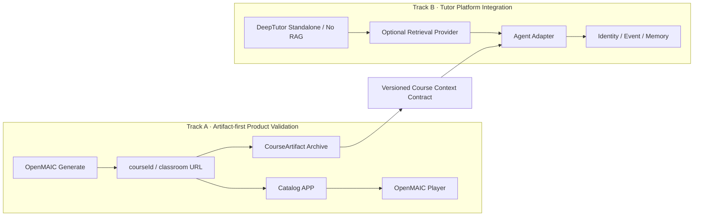

# 08 · 快速验证与双轨演进计划

## 1. 评审结论

“先直接生成并消费课程，同时把 DeepTutor/OpenMAIC 的深度集成作为独立演进线”是合理且推荐的路径。两者不冲突，因为真正的汇合点应是稳定的课程产出物和服务契约，而不是先合并源码、数据库表或 UI。

结论为 **Accept with Constraints**：

1. 快速课程链路不能依赖 DeepTutor、RAG、统一身份或学习进度。
2. 两个上游固定版本，第一阶段不修改其任务代码。
3. “共享数据库”只表示同一 PostgreSQL 基础设施，必须隔离逻辑数据库/schema 和 migration ownership。
4. 第一阶段默认不安装或启动 RAG；需要检索时才启用可替换的 Provider。
5. DeepTutor/OpenMAIC 深度集成只通过 Adapter 和版本化 contract 汇合。
6. 快速原型可以保存 `courseId + classroomUrl`，但进入长期产品前必须补齐不可变 CourseArtifact、校验和与资产归档。

## 2. 为什么两条路径可以分开

Track A 在没有 Track B 的情况下已经能验证：课程是否能生成、质量如何、用户是否愿意查看和学习。Track B 在没有 Catalog APP 的情况下也能用固定 fixture 验证：DeepTutor 是否能基于当前 scene 和资料提供可靠回答。

只有在 `CourseArtifact/Scene/SourceRef` contract 冻结后，两条线才需要汇合。

## 3. 双轨范围

### 3.1 Track A · 快速课程验证

目标：用最少自研代码验证“输入主题/材料 → 生成课程 → 查看课程”。

第一阶段只包含：

- OpenMAIC 一键生成；
- 生成状态轮询；
- 保存 course ID、标题、状态、课堂 URL；
- 课程列表和查看入口；
- iframe 或新窗口复用 OpenMAIC Player；
- 记录生成耗时、错误、模型和人工质量评分。

不包含：

- DeepTutor；
- RAG grounding；
- 登录/多租户；
- 跨设备进度；
- Memory/Mastery；
- 自研 Player；
- Durable queue。

### 3.2 Track B · DeepTutor/RAG 集成

目标：验证 Tutor 能力和长期技术边界，不阻塞课程生成。

顺序为：

1. DeepTutor 独立运行和模型配置；
2. 先用当前 scene direct context 验证无 RAG Tutor；
3. 有明确长文档/引用需求后，再选择本地 LlamaIndex、LightRAG 或其他 Provider；
4. 用固定课程 fixture 做 scene-aware Tutor；
5. 新增 Agent Adapter，规范化 session/turn/stream/citation；
6. 最后才接统一身份、LearningEvent、Memory 和 Mastery。

## 4. Phase 与交付计划

| Phase | 时间参考 | Track | 目标 | 退出条件 |
| --- | --- | --- | --- | --- |
| F0 · Compose Contract | 0.5–1 天 | A/B 基础 | 默认三服务无 RAG；可选检索 profile | 默认/profile 的 `docker compose config` 均通过 |
| F1 · Generation Smoke | 1–2 天 | A | 生成并查看 3 门短课程 | 3/3 可打开；记录耗时、失败和 URL |
| F2 · Batch Benchmark | 2–3 天 | A | 10 个主题/材料的快速生成评估 | 输出 JSON/Markdown 报告和质量 rubric |
| F3 · Thin Catalog | 3–7 天 | A | 独立 APP 统一查看课程 | 提交、轮询、列表、打开、错误恢复可用 |
| F4 · Artifact Baseline | 2–5 天 | A | 从 URL 记录演进到版本化产出物 | manifest/schema/version/checksum/asset check 通过 |
| T1 · Tutor Standalone | 1–2 天 | B | DeepTutor 无 RAG、当前 scene 问答 | 20 个基础问题流式完成并记录故障 |
| T2 · Optional RAG Spike | 2–4 天 | B | 选一个 Provider ingest/retrieve + DeepTutor 连接 | 引用可回到原材料；重启后索引可用 |
| T3 · Scene-aware Adapter | 3–5 天 | B→A | 当前课程/scene/selection 上下文问答 | 浏览器伪造正文不进入 trusted prompt |
| T4 · Product Integration | 1–2 周 | 汇合 | Tutor Panel、session mapping、引用跳转 | 课程播放不依赖 Tutor；Tutor 故障可降级 |
| T5 · Production Data | 2–4 周 | 汇合 | 身份、事件、进度、审计、预算 | 跨用户负向测试、重放和恢复通过 |

时间是 1–2 人快速验证估算，不包含模型生成等待、复杂媒体和生产安全整改。

## 5. 分阶段任务清单

### F0 · Compose Contract

- [ ] **P0F-01** 固定 DeepTutor/OpenMAIC/PostgreSQL 版本；可选 LightRAG 也必须固定版本。
- [ ] **P0F-02** 定义一个 PostgreSQL 实例、`innate/openmaic/lightrag` 三个逻辑数据库。
- [ ] **P0F-03** 给 OpenMAIC classroom data、DeepTutor workspace、可选 RAG scratch 分配独立 volume。
- [ ] **P0F-04** 默认只要求 LLM；Embedding/RAG 配置放入可选 profile，不提交 secret。
- [ ] **P0F-05** 所有宿主端口仅绑定 `127.0.0.1`。
- [ ] **P0F-06** 写明 OpenMAIC 不自动调用 RAG、DeepTutor 不自动使用 PostgreSQL。
- [ ] **P0F-07** 分别静态校验默认无 RAG和可选 RAG profile 的变量、依赖、volume、healthcheck。

### F1–F2 · 课程生成验证

- [ ] **P0F-08** 准备 3 个 smoke topic：知识讲解、带 Quiz、含一份短材料。
- [ ] **P0F-09** 调用 `POST /api/generate-classroom` 并轮询 job 状态。
- [ ] **P0F-10** 保存 job ID、course ID、URL、总耗时、模型、错误类型。
- [ ] **P0F-11** 验证刷新和容器重启后课堂仍能打开。
- [ ] **P0F-12** 扩展到 10 个 benchmark，并执行人工 rubric。
- [ ] **P0F-13** 确认失败是 Provider、生成、schema、媒体还是持久化问题。
- [ ] **P0F-14** 形成继续/缩小范围/停止的 Go/No-Go 结论。

### F3–F4 · Catalog 与 Artifact

- [ ] **P0F-15** 新 APP 只保存课程目录元数据，不复制 OpenMAIC 内部状态机。
- [ ] **P0F-16** 实现提交、轮询、列表、详情和打开 Player。
- [ ] **P0F-17** Player 故障不影响 Catalog，其错误可被识别和重试。
- [ ] **P0F-18** 定义 `CourseArtifact v0`：upstream version、course ID、scene metadata、asset refs。
- [ ] **P0F-19** 保存 `.maic.zip` 或等价 manifest/media snapshot，并计算 checksum。
- [ ] **P0F-20** 校验远程资产、互动 HTML、音视频缺失和格式版本。
- [ ] **P0F-21** 将 artifact 固定为不可变 CourseVersion fixture，供 Track B 使用。

### T1–T3 · Tutor/RAG Spike

- [ ] **P0T-01** 配置 DeepTutor 单用户模式和一个 LLM，不配置 KB/Embedding。
- [ ] **P0T-02** 先验证当前 scene/selection direct context 问答和无出处回答边界。
- [ ] **P0T-03** 只有命中长文档/引用触发条件时才选择并启用 RAG Provider。
- [ ] **P0T-04** 验证 top-k 内容、source locator、中文问题和无答案问题。
- [ ] **P0T-05** 用 F4 fixture 定义 `courseVersionId/sceneId/selection/SourceRef` 输入。
- [ ] **P0T-06** 只通过 `DeepTutorApp` 或 `/api/v1/ws` 实现 Adapter。
- [ ] **P0T-07** 规范化 stream/cancel/reconnect/citation/usage。
- [ ] **P0T-08** 禁用 shell、任意 MCP、subagent 等非必要工具。
- [ ] **P0T-09** Tutor 超时或不可用时，OpenMAIC Player 继续正常播放。

## 6. 汇合契约和 Gate

| Gate | Track A 提供 | Track B 提供 | 未通过时 |
| --- | --- | --- | --- |
| G0 · Runtime | 可打开的 classroom URL | 可独立问答的 DeepTutor | 两线继续独立排错 |
| G1 · Artifact | 不可变 CourseVersion + scene fixture | 可读取 fixture 的 Context Adapter | 不开发 Tutor Panel |
| G2 · Grounding | SourceRef/原材料映射 | 有引用的 RAG result | Tutor 降级为仅当前 scene 问答 |
| G3 · Interaction | 当前 scene/selection 信号 | session/turn/stream contract | 仍用独立 DeepTutor UI |
| G4 · Product | Catalog/Player 稳定 | Tutor 可取消、恢复、降级 | 不接进度/Memory |
| G5 · Data | LearningEvent 和身份事实源 | Memory 只消费过滤事件 | 不进入多用户 Pilot |

## 7. Compose 的演进边界

当前 Compose 是 F0 交付物，不是最终生产拓扑：

- 允许只启动 `postgres openmaic` 走 Track A；
- 默认 `docker compose up` 启动 OpenMAIC、DeepTutor、PostgreSQL，不启动 RAG；
- `--profile rag-lightrag` 才额外安装并启动内置 LightRAG；
- 替换为外部/其他 RAG 时保持该 profile 关闭，通过 `RagProviderPort` 接入；
- PostgreSQL 共享实例但不共享上游表；
- LightRAG 通过 API 共享，不允许两个项目直接操作其数据库；
- 所有服务保持单实例和本地可信网络；
- 不包含 Catalog APP、Adapter、对象存储、身份和 durable queue；它们按 Gate 增加。

## 8. Go/No-Go 标准

快速路线继续进入 F3 的最低条件：

- 10 个样本至少 8 个可进入人工编辑；
- 生成成功后课堂可以稳定再次打开；
- 失败可以分类，不出现大量 silent partial success；
- 单课程平均成本和等待时间在目标场景可接受；
- 至少一类目标用户认为生成结果值得继续使用。

DeepTutor 路线进入 T4 的最低条件：

- 当前 scene 问答明显优于无上下文通用 Chat；
- 引用可以解析到有权访问的 SourceRef；
- Tutor 故障不影响课程播放；
- Adapter 没有依赖 DeepTutor 不稳定内部模块；
- 工具权限和跨 workspace 负向用例通过。

任一条线 No-Go 不自动否定另一条线，这正是双轨拆分的主要价值。
