# InnateTutor 三段式架构方案（云端生产 · 客户端发布与进度 · AI 对话 Agent）

> **报告日期**：2026-08-06
> **报告定位**：在「组件集成分析」「服务级集成」两份报告基础上，**按照三段式职责重构**——清晰拆分云端（生产）、客户端（消费）、AI Agent（陪伴）三个独立可演进层级。
>
> **核心结论**：✅ **这种划分非常合理**。前两份报告的"组件化 monorepo"思路与之并不冲突，但需要把"InnateTutor"项目**重新设计为按职责横向拆分为三个独立子产品**，每个子产品独立伸缩、独立替换、独立升级。两大开源项目（DeepTutor / OpenMAIC）将作为这些子产品的"组件库"被按需引入。

---

## 1. 三段式架构总览

### 1.1 职责定义

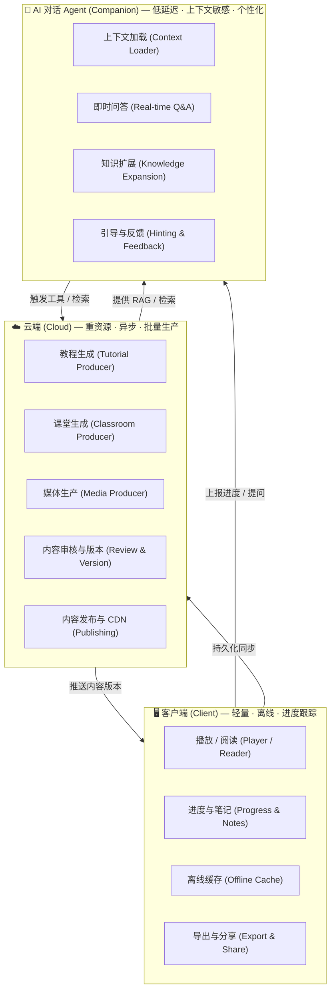

### 1.2 三层职责矩阵

| 层级 | 角色 | 关键属性 | 主要组件来源 |
| --- | --- | --- | --- |
| **☁️ Cloud** | 教程 / 课堂 / 媒体的**生产** | 重资源 · 异步作业 · 可中断 · 高吞吐 | OpenMAIC + DeepTutor 工具链 |
| **🖥️ Client** | 内容的**消费 + 进度跟踪** | 轻量 · 离线优先 · 同步、断点续传 | OpenMAIC Renderer + 自研 |
| **🤖 Agent** | 上下文敏感的**陪伴式答疑** | 低延迟 · 流式 · 个性化 · 上下文跟随 | DeepTutor Agent Loop + RAG |

### 1.3 与前两份报告的关系

| 之前报告 | 重点 | 本报告调整 |
| --- | --- | --- |
| `integration-feasibility.md` | 服务级集成（REST/WS） | 保留作为"应急方案" |
| `new-project-integration.md` | 组件级 monorepo 集成 | **改造为按职责横向拆分**——不再是单一 monorepo 单体应用，而是分层独立子产品 |
| **`three-tier-architecture.md`（本报告）** | **三段式职责清晰划分** | **推荐方案** |

---

## 2. 调整后的整体架构

### 2.1 调整后的三段式架构

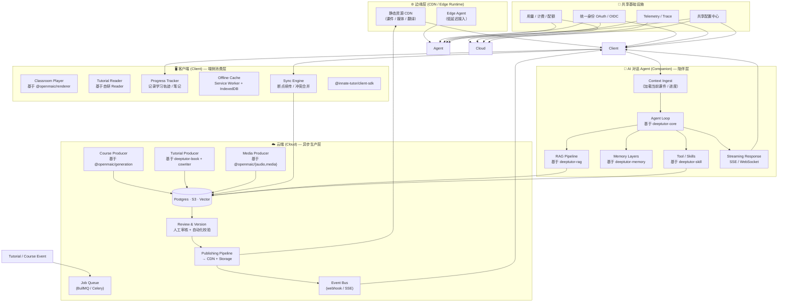

### 2.2 关键架构特点

1. **三层独立部署**：Cloud / Client / Agent 各自独立伸缩
2. **Cloud 是异步生产者**：所有重计算任务走消息队列
3. **Client 是离线优先**：本地缓存 + 断点同步
4. **Agent 是低延迟常驻服务**：流式响应，SSE
5. **共享基础设施**：身份 / 计费 / 监控 / 配置
6. **数据流向清晰**：Cloud→Client（推送）、Client→Agent（提问）、Agent→Cloud（检索）、Client→Cloud（同步）

---

## 3. 三个子产品的细化设计

### 3.1 ☁️ Cloud Tier — 内容生产云

#### 3.1.1 角色与组成

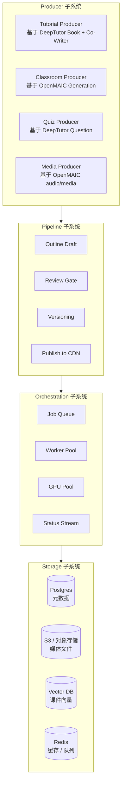

#### 3.1.2 核心组件映射

| 子系统 | 使用的能力 | 来自 |
| --- | --- | --- |
| **Tutorial Producer** | BookEngine（章节编译） | DeepTutor `book/` |
| | Co-Writer（选区编辑） | DeepTutor `co_writer/` |
| | Knowledge Manifest | DeepTutor `knowledge/manifest.py` |
| **Classroom Producer** | OutlineGenerator | OpenMAIC `@openmaic/generation` |
| | SceneGenerator | OpenMAIC `@openmaic/generation` |
| | Director Graph | OpenMAIC `lib/orchestration/` |
| | Action Engine | OpenMAIC `lib/action/` |
| **Quiz Producer** | Question Agent | DeepTutor `agents/question/` |
| | Quiz Grading | DeepTutor `learning/grading.py` |
| **Media Producer** | TTS Synth | OpenMAIC `@openmaic/audio` |
| | ASR Transcribe | OpenMAIC `@openmaic/audio` |
| | Image Generation | OpenMAIC `@openmaic/media` |
| | Video Generation | OpenMAIC `@openmaic/media` |
| **Pipeline** | Review workflow | 自研 |
| | Versioning | 基于 Git semantics |
| | CDN Upload | S3 / OSS |
| **Orchestration** | Job Queue | BullMQ / Celery |
| | Worker Pool | K8s / Fargate |
| | GPU Pool | K8s GPU node |

#### 3.1.3 异步任务流程

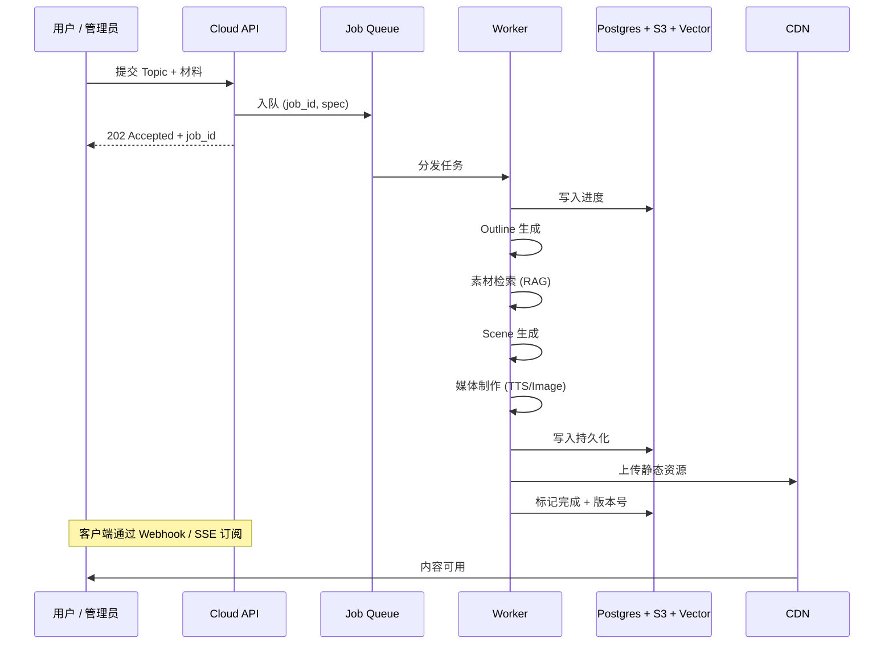

#### 3.1.4 部署形态

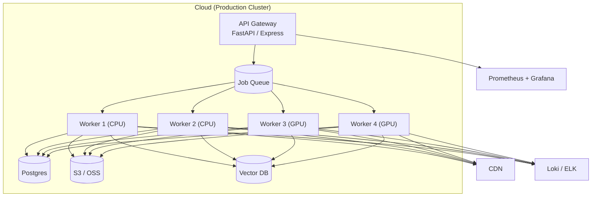

---

### 3.2 🖥️ Client Tier — 端侧消费 + 进度

#### 3.2.1 角色与组成

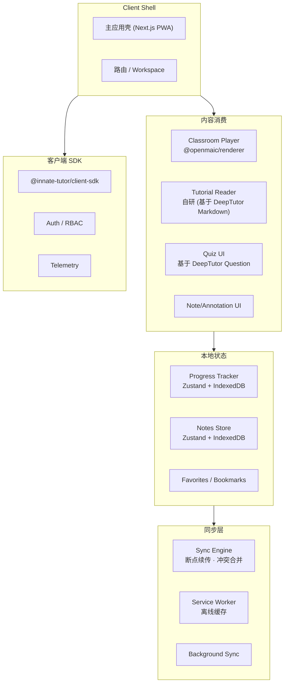

#### 3.2.2 核心组件映射

| 子系统 | 使用的能力 | 来自 |
| --- | --- | --- |
| **Classroom Player** | Renderer（与 Web 解耦） | OpenMAIC `@openmaic/renderer` |
| | DSL Runtime | OpenMAIC `@openmaic/dsl` |
| | Stage API | OpenMAIC `@openmaic/stage-api`（待提取） |
| **Tutorial Reader** | Markdown / KaTeX / Mermaid | 自研 |
| | Book Block | DeepTutor `book/`（待提取 @deeptutor/reader） |
| **Quiz UI** | Question Card | DeepTutor `learning/` |
| | Mastery Visualizer | 自研 |
| **Progress Tracker** | Zustand Store | 自研 |
| | IndexedDB persist | OpenMAIC `@openmaic/storage` 思路 |
| **Sync Engine** | Outbox Pattern | 自研 |
| | Conflict Resolution | 自研（CRDT 思路） |
| **Offline Cache** | Service Worker | 自研 |
| | IndexedDB | 自研 |

#### 3.2.3 离线优先策略

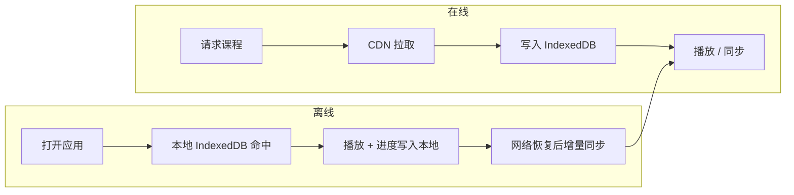

#### 3.2.4 进度同步协议

```typescript
// 客户端 SDK 协议
interface ProgressEvent {
  userId: string;
  clientId: string;          // 用于幂等
  timestamp: number;
  contentId: string;         // 教程 / 课堂 ID
  scene?: string;            // 选填: 课堂场景 ID
  type: 'view' | 'complete' | 'quiz' | 'note' | 'bookmark';
  payload: ViewPayload | CompletePayload | QuizPayload | NotePayload | BookmarkPayload;
}

// 增量同步
POST /api/v1/client/progress { events: ProgressEvent[] }

// → 服务端 sync 写入 Postgres
// → 触发 Agent 上下文更新
```

---

### 3.3 🤖 AI Agent Tier — 上下文敏感的陪伴

#### 3.3.1 角色与组成

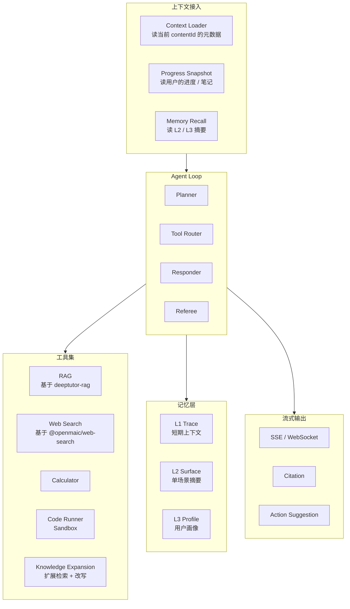

#### 3.3.2 核心组件映射

| 子系统 | 使用的能力 | 来自 |
| --- | --- | --- |
| **Context Loader** | KD 解析 | DeepTutor `core/` |
| | Progress Join | 自研 |
| | Memory Recall | DeepTutor `services/memory/` |
| **Agent Loop** | 主循环 | DeepTutor `deeptutor-core` |
| | Tool Call | DeepTutor `core/tool_protocol.py` |
| | Capability 协议 | DeepTutor `core/capability_protocol.py` |
| **RAG** | 多引擎 | DeepTutor `deeptutor-rag` |
| | Embedding | DeepTutor `deeptutor-llm` |
| **Web Search** | 多 Provider | OpenMAIC `@openmaic/web-search` |
| **Memory** | L1/L2/L3 | DeepTutor `deeptutor-memory` |
| **Knowledge Expansion** | 检索 + 改写 | 自研 |
| **Streaming** | SSE | 自研 |

#### 3.3.3 上下文与知识扩展

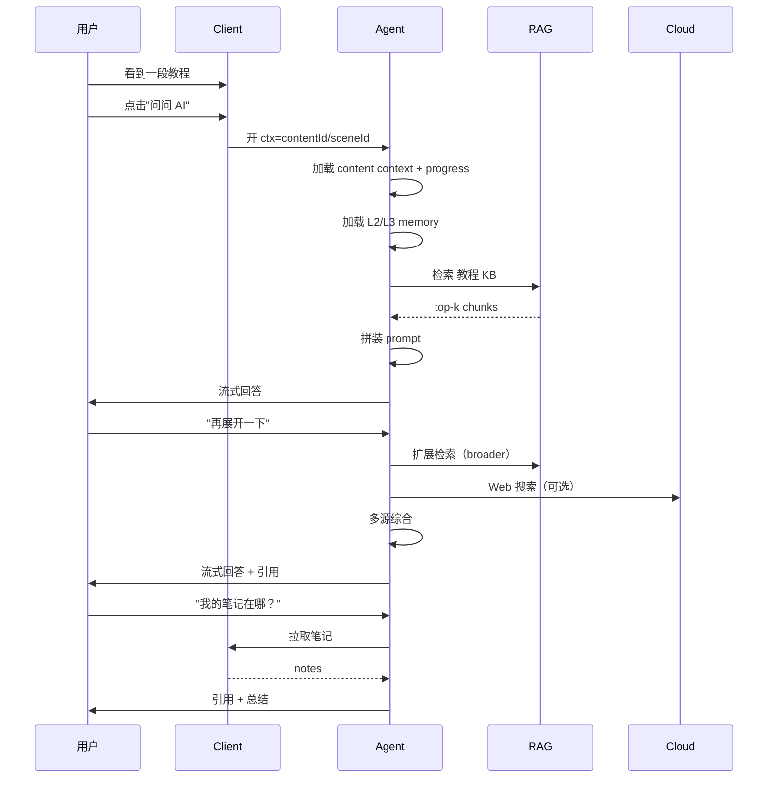

#### 3.3.4 Agent 关键交互场景

| 场景 | 触发 | 能力 | 工具 |
| --- | --- | --- | --- |
| **即时讲解** | 选中一段文字 → "解释" | 上下文敏感解释 | RAG、Memory |
| **知识扩展** | "再深入一点" | 同主题扩展 | Web Search、Knowledge Expansion |
| **答疑** | "这道题为什么选 B" | 错题解析 | Progress、Quiz 数据 |
| **路径推荐** | "下一步该学什么" | 自适应路径 | Mastery Path |
| **笔记助手** | 写笔记中的伴随 | 知识补充 | RAG |
| **尝试性提问** | "我理解对吗" | 引导式反馈 | Loop 检查 |

#### 3.3.5 部署形态

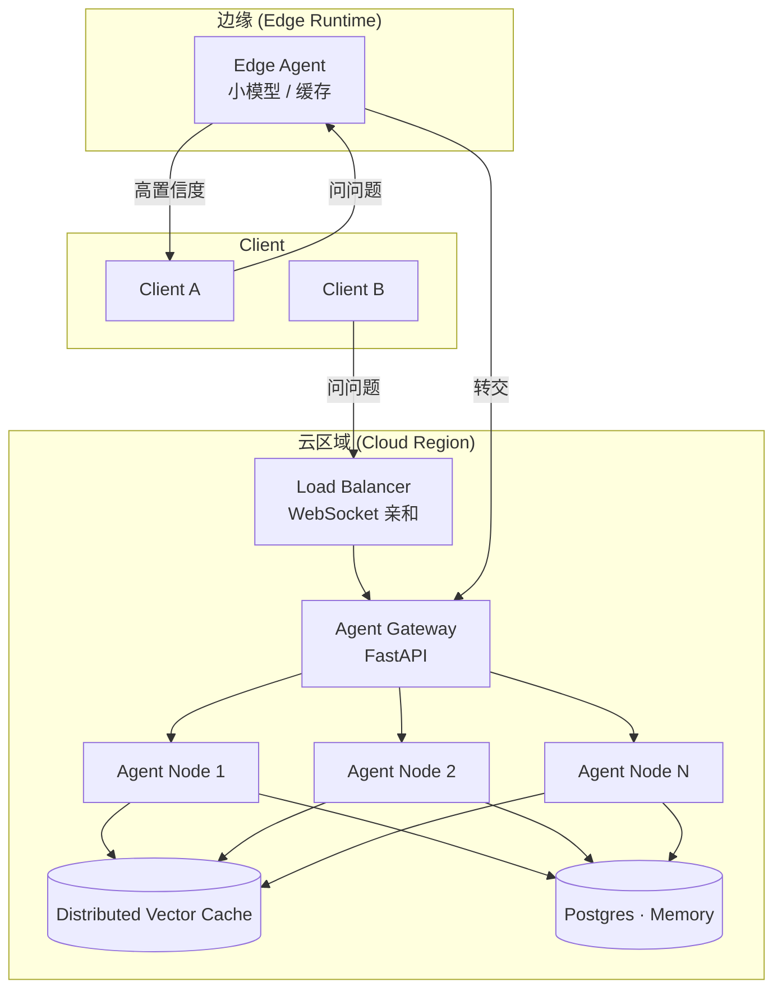

> **Edge Agent 优化**：把常见问题（如"这段什么意思"）的响应在边缘节点缓存，首次问答 < 100ms；复杂问题回源到 Region Agent。

---

## 4. 调整后的实施路线图

### 4.1 阶段 0 — 顶层骨架（2 周）

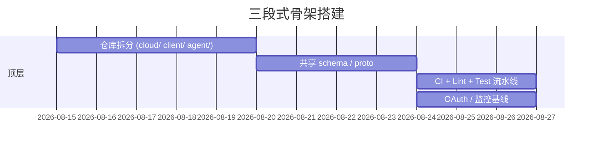

建立：

```
innate-tutor/
├── cloud/              # Cloud 子产品
├── client/             # Client 子产品
├── agent/              # Agent 子产品
├── shared/             # 共享 schema / proto / types
└── infra/              # 共享基础设施
```

### 4.2 阶段 1 — Cloud MVP（4 周）

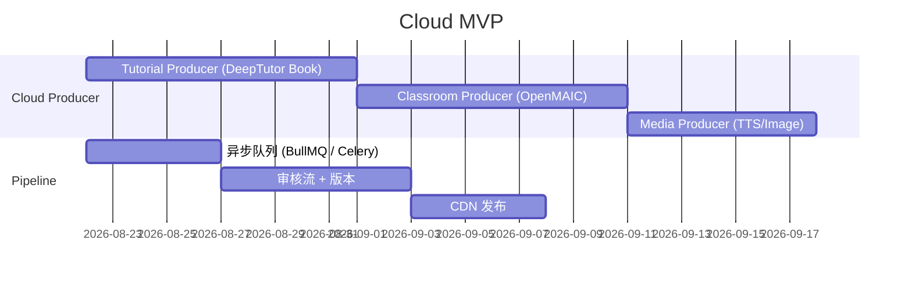

### 4.3 阶段 2 — Client MVP（4 周）

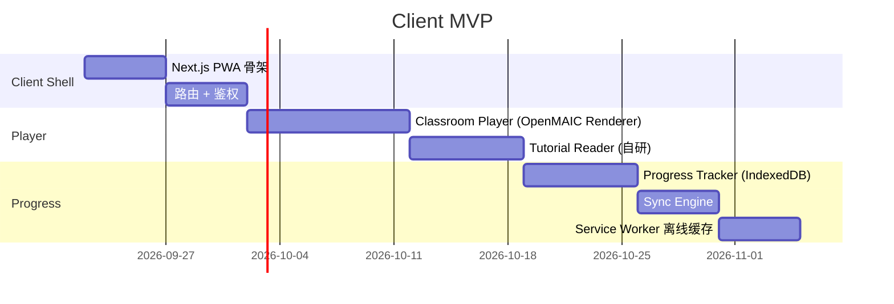

### 4.4 阶段 3 — Agent MVP（4 周）

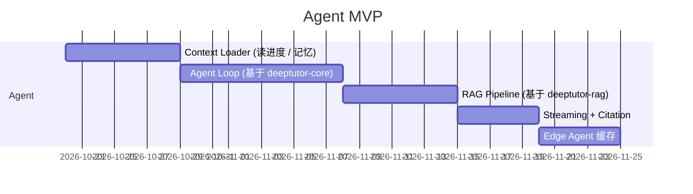

### 4.5 阶段 4 — 联调 & 优化（4 周）

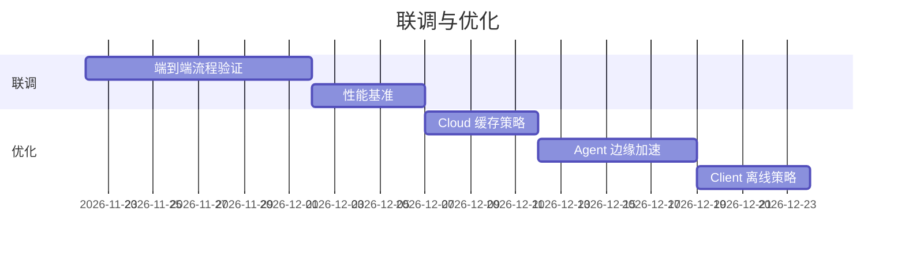

---

## 5. 关键设计决策

### 5.1 三层通信矩阵

| 通信 | 协议 | 方向 | 性能要求 |
| --- | --- | --- | --- |
| **Cloud → Client**（推送内容） | Webhook / SSE / Pull 缓存 | 主动 + 拉取 | 中（异步） |
| **Client → Cloud**（同步进度） | REST + 增量协议 | 主动 | 中（批量） |
| **Client → Agent**（提问） | WebSocket / SSE | 主动 | **高（< 100ms 首字节）** |
| **Agent → Cloud**（检索） | gRPC / REST | 主动 | 中（缓存） |
| **Agent → Client**（流式回答） | SSE | 主动 | **高（流式）** |

### 5.2 数据一致性策略

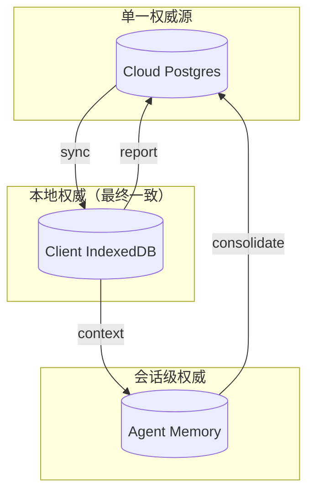

- **Cloud Postgres = 唯一真相**：所有最终数据
- **Client IndexedDB = 本地副本**：进度、笔记、缓存
- **Agent Memory = 会话级**：短期，会话结束落 Cloud

### 5.3 鉴权与权限

| 角色 | 权限 | 访问层 |
| --- | --- | --- |
| **Admin** | 全权 | Cloud + Client + Agent |
| **Teacher** | 创建内容、查看学生进度 | Cloud + Client |
| **Student** | 消费内容、提问 | Client + Agent |
| **Guest** | 公共内容预览 | Client（只读） |

### 5.4 配额与计费

| 层 | 配额维度 | 计费模型 |
| --- | --- | --- |
| **Cloud** | 教程数 / 课堂数 / 媒体生成量 | 包月 / 按量 |
| **Client** | 离线容量 / 同步频率 | 包含 |
| **Agent** | 每用户每月调用次数 / Token 量 | 按量 |

### 5.5 监控指标

| 层 | 关键指标 |
| --- | --- |
| **Cloud** | 任务吞吐、平均生成时长、失败率、队列长度 |
| **Client** | DAU / 离线率 / 资源加载 P95 / 进度同步 P95 |
| **Agent** | 首字节延迟 / 流式吐字速率 / 引用准确率 / 重试率 |

---

## 6. 数据流：端到端示例

### 6.1 用户学习一个"Python 入门"课堂

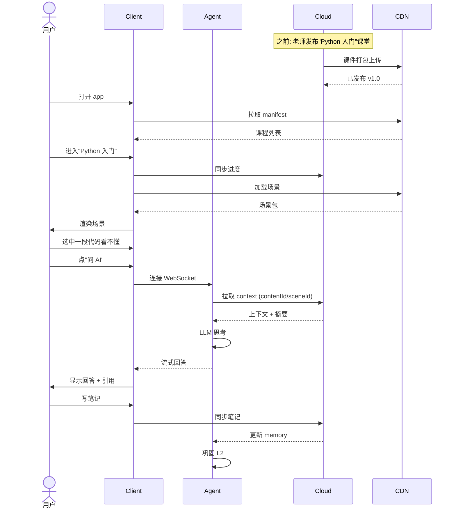

### 6.2 老师创建一个新教程

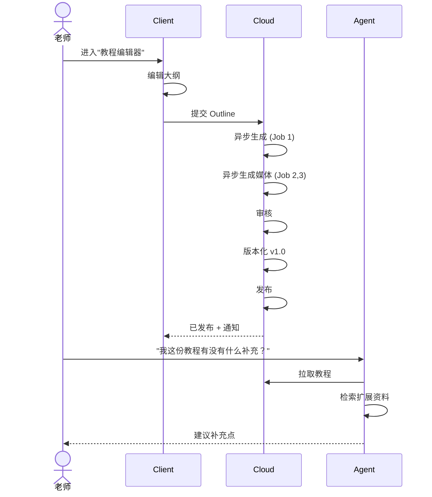

---

## 7. 与上一份"组件集成方案"的对比

| 维度 | 上一份（组件 monorepo） | 本报告（三段式） |
| --- | --- | --- |
| **仓库结构** | 单一 monorepo（apps + services + libs） | **三个独立子产品仓库**（cloud / client / agent） |
| **运行时** | 双语言同进程 | **三层独立部署** |
| **伸缩** | 整体伸缩 | **各层独立伸缩** |
| **更换成本** | 整体替换 | **每层独立替换** |
| **研发分工** | 统一团队 | **Cloud / Client / Agent 三个团队** |
| **MVP 周期** | 16-20 周 | **14 周（4+4+4+2 联调）** |
| **适合阶段** | 早期单团队 | **长期产品化** |
| **互操作性** | 紧密耦合 | **REST/WebSocket 标准化** |

---

## 8. 关键交付物清单

### 8.1 Cloud
- [ ] 异步任务队列（Job Queue）
- [ ] 教程生成器（DeepTutor Book 包装）
- [ ] 课堂生成器（OpenMAIC Generation 包装）
- [ ] 媒体生成器（OpenMAIC audio/media 包装）
- [ ] 审核流 + 版本
- [ ] CDN 发布
- [ ] 元数据 API

### 8.2 Client
- [ ] PWA 壳
- [ ] Classroom Player（OpenMAIC Renderer）
- [ ] Tutorial Reader
- [ ] Progress Tracker
- [ ] Sync Engine
- [ ] 离线缓存（Service Worker）
- [ ] 导出 / 分享

### 8.3 Agent
- [ ] Context Loader
- [ ] Agent Loop（DeepTutor core 包装）
- [ ] RAG Pipeline（DeepTutor rag 包装）
- [ ] Memory Layers（DeepTutor memory 包装）
- [ ] Knowledge Expansion
- [ ] Streaming + Citation
- [ ] Edge Agent 缓存

### 8.4 共享
- [ ] 统一 OAuth / OIDC
- [ ] 共享 Schema（TypeScript + Python）
- [ ] 共享配置中心
- [ ] Telemetry / Trace
- [ ] 计费 / 配额

---

## 9. 风险与缓解

| 风险 | 等级 | 缓解 |
| --- | --- | --- |
| 三层间的契约不稳定 | 🟠 高 | **先定义 proto / TS / Py 共享 schema**，再实现 |
| Cross-tier 调试复杂 | 🟡 中 | 统一 Trace ID + OpenTelemetry |
| 鉴权一致性 | 🟡 中 | 共享 OAuth 服务，JWT 传递 |
| 进度同步冲突 | 🟡 中 | 客户端 CRDT，服务端权威冲突合并 |
| 三团队协作 | 🟡 中 | 共享 Backend For Frontend / API 文档 |
| Agent 延迟不达标 | 🟠 高 | Edge Agent + 缓存 + 预热 |
| Client 离线后冲突 | 🟡 中 | 离线只追加，回连后合并 |
| Cloud 任务失控 | 🟡 中 | Job Queue 限流 + 超时 + 重试 |

---

## 10. 推荐起步

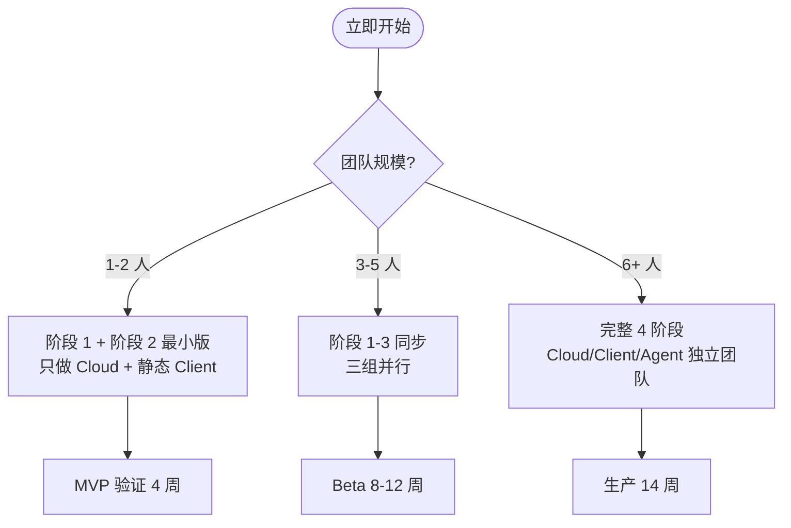

> **不论规模，都建议先做阶段 1（Cloud + 第一个客户端渲染）**，验证生产链路通畅后，再启动 Agent。

---

## 11. 总结

| 维度 | 结论 |
| --- | --- |
| **是否需要调整** | ✅ **需要且对齐** |
| **核心变化** | 从"单一 monorepo"调整为"**三段式独立子产品**" |
| **最大优势** | **独立伸缩、独立替换、独立团队** |
| **关键决策** | （1）三段独立仓库（2）Agent 优先 Edge 部署（3）Client 离线优先（4）Cloud 异步生产 |
| **资源复用** | OpenMAIC → Cloud 生产 + Client 播放；DeepTutor → Cloud 教程 + Agent 答疑 |
| **MVP 周期** | 14 周（4+4+4+2 联调） |
| **下一步** | 阶段 0 拆分仓库 + 定义共享 schema |

> **最终建议**：把"InnateTutor"重新定义为"**Innate Cloud** + **Innate Client** + **Innate Agent**"三个子产品的组合，每个子产品独立演进，共享 schema / 鉴权 / 监控。两个开源项目（DeepTutor / OpenMAIC）作为这些子产品的"组件供应链"，按需引入。

---

## 附录 A · 子产品技术栈

### A.1 Cloud 子产品
- **运行时**：Node.js 20+（OpenMAIC）/ Python 3.11+（DeepTutor）
- **框架**：FastAPI + Express + BullMQ
- **存储**：Postgres + S3 + Vector DB (Qdrant / Pinecone)
- **GPU**：可选（VoxCPM2 / MinerU / ComfyUI）
- **监控**：Prometheus + Grafana + Loki

### A.2 Client 子产品
- **运行时**：Browser（现代 evergreen）
- **框架**：Next.js 16 (PWA)
- **状态**：Zustand + IndexedDB
- **UI**：shadcn/ui + Radix
- **离线**：Service Worker + Background Sync
- **渲染**：OpenMAIC Renderer + 自研 Reader

### A.3 Agent 子产品
- **运行时**：Node.js 20+（边缘）/ Python 3.11+（区域）
- **框架**：FastAPI + WebSocket
- **核心**：DeepTutor Agent Loop + RAG + Memory
- **边缘**：Cloudflare Workers / Vercel Edge
- **缓存**：Redis + Vector Cache

### A.4 共享基础设施
- **身份**：OAuth / OIDC
- **Schema**：Protobuf / TypeScript / Pydantic
- **监控**：OpenTelemetry + Sentry
- **CI**：GitHub Actions
- **IaC**：Terraform / Helm

---

## 附录 B · 三层 SLA 目标

| 层 | 可用性 | 延迟 | 吞吐 |
| --- | --- | --- | --- |
| **Cloud** | 99.9% / 月 | 任务完成 < 5 分钟 | 1000 任务 / 小时 |
| **Client** | 99.5% / 月（依赖 CDN） | 首屏 < 1.5s | 50k 并发 |
| **Agent** | 99.95% / 月 | 首字节 < 200ms | 10k 并发连接 |
